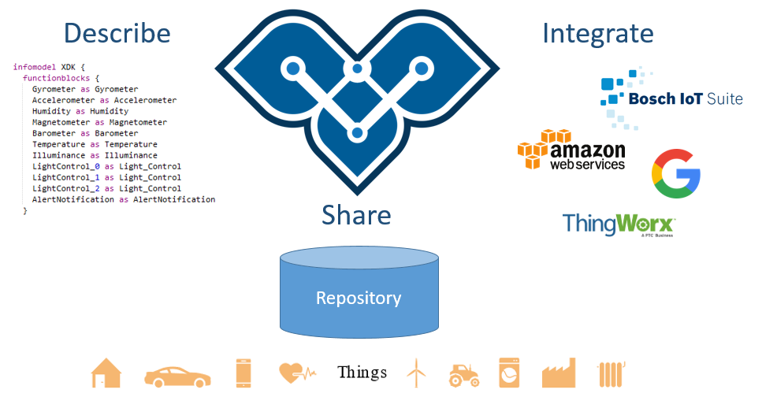

[Eclipse Vorto](http://www.eclipse.org/vorto) provides a language for describing models and interfaces for IoT Digital Twins. Digital twins are models of entities in the physical world such as a (multi) sensor device, smart power plant, and other entities that participate in IoT solutions. Modeling enables IoT solutions and IoT platforms to provision, use, and configure IoT devices and logical entities from multiple sources in a single solution. Using the vortolang and describing the entities's capabilities, IoT platforms and IoT solutions can leverage the semantics of these IoT entities.

<a href="docs/vortolang-1.0.md"><b>Vortolang 1.0 Specification</b></a>

## Getting Started with Vorto

[Read here](docs/gettingstarted.md)

## Vorto Examples

Vorto comes with tons of examples, that demonstrate you the use of Vorto in IoT Solution Development. 

One of these examples, is the Vorto Dashboard, that visualizes sensor data in Vorto Function Block compliant UI widgets:
[Click here for demo](http://vorto-dashboard.eu-central-1.elasticbeanstalk.com/)

 

Check out more cool [Vorto Examples](https://www.github.com/eclipse/vorto-examples).

## Developer Guide

- [Plugin SDK](plugin-sdk/Readme.md) that lets you extend Vorto with different plugin types
- Compiling Vorto: Vorto currently only compiles with Java 8.

## Contact us
 - You want to chat with us? 
 - You found a bug in Vorto? Open a [GitHub issue](https://github.com/eclipse/vorto/issues)
 - Find out more about the project on our [Vorto Homepage](http://www.eclipse.org/vorto)
 - You have a problem? Reach out to our developers through [StackOverflow](https://stackoverflow.com/questions/ask?tags=eclipse-vorto) 

## Follow us
follow us [@EclipseVorto](https://twitter.com/EclipseVorto)

| Channel | Releases           | Features                 | Tutorials                |
|:--------|:------------------:|:-------------------------|--------------------------|
| Twitter | :heavy_check_mark: | :heavy_check_mark:       | :heavy_check_mark:       |
| Email   | :heavy_check_mark: | :heavy_multiplication_x: | :heavy_multiplication_x: |

We favor Twitter for feature and tutorial news, because the nature of twitter allows for shorter and faster news. 
Also such a flood of information via Email would be considered spam. 
If you have suggestions on how and what news we should provide let us know in the issues.

## Contribute to the Project

When you create a Pull Request, make sure:

1. You have a valid [ECA](https://www.eclipse.org/legal/ECA.php) signed with Eclipse
2. All your commits are signed off (git commit -s)
3. Your commit message contains "Fixes #`<Github issue no>`
4. Target to merge your fix is development branch
5. Your code fits the code style guidelines

#### Attribution
The code style guidlines are taken from https://github.com/google/styleguide.

