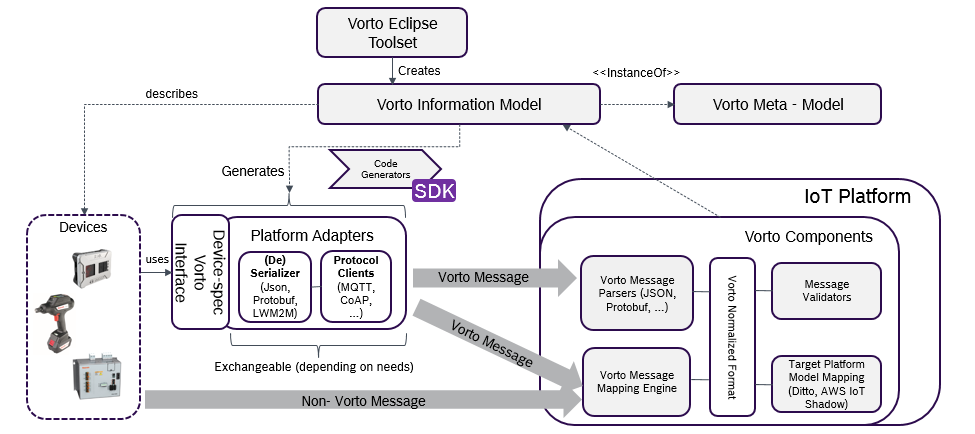

 

# Overview

[Vorto](http://www.eclipse.org/vorto) provides an **Eclipse Toolset** that lets you describe the device functionality and characteristics as **Information Models**. These models are managed in a [Vorto Repository](http://vorto.eclipse.org). [Code generators](http://vorto.eclipse.org/#/generators) convert these models into device - specific "stubs" that run on the device and send Information Model compliant messages to an IoT Backend. In order to process these messages in the IoT backend, Vorto offers a set of **technical components**, for example parsers and validators. For devices sending arbitrary, non-Vorto, messages to an IoT backend, the **Vorto Mapping Engine** helps you to execute device message transformations to IoT Platform specific meta-models, e.g. Eclipse Ditto or AWS IoT Shadow.  

Learn more about how to use Vorto in our [tutorial section](tutorials/Readme.md). 
 
 

# Getting started with Vorto

## 1. Create Account and Install Vorto Toolset

1. Log-in to [Vorto Repository](http://vorto.eclipse.org) with your Github account and complete the sign-up process.
2. Download the [Vorto Eclipse Toolset](https://marketplace.eclipse.org/content/vorto-toolset)
3. Restart Eclipse
4. Go to Eclipse Settings --> Vorto Repository and configure your Vorto username and password

## 2. Describe a device with Vorto

Switch to the Vorto perspective and start describing the functionality of a device.

## 3. Publish the Information Model

Use the Vorto Eclipse Toolset to share the model with the [Vorto Repository](http://vorto.eclipse.org), by right-clicking on the Information Model in the Vorto perspective.

## 4. Generate Source Code for Eclipse Hono

Integrate the device by sending a Vorto message to Eclipse Hono via MQTT.

1. Open the [Vorto Repository](http://vorto.eclipse.org)
2. Select your Information Model
3. Choose **Eclipse Hono Generator** and confirm with **Generate**.
4. Download the generated Device client stub and **import** it into your IDE
5. Send data to hono.eclipse.org sandbox for your preconfigured tenant and registered device ID.
	> Please take a look at the Eclipse Hono Web Site for the sandbox configuration parameters

# Developer Guide

## Generator SDK

With the **Generator SDK** you can easily create and plug-in a new Vorto Generator. [Read the Tutorial](tutorials/tutorial_create_generator.md)

Here is a list of currently supported [Vorto Generators](http://vorto.eclipse.org/#/generators)

## Repository Client API

Access models and generate code via the [Repository Client API](server/repo/repository-java-client/Readme.md)

## Data Mapping API

Learn more about, how to map arbitrary device data, such as JSON or BLE GATT, to Vorto compliant Eclipse Ditto payload. [Data Mapping API](server/repo/repository-mapping/Readme.md)  

# Documentation

- Read our [tutorials](tutorials/Readme.md)
- Read our [Vorto Documentation](http://www.eclipse.org/vorto/documentation/overview/introduction.html)

# Contact us
 - You want to chat with us ? 
 - You have problems with Vorto ? Open a [GitHub issue](https://github.com/eclipse/vorto/issues)
 - Find out more about the project on our [Vorto Homepage](http://www.eclipse.org/vorto)
 - Reach out to our developers on our [Discussion Forum](http://eclipse.org/forums/eclipse.vorto) 

# Contribute to the Project

Make sure, that you have installed [Vorto for contributors](tutorials/tutorial_vortosetup_contributors.md)

When you create a Pull Request, make sure:

1. You have a valid CLA signed with Eclipse
2. All your commits are signed off (git commit -s)
3. Your commit message contains "Fixes #`<Github issue no>`
4. Target to merge your fix is development branch

