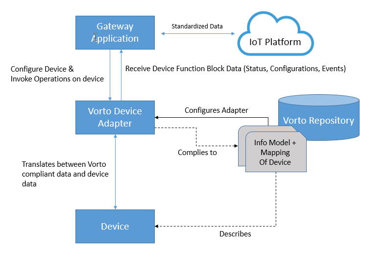

# Vorto Device Adapter

The **Vorto Device Adapter** consumes Vorto Information Models, providing a Vorto compliant interface for client applications to easily configure and receive data of a device. The adapter takes charge of translating between device specific data and the Vorto Information Model data. 

