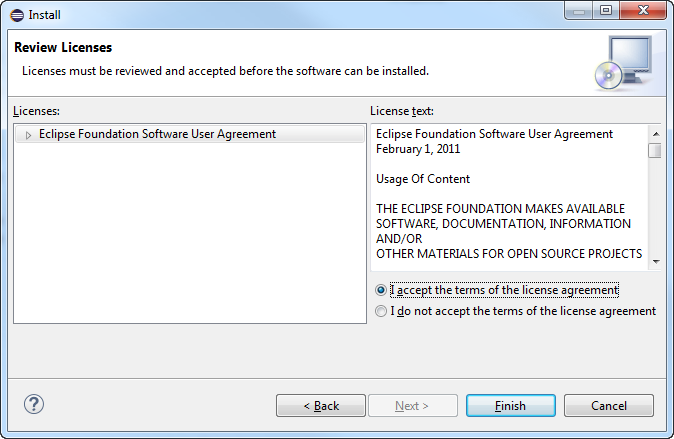
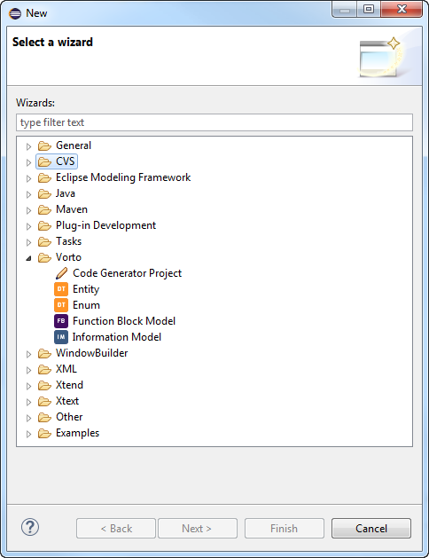

## Installing the Vorto Plug-ins

**Prerequisites**

+ You have started your IDE.

+ You have added the *Vorto plug-ins repository* or imported the Vorto plug-ins zip archive into your IDE (refer to [Getting the Vorto Plug-ins](../2.1/index.md)).

**Proceed as follows**

1. If not yet done click **Help > Install new Software...** in the main menu.  
   The **Install** dialog opens displaying the **Available Software**.

2. In the **Work with** selection list, select the entry with the *Vorto plug-ins* URL.  
   The **Available Software** list is updated.

3. In the **Available Software** list, select Vorto.  
   All containing software parts are checked.  
   

4. Click **Next** to verify the installation of *Vorto plug-ins* and its dependencies.  
   The **Install** dialog now displays the **Install Details**.   
   

5. Click **Next**.  
   The **Install** dialog now displays the **Review Licenses**.  
   

6. Select **I accept the terms of the license agreements** and click **Finish**.  
   The software is being installed.  
   After the installation is complete the **Software Updates** dialog opens.  
   

7. Click **Yes** to restart the your IDE.  
   After the restart the IDE contains the new **Vorto > Function Block Model** wizard item (**File > New > Project...**).  
   