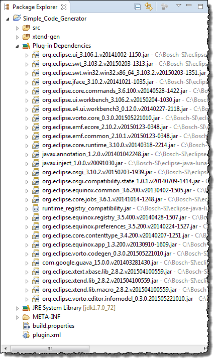

## Creating a New Code Generator Plug-in Project

**Prerequisites**

You have started your IDE.

**Proceed as follows**

1. In the main menu, click **File > New > Project > Vorto > Code Generator Project**.  
   The **New Code Generator Project** dialog opens.
2. In the field **Project name**, enter a project name.  
   
3. Click **Finish**.  
   The next sb dialog opens.
4. Enter relevant data into the fields accrording to your needs and click **Finish**.
5. If the **Open Assiciated Perspective?** dialog opens click **YES** to open the **Plug-in Development** perspective.  
   The new plug-in project is now generated. All dependencies required by the new project, as well as default classes and configuration files are generated.  
   
