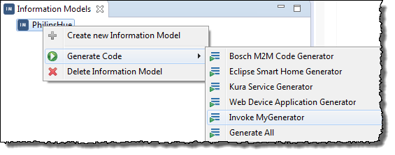
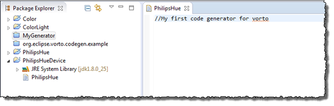

## Testing the New Code Generator

After packaging and deploying the plug-in in the eclipse plug-ins folder the code can be triggered using the context menu.

**Prerequisites**

* You have created a plug-in project. (refer to [Create a New Code Generator Plug-in Project](../3.1/index.md)).
* You have implemented the code for the plug-in project (refer to [Implementing the Code](../3.2/index.md)).

**Proceed as follows**

1. In the **Package Explorer**, select the plug-in project (`MyGenerator` in the example).
2. From the context menu, choose **Run As > Eclipse Application**.    
   A new Eclipse instance is started.
3. Switch to the **Vorto** perspective.
4. Create an information model (e.g., `PhilipsHue`) and select it.
5. From the context menu, choose **Generate Code > Invoke MyGenerator**.  
     
   A new project with name `PhilipsHueDevice` is generated.  
   