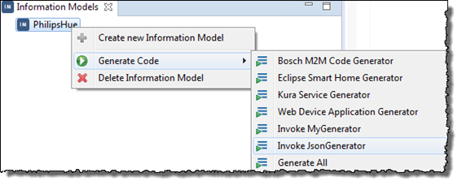
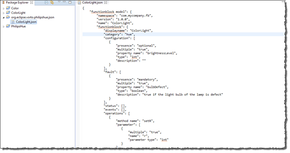

## Runing the Example Code Generator

An example code generator is provided for you to understand code generator easier. The implementation convert all function block models in a information model to json format. Please follow below steps to run example code generator.

**Proceed as follows**

1. In the main menu, click **File > New > Project > Vorto > Code Generator Project**.   
   The **New Code Generator Project** dialog opens.
2. In the field **Project name**, enter a project name. Also check the option **Add Example Code Generator Project**.  
     
   Beside your project, an example code generator project **org.eclipse.vorto.codegen.example** will also be generated.
3. Create an information model (e.g., `PhilipsHue`).
4. Create one or more function block(s) and add it or them to the information model. 
5. From the context menu, choose **Generate Code > Invoke JsonGenerator**.  
     
   A new project with name `PhilipsHueDevice` is generated.  
   