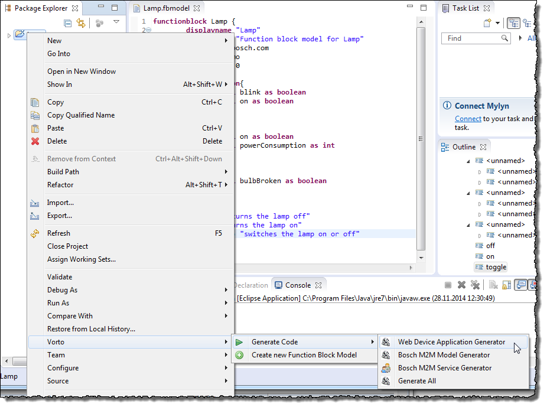
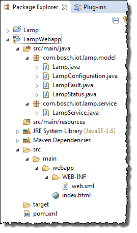

## Generating a Web Device Application Using Sample Code Generator

**Prerequisites**

You have created a plug-in project (refer to [Creating and Editing a Function Block Definition](../4.1/index.md)).

**Proceed as follows**

1.  In Java perspective, select the function block you want to generate code from.
2. From the context menu, choose **Vorto \> Generate Code \> Web Device Application Generator**.    
      
   A Web application project LampWebapp will be generated.
3. Select the project LampWebapp. From the context menu, choose **Maven \> Update Project** to resolve the compilation errors.
4. In the opening **Update Maven Project** dialog, click **OK**.     
   The generated project contains following resources:    
     
   - POJO Java classes corresponding to the function block model created (with package com.bosch.iot.lamp.model). For the purpose of simplicity, only primitive types are generated.    
     - `Lamp.java`  
     - `LampConfiguration.java`  
     - `LampFault.java`  
     - `LampStatus.java`  
   - One service class that support REST operation (e.g., retrieve of device information or perform operation on device, with package `com.bosch.iot.lamp.service`).  
     `LampService.java`
   - An xml file that allows the application to run as a web application.  
     `web.xml`
   - An html file that provides visualization of a device.  
     `index.html`
   - A pom file that allows the package to run the application as web application. Additionally, it also contains configuration to allow the application to launch from Eclipse using jetty server.  
     `pom.xml`