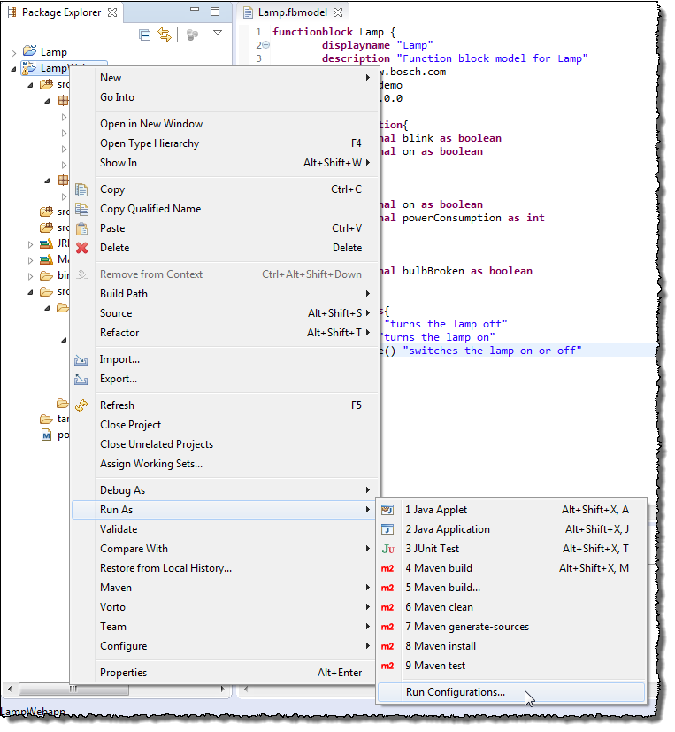
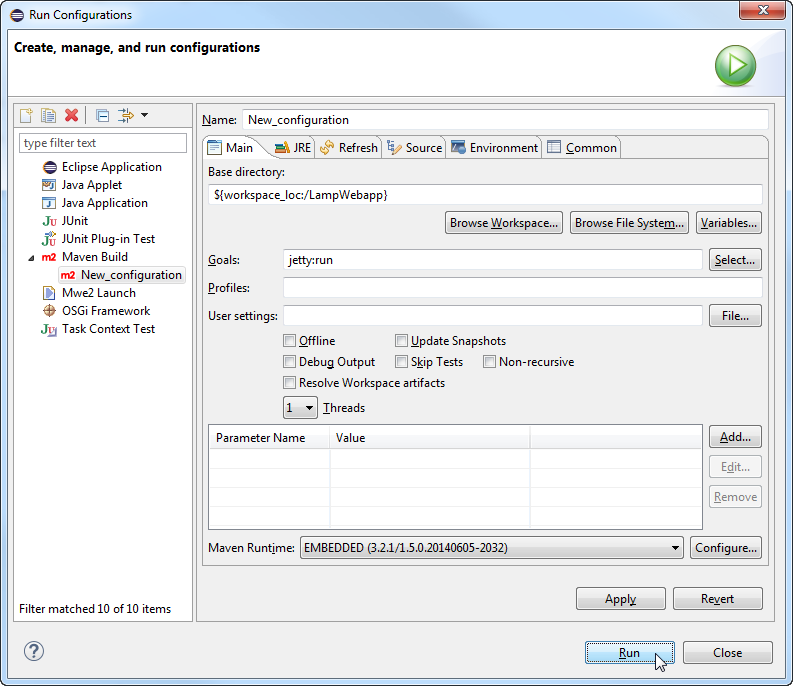
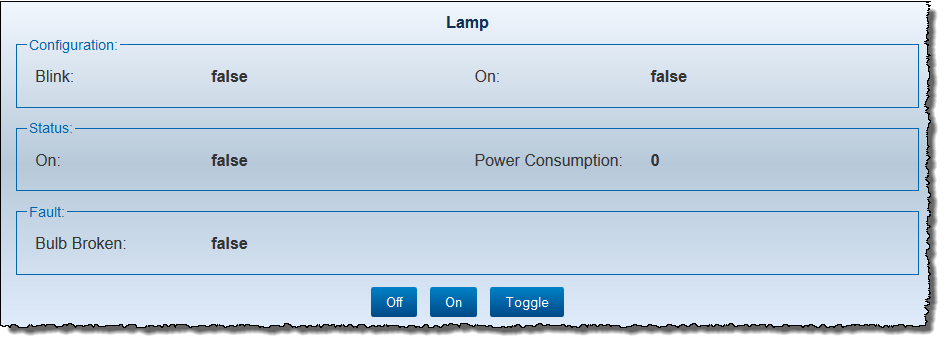

## Running the Generated Web Device Application

**Prerequisites**

- You have created a plug-in project (refer to [Creating and Editing a Function Block Definition](../4.1/index.md)).
- You have generated a Web device application (refer to [Generating a Web Device Application Using Sample Code Generator](../4.2/index.md)).

**Proceed as follows**

1.  Select the project `LampWebapp`. From the context menu, choose **Run As > Run configurations**.    
       
    The dialog **Run Configurations** opens.    
2. In the configuration list on the left side, expand **Maven Build** and click the sub item **New_configuration**.   
    A configuration form opens.
3. Change the entry in the **Name** field to `Lamp_configuration`.    
4.   In the **Base directory** field, enter `${workspace_loc:/LampWebapp}`.
5. In the **Goals** field, enter `jetty:run`.
6. Click the **Run** button.   
      
   Wait a few seconds for jetty server to start. Upon successfully start, the message `[INFO] Started Jetty Server` should be displayed in the Eclipse console.
7. Open the URL `http://localhost:8080/Lamp/index.html` in your browser to see the HTML representation of your device over Web.  
      