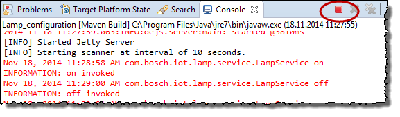
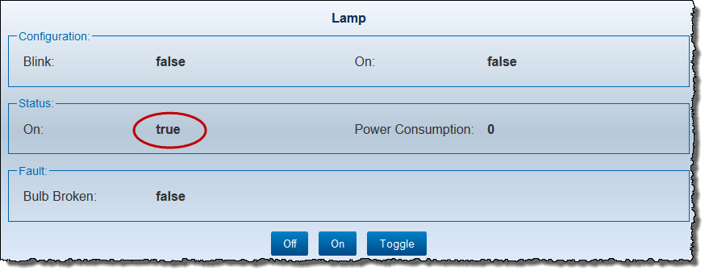

## Modifying the Behavior of the Generated Web Device Application

The default REST service class `LampService` generated provides a service to return default properties of the lamp instance. It also provides a service to handle an operation request. However it only contains dummy log statements. If you click the **On** button the status of **Lamp** is still shown as **false**. The service does not update the status of the lamp instance.

**Prerequisites**

* You have created a plug-in project (refer to [Creating and Editing Model Definition](../4/4.1/index.md)).
* You have generated a Web device application (refer to [Generating a Web Device Application Using Sample Code Generator](../4/4.2/index.md)).

**Proceed as follows**

1.  Update the service method `on()` of class `LampService` to update the lamp instance status.  

        @PUT
        @Path("/on")
        public void on() {
          lampinstance.getStatus().setOn(true);
        }

2. Stop the application by clicking the red square beside the **Console** tab in your IDE.   
   
3. Start the application again by selecting the project `mylightingdevice-webapp` and choosing **Run As > Run configurations** from the context menu.
4. In your browser, open the URL `http://localhost:8080/mylightingdevice-webapp/index.html` again.
5. Click the **On** button.  
   The **On** status is changed to **true**.   
   