sky# Vorto User Guide

### Version 0.4 Milestone 1

### Bosch Software Innovations

    Copyright (c) 2015 Bosch Software Innovations GmbH and others.
    All rights reserved. This program and the accompanying materials
    are made available under the terms of the Eclipse Public License v1.0
    and Eclipse Distribution License v1.0 which accompany this distribution.
    The Eclipse Public License is available at
    http://www.eclipse.org/legal/epl-v10.html

    The Eclipse Distribution License is available at
    http://www.eclipse.org/org/documents/edl-v10.php.

    Contributors:
    Bosch Software Innovations GmbH - Please refer to git log  

-----

# Contents

- [Introduction](#introduction)  
  - [Overview](#overview)  
  - [Features](#features)  
  - [System Requirements](#system-requirements)  
- [Installing the Plug-ins](#installing-the-plug-ins)  
  - [Getting the Vorto Plug-ins](#getting-the-vorto-plug-ins)  
  - [Installing the Vorto Plug-ins](#installing-the-vorto-plug-ins)  
  - [Upgrading the Vorto Plug-ins](#upgrading-the-vorto-plug-ins)  
  - [Vorto Perspective](#vorto-perspective)  
  - [Domain-specific Language](#domain-specific-language)  
- [Defining a Data Type](#defining-a-data-type)  
  - [Data Types](#data-types)  
  - [Creating a New Data Type](#creating-a-new-data-type)  
  - [Editing a Data Type](#editing-a-data-type)
- [Defining a Function Block](#defining-a-function-block)  
  - [Function Blocks](#function-blocks)  
  - [Creating a New Function Block](#creating-a-new-function-block)  
  - [Editing a Function Block](#editing-a-function-block)  
- [Defining an Information Model](#defining-an-information-model)  
  - [Information Models](#information-models)  
  - [Creating a New Information Model](#creating-a-new-information-model)  
  - [Editing an Information Model](#editing-an-information-model)  
- [Defining an Information Model Mapping](#defining-an-information-model-mapping) 
- [Code Generators](#code-generators)  
  - [Code Generators Overview](#code-generators-overview)  
  - [Example Code Generator - Web Device Application](#example-code-generator-web-device-application)  
  - [Example Code Generator - Bosch M2M Platform](#example-code-generator-bosch-m2m-platform)  
- [Uninstalling the Vorto Plug-ins](#uninstalling-the-vorto-plug-ins)  
- [Troubleshooting](#troubleshooting)  
  - [Installation Issues](#installation-issues)  
  - [General Issues](#general-issues)  
- [Data Type Model DSL Reference](#data-type-model-dsl-reference)  
- [Function Block Model DSL Reference](#function-block-model-dsl-reference)  
  - [Function Block DSL Syntax](#function-block-dsl-syntax)  
  - [Function Block DSL Semantics](#function-block-dsl-semantics)  
- [Information Model DSL Reference](#information-model-dsl-reference)  
  - [Information Model DSL Syntax](#information-model-dsl-syntax)  
  - [Information Model DSL Semantics](#information-model-dsl-semantics)  
- [Information Model Mapping DSL Reference](#information-model-mapping-dsl-reference)  
  - [Information Model Mapping DSL Syntax](#information-model-mapping-dsl-syntax)  
  - [Information Model Mapping DSL Semantics](#information-model-mapping-dsl-semantics)  

-----

# Introduction

This section details the following topics: 

[Overview](#overview)  
[Features](#features)  
[System Requirements](#system-requirements)

## Overview

Vorto is an open source tool that allows for creating and managing technology agnostic, abstract device descriptions, so called information models. Information models describe the attributes and the capabilities of real world devices. These information models can be managed and shared within the Vorto repository. In addition Vorto provides a code generator extension point where code generators can be plugged in. 

## Features

Vorto plug-ins provide the following features:

**Datatype (Entity/Enum) wizard**  
 Vorto provides an Eclipse wizard to create a new data type (Entity or Enum). You can use auto-completion and validation to update data types. 

**Function block model wizard**  
Vorto provides an Eclipse project wizard to create a function block model project containing all necessary resources.

**Information model wizard**  
Information models represent the capabilities of a particular type of device in its entirety. An information model contains one or more function blocks. Vorto provides an UI wizard to create an information model project and all required resources.

**DSL editors**  
The new Domain-specific Language (DSL) is a simple way to define and read datatype models, function block models and information models without the need to understand XML, XSD or even Java. On-the-fly auto-completion and validation lets you create the named models even faster than ever.

Datatype model DSL editor:  
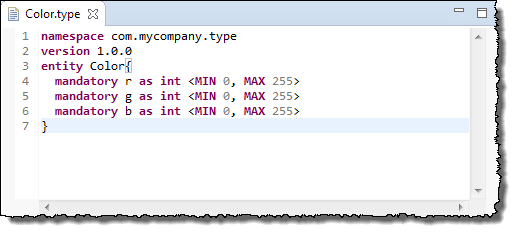

Function block model DSL editor:  
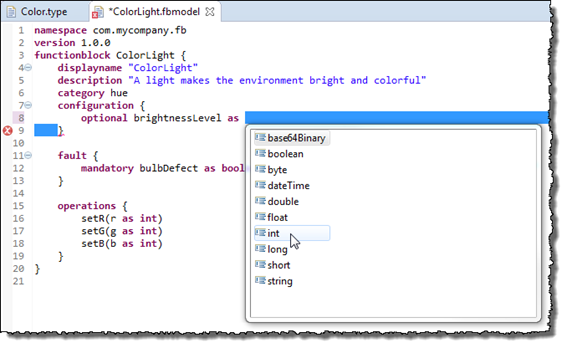

Information model DSL editor:  

**Vorto perspective**  
The Vorto perspective as a new Eclipse perspective simplifies the view and, thus, the work with the more abstract models.

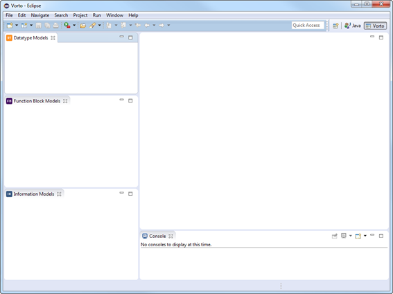

**Information model mapping**  
Vorto provides Mapping DSL editor for user to create customized mapping that map a vorto information model to another platform model. 

**Example code generators**  
Vorto provides several code generators, so that the user can generate code based on the select information model. Vorto also provides a code generator extension point, so that the user can create his own code generator.

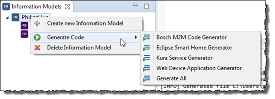

##System Requirements

For the use of the Vorto plug-ins the following software requirements must be met:

- IDE
  - Eclipse (Luna or higher)
  - Eclipse [Xtext plug-in](http://download.eclipse.org/modeling/tmf/xtext/updates/composite/releases/) 2.7.\* (Xtext Redestributable)
- [Oracle Java SE 7](http://www.oracle.com/technetwork/java/javase/downloads/)  

<table class="note">
  <tr>
    <td class="notesign"></td>
    <td>Validity period will endure at the most as long as the version of infrastructure software of third party manufacturers defined in this document (Operating Systems, Java, etc.) is publicly and officially supported. We support the most recent patch releases of the respective software product version.</td>
  </tr>
</table>

-----

# Installing the Plug-ins

This section details the following topics:

[Getting the Vorto Plug-ins](#getting-the-vorto-plug-ins)  
[Installing the Vorto Plug-ins](#installing-the-vorto-plug-ins)  
[Upgrading the Vorto Plug-ins](#upgrading-the-vorto-plug-ins)  
[Vorto Perspective](#vorto-perspective)  
[Domain-specific Language](#domain-specific-language)  

## Getting the Vorto Plug-ins

The Vorto plug-ins are hosted in the Bosch *Vorto plug-ins repository*. The URL to this repository is [https://eclipse.org/vorto/update/](https://eclipse.org/vorto/update/ "https://eclipse.org/vorto/update/"). You must add this repository to your IDE or, alternatively, import the Vorto plug-in zip archive to get the Vorto plug-ins.

**Proceed as follows**

1. Start your IDE (Eclipse Luna or later).  
2. In the main menu, click **Help > Install new Software...**.  
   The **Install** dialog opens displaying the **Available Software**.
3. Click the selection button of the **Work with** selection list field to check if the *Vorto plug-ins repository* is already present.  
     
   If the *Vorto plug-ins repository* URL is displayed in the expanding list, you can end the procedure here.  
   Otherwise proceed with the next step.
4. Add the *Vorto plug-ins repository* URL:  
   a. Click the **Add...** button beside the **Work with** field. The **Add Repository** dialog opens.  
   b. Enter a Name (optionally, e.g., *Vorto*).  
   c. Enter the *Vorto plug-ins repository* URL [https://eclipse.org/vorto/update/](https://eclipse.org/vorto/update/ "https://eclipse.org/vorto/update/") into the **Location** field.  
   d. Click **OK**.

In the **Install** dialog, the available software list is updated and now contains the software found in the added repository and in the installed archive, respectively.

<table class="note">
  <tr>
    <td class="notesign"></td>
    <td>The update of the available software list may take a while.</td>
  </tr>
</table>

## Installing the Vorto Plug-ins

**Prerequisites**  

- You have started your IDE.  
- You have added the *Vorto plug-ins repository* to your IDE (refer to [Getting the Vorto Plug-ins](#getting-the-vorto-plug-ins)).

**Proceed as follows**  

1. If not yet done click **Help > Install new Software...** in the main menu.  
   The **Install** dialog opens displaying the **Available Software**.  
2. In the **Work with** selection list, select the entry with the *Vorto plug-ins* URL.  
     
   The **Available Software** list is updated.  
3. In the **Available Software** list, select Vorto.  
   All containing software parts (features) are checked.  
   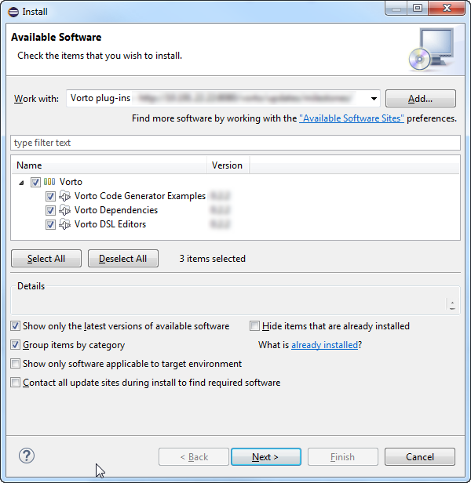  
4. Click **Next** to verify the installation of *Vorto plug-ins* and its dependencies.  
   The **Install** dialog now displays the **Install Details**.  
   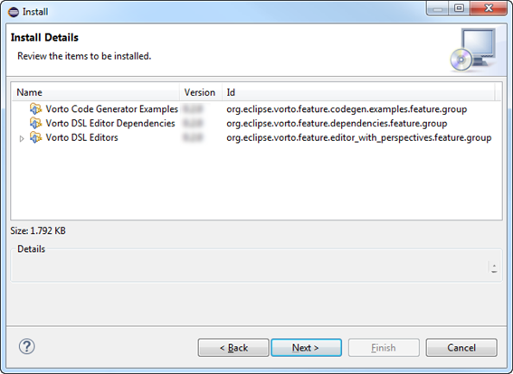  
5. Click **Next**.  
   The **Install** dialog now displays the **Review Licenses**.  
     
6. Select **I accept the terms of the license agreements** and click **Finish**.  
   The software is being installed.  
7. If the **Security Warning** dialog opens click **OK**.  
   After the installation is complete the **Software Updates** dialog opens.  
     
8. Click **Yes** to restart the your IDE.  
   After the restart the IDE contains the **Vorto** project group with several new project wizard items (**File > New > Project...**).  
     

<table class="note">
  <tr>
    <td class="notesign"></td>
    <td>In case the installation is unsuccessful, uninstall the previous version of the Vorto and install it again.</td>
  </tr>
</table>

## Upgrading the Vorto Plug-ins

This section lists the steps required to upgrade the Vorto plug-ins.

**Prerequisites**  

- You have a working installation of the previous version of the Vorto plug-ins.  
- This assumes that your IDE version is in the Vorto supported versions, and stable releases of *Xtext* and *M2E* have been installed (for more information refer to [System Requirements](#system-requirements)).
- You have started your IDE.  

**Proceed as follows**  

1. Click **Help > Install new Software...** in the main menu.  
   The **Install** dialog opens displaying the **Available Software**.  
2. In the **Work with** selection list, select the entry with the *Vorto plug-ins* URL.  
   The **Available Software** list is updated.  
3. In the **Available Software** list, select `Vorto`.  
   All containing software parts (features) are checked.   
4. Click **Next** to verify the installation of *Vorto plug-ins* and its dependencies.  
   The **Install** dialog now displays the **Install Details**.  
5. If the plug-ins are up-to date the **Finish** button remains inactive. End here by clicking **Cancel**.
5. Otherwise, click **Next**.  
   The **Install** dialog now displays the **Review Licenses**.
6. Select **I accept the terms of the license agreements** and click **Finish**.  
   The software is being installed.  
7. If the **Security Warning** dialog opens click **OK**.  
   After the installation is complete the **Software Updates** dialog opens.  
8. Click **Yes** to restart the your IDE.  

## Vorto Perspective

The Vorto prospective has three tabs:

- **Datatype Models** for managing data types.  
- **Function Block Models** for managing function block models.  
- **Information Models** for managing information models.

If the **Vorto** button is not visible you must open the Vorto perspective.

**Proceed as follows**

1. In the main menu, click **Window > Open Perspective > Other...**.  
   The **Open Perspective** dialog opens.
2. Select `Vorto` and click **OK**.
   The **Vorto** button appears in the menu bar area for open perspectives.

To switch to the Vorto perspective just click the **Vorto** button in the menu bar area for open perspectives.

## Domain-specific Language

In the function block editor, you use the domain-specific language (DSL). The DSL uses a small set of elements so you can describe function blocks in an easy way. For a detailed language specification refer to [Function Block DSL Reference](#function-block-model-dsl-reference).

-----

# Defining a Data Type

This section details the following topics:  

[Data Types](#data-types)  
[Creating a New Data Type](#creating-a-new-data-type)  
[Editing a Data Type](#editing-a-data-type)

## Data Types

A data type is a reusable entity that can be shared between function blocks.

## Creating a New Data Type

**Prerequisites**  

- You have started your IDE.  
- You have selected the Vorto perspective.

**Proceed as follows**

1. Right-click in the **Datatype Models** tab and choose **Create new Entity** from the context menu, and the **Create entity type** dialog opens:  
   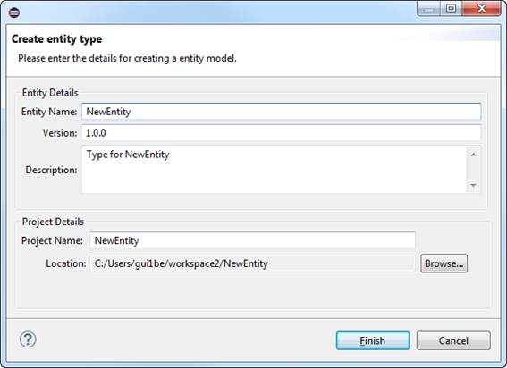  
2. Enter `Color` as **Entity Name**.  
3. Click on **Finish**.  
   The new data type (entity) `Color` is created and the data type model DSL source file (`Color.type`) is generated.  
   

## Editing a Data Type

**Prerequisites**

You have created a data type (refer to [Create a new Data Type](#creating-a-new-data-type)).

**Proceed as follows**

1. In the **Datatype Models** tab, click the data type entity you want to edit, e.g., `Color`.  
   The DSL editor for the file `Color.type` opens.
2. In the DSL editor, edit the entity according to your needs.

**Example**

	namespace com.mycompany.type
	version 1.0.0
    entity Color{
      mandatory r as int <MIN 0, MAX 255>
      mandatory g as int <MIN 0, MAX 255>
      mandatory b as int <MIN 0, MAX 255>
    }

-----

# Defining a Function Block

This section details the following topics:       

[Function Blocks](#function-blocks)  
[Creating a New Function Block](#creating-a-new-function-block)  
[Editing a Function Block](#editing-a-function-block)

## Function Blocks

A function block provides an abstract view on a device to applications that want to employ the devices' functionality. Thus, it is a consistent, self-contained set of (potentially re-usable) properties and capabilities.

For more detailed concept of function block please refer to section *Function Block Specification* in the *Vorto Developer Guide*.

A function block definition is typically structured as follows:

- **Properties**  
    - Status  
    - Configuration  
    - Fault  
    - Events  
- **Services** - they represent the functional operations offered by the device.

## Creating a New Function Block

**Prerequisites**  

- You have started your IDE.  
- You have selected the the Vorto perspective.

**Proceed as follows**

1.  Right-click in the **Function Block Models** tab and choose **Create new Function Block** from the context menu:  
  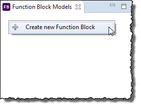  
   Alternatively, you can click **File > New > Project...**. in the main menu. In the opening **New Project** dialog select **Vorto > Function Block Model** and click **Next**.  
   The **Create Function Block** dialog opens.  
   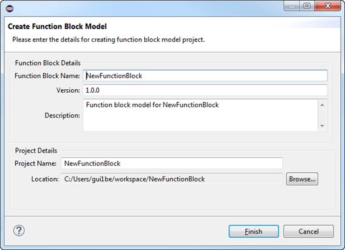

2. Adjust the entries for the input fields **Function Block Name**, **Version**, **Description** and **Project Name** according to your needs and click **Finish**.  
   The function block model DSL source file (with suffix .fbmodel) is generated and displayed in the function block editor. The file contains a complete structure according the DSL syntax with the values given in the preceding step.  
   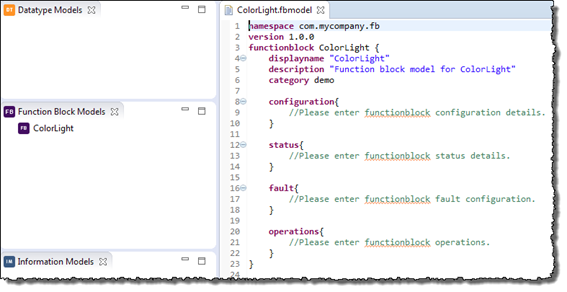

## Editing a Function Block

**Prerequisites**

You have created a function block project (refer to [Creating a New Function Block](#creating-a-new-function-block)).

**Proceed as follows**

Edit the function block project by extending the generated source file in the function block DSL editor.

**Example**

	namespace com.mycompany.fb
	version 1.0.0
    functionblock Lamp {
      displayname "Lamp"
      description "A lamp makes the environment bright"
      category demo
      
      configuration{
        mandatory blinking as boolean "if the lamp is currently blinking or not"
        mandatory on as boolean "if the lamp is currently switched on"
        mandatory powerConsumption as int
          "the amount of power the lamp is consuming"  
      }
     
      fault{
        mandatory bulbDefect as boolean
          "true if the light bulb of the lamp is defect"
      }

      operations{
        blink(blinkType as int) "sets the blinking type for the lamp"
        getPowerConsumption() returns int
          "gets the amount of power being consumed by the lamp"
        isOn() returns boolean "checks if the lamp is switched on"
        off() "turns the lamp off"
        on() "turns the lamp on"
        stopBlinking() "stops the blinking of the lamp"
        toggle() "switches the lamp on or off"
        toggleWithDelay(delayInSeconds as int)
          "switches the lamp on or off with a delay of the specified seconds"
      }
    }

-----

# Defining an Information Model

This section details the following topics:

[Information Models](#information-models)  
[Creating a New Information Model](#creating-a-new-information-model)  
[Editing an Information Model](#editing-an-information-model)  

## Information Models

Information models represent the capabilities of a particular type of device entirety. An information model contains one or more function blocks.

## Creating a New Information Model

**Prerequisites**  

You have create a function block model (refer to [Creating a New Function Block Project](#creating-a-new-function-block)).

**Proceed as follows**

1. Right-click in the **Information Models** tab and choose **Create new Information Model** from the context menu:  
   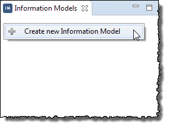  
   The **Create Information Model** dialog opens:  
   
2. Enter, e.g., `MyLightingDevice
3. ` as **Information Model Name**.  
3. Click **Finish**.
   The information model DSL source file (with suffix .infomodel) is generated and displayed in the information model editor. The file contains a complete structure according the DSL syntax with the values given in the preceding step.  
   

## Editing an Information Model

**Prerequisites**

You have created an information model (refer to [Creating a new Information Model](#creating-a-new-information-model)).

**Proceed as follows**

Edit the information model by extending the generated source file in the information model DSL editor.

**Example**

1. Create a new function block model named `Switchable` and update it according the following:

        namespace com.mycompany.fb
        version 1.0.0
        functionblock Switchable {
            displayname "Switch"
            description "Function block model for Switch"
            category demo

            status {
                optional on as boolean
            }

            operations {
                on()
                off()
                toggle()
            }
        }

2. Create a new function block model named `ColorLight` and update it according the following:

        namespace com.mycompany.fb
        version 1.0.0
		using com.mycompany.type.Color;1.0.0
        functionblock ColorLight {
            displayname "ColorLight"
            description "A light makes the environment bright and colorful"
            category hue

            configuration {
                optional brightnessLevel as int
				optional defaultColor as Color
            }

            fault {
                mandatory bulbDefect as boolean "true if the light bulb of the lamp is defect"
            }

            operations {
                setR(r as int)
                setG(g as int)
                setB(b as int)
            }
        }

3. Drag and drop the two created and edited function blocks from the **Function Block Models** tab into the information model **MyLightingDevice** in the **Information Models** tab to create the reference.  
   
4. Update the information model according the following:

        namespace com.mycompany
        version 1.0.0
        using com.mycompany.fb.Switchable ; 1.0.0
        using com.mycompany.fb.ColorLight ; 1.0.0
        infomodel MyLightingDevice {
                displayname "MyLightingDevice"
                description "Information model for MyLightingDevice"
                category demo

                functionblocks {
                        switchable as Switchable colorlight as ColorLight
                }
        }

-----

# Defining a Model Mapping

Vorto allows the user to define mapping rules to map Vorto models to other target platform domain models.

**Prerequisites**

 - You have followed previous steps to create Entity, Function Block, and Information models.
 - You have selected the Java perspective.

## Define a Entity Mapping
In entity mapping, you can define mapping rules for entity types. 
**Proceed as follows**
			
1. In the data type project Color, navigate to the folder `src/models`.

2. Select the folder `models` and right-click and choose **New > File** from the context menu.  
   The **New File** dialog opens.

3. Enter a file name describing your actual platform with the suffix `.mapping`, e.g., `MyColor.mapping`.

4. Edit the mapping file according to your needs.

**Example of an entity mapping file**

	namespace com.mycompany.type
	version 1.0.0
	using com.mycompany.type.Color ; 1.0.0
	
	entitymapping MyColor {
	
		from Color.version
		to MyColor with { Revision : "Rev-" }
	
		from Color.r, Color.g, Color.b
		to MyColor with { r : "Red", g : "Green", b : "Blue" }
	}
-----

## Define a Function Block Mapping
In function block model mapping, you can define mapping rules for function block model attributes, as well as detailed function block properties, and data types used in function blocks.

**Proceed as follows**

1. In the function block project you want to create the mapping for (`ColorLight` in the example), navigate to the folder `src/models`.

2. Select the folder `models` and right-click and choose **New > File** from the context menu.  
   The **New File** dialog opens.
3. Enter a file name describing your actual platform with the suffix `.mapping`, e.g., `MyColorLight.mapping`.

4. Edit the mapping file according to your needs.
   Please note that in addition to map function block elements to target Stereo Type element, you can also specify to refer function block properties to use an imported entity mapping (MyColor.mapping).

**Example of a function block mapping file**

	namespace com.mycompany
	version 1.0.0
	using com.mycompany.fb.ColorLight ; 1.0.0
	using com.mycompany.type.MyColor; 1.0.0
	functionblockmapping MyColorLight {
	
		from ColorLight.displayname
		to TargetDisplayName
	
		from ColorLight.configuration.defaultColor to reference MyColor
		
		from ColorLight.operation.setR, ColorLight.operation.setG, ColorLight.operation.setB
		to channelType with { Attribute : "color" }
	
	}

-----

## Define an Information Model Mapping
In information model mapping, you can define mapping rules for information model attributes, as well as detailed function block properties for each function block variable, and data types used in function blocks.

**Proceed as follows**

1. In the information model project you want to create the mapping for (`MyLightingDevice` in the example), navigate to the folder `src/models`.

2. Select the folder `models` and right-click and choose **New > File** from the context menu.  
   The **New File** dialog opens.

3. Enter a file name describing your actual platform with the suffix `.mapping`, e.g., `SmartHome.mapping`.

4. Edit the mapping file according to your needs.
   Please note that in addition to map information model elements to a stereo type, you can also specify to refer information model function block  to use an imported function block mapping (MyColorLight.mapping).

**Example of an information model mapping file**

	namespace com.mycompany
	version 1.0.0
	using com.mycompany.MyLightingDevice ; 1.0.0
	using com.mycompany.fb.MyColorLight ; 1.0.0
	
	infomodelmapping SmartHome {
	
		from MyLightingDevice.displayname
		to TargetDisplayName
	
		from MyLightingDevice.switchable
		to MySwitch with { Icon : "switch.png" }
	
		from MyLightingDevice.colorlight
		to reference MyColorLight
	}

-----

# Code Generators

This section details the following topics:

[Code Generators Overview](#code-generators-overview)  
[Example Code Generator - Web Device Application)](#example-code-generator-web-device-application)  
[Example Code Generator - Bosch M2M Platform](#example-code-generator-bosch-m2m-platform)  

## Code Generators Overview

By means of code generators, you can create information model based code artifacts which you can use in specific solutions. Vorto provides wizards to support the creation of new code generators. Example code generators are also part of the Vorto project. To implement your own code generators, please refer to the *Vorto Developer Guide*.

The examples of the following sections explain the *Code Generator* concept.

## Example Code Generator - Web Device Application

This section describes the use of an example code generator to generate a Web Device Application.

**Prerequisites**

- You have created the information model project `MyLightingDevice` (refer to [Creating a new Information Model](#creating-a-new-information-model) and [Editing an Information Model](#editing-an-information-model)).
- You have selected the Vorto perspective.
- Eclipse [M2E plug-in](http://download.eclipse.org/technology/m2e/releases) 1.5.\* (can already be packaged with Eclipse Luna)  

<table class="note">
  <tr>
    <td class="notesign"></td>
    <td>In order to use a repository you have to adjust the maven <code>settings.xml</code> file by adding a new profile.</td>
  </tr>
</table>

<table class="note">
  <tr>
    <td class="notesign"></td>
    <td>In the Eclipse preferences (<b>Maven > User Settings > User Settings</b>), add the absolute path to the maven <code>settings.xml</code> file.</td>
  </tr>
</table>

**Proceed as follows**

Select the information model project created (`MyLightingDevice`), right-click and choose **Generate Code > Web Device Application Generator** from the context menu.

The Web application project `MyLightingDevice-webapp` is generated and Eclipse switches to the Java perspective.

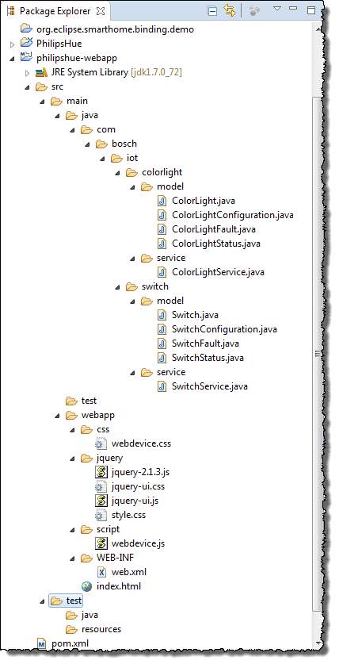

<table class="note">
  <tr>
    <td class="notesign"></td>
    <td>There might be some errors on the generated project. You can select the project, then right-click to open the context menu and click <b>Maven-Update Project...</b> to resolve the errors.</td>
  </tr>
</table>

The following items are generated:

- POJO Java classes corresponding to the function block model created (with package `com.bosch.iot.<functionblock>.model`). For the purpose of simplicity, only primitive types are generated.
- One service class that support REST operation (e.g., retrieve of device information or perform operations of the device with package `com.bosch.iot.<functionblock>.service`)
- An XML file that allows the application to run as a web application.  
   `Web.xml`
- An html file that provides visualization of a device.  
   `Index.html`
- A POM file that allows the package to run the application as web application. Additionally it also contains configurations for launching the application from Eclipse using jetty server.  
   `pom.xml`

### Running the Generated Web Device Application

Run the generated Web device application to visualize it.
	
**Prerequisites**  

- You have create a Web device application (refer to [Example Code Generator - Web Device Application](#example-code-generator-web-device-application)).
- You have selected the ava perspective.

**Proceed as follows**

1. In the Package Explorer, select the Web device application project (`mylightingdevice-webapp` in the example). From the context menu, choose **Run As > Run Configurations...**.  
   The **Run Configurations** dialog opens.
2. In the configuration list on the left side, expand **Maven Build** and click the sub item **New_configuration**.  
   A configuration form opens.
3. Change the entry in the **Name** field to, e.g., `MyLightingDevice_configuration`.
4. In the **Base directory** input field, enter `${workspace_loc}/mylightingdevice-webapp`.
5. In the **Goals** input field, enter `jetty:run`.
6. Click **Run**.  
   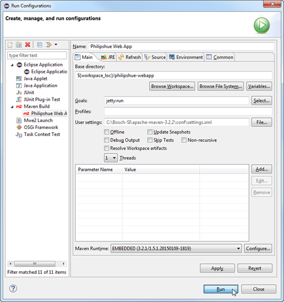  
   Wait a few seconds for jetty server to start. Upon successfully start, message `[INFO] Started Jetty Server` should be displayed in the Eclipse console.
7. Open the URL `http://localhost:8080/mylightingdevice-webapp/index.html` in your browser to see the HTML representation of your device over Web.  
   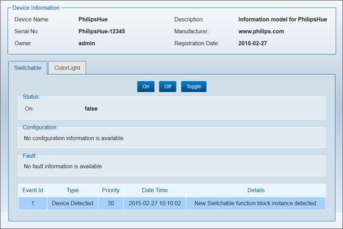

### Modifying the Behavior of the Generated Web Device Application

The default REST service class `Switchable` generated provides a service to return default properties of the lamp instance. It also provides a service to handle an operation request. However it only contains dummy log statements. If you click the **On** button the status of Lamp is still shown as **false**. The service does not update the status of the lamp instance.

**Prerequisites**  

- You have created an information model mapping with target platform set to "smarthome" (refer to [Editing an Information Model](#editing-an-information-model)).
- Eclipse smart home generator is provided to generate eclipse thing types based on Vorto information model.

**Proceed as follows**

1. Update the service method **on()** of class `Switchable` (file `SwitchableService.java`) to update the device instance status.

        @PUT
        @Path("/on")  
        public void on() {  
            switchableinstance.getStatus().setOn(true);  
        }

2. Stop the application by clicking the red square beside the Console tab in your IDE.
3. Start the application again by selecting the project and choosing **Run As > Run configurations** from the context menu.
4. In your browser, open the URL `http://localhost:8080/mylightingdevice-webapp/index.html` again.
5. Click the **On** button.  
The **On** status is changed to **true**.

## Example Code Generator - Bosch M2M Platform

A function block model contains necessary artifacts (e.g., Java representation of the model) which can be used by the M2M Agent Hub and the Central Registry at run time.

**Prerequisites**  

- You have created and edited a function block project (refer to [Creating a New Function Block](#creating-a-new-function-block) and [Editing a Function Block](#editing-a-function-block)).  
- You have selected the Vorto perspective.

<table class="note">
  <tr>
    <td class="notesign"></td>
    <td>Currently, there is the following limitation: 
    Although you can drop multiple function blocks in an information model, the Bosch M2M code generator considers only one function block model in an information model (namely the first).</td>
  </tr>
</table>

**Proceed as follows**

1. In the **Function Block Models** browser, select the function block project you want to generate code for.
2. Right-click to open the context menu and click **Generate Code > Bosch M2M Model Generator**.  
   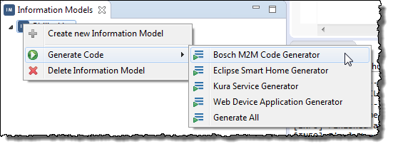  
   The following is generated and Eclipse switches to the Java perspective:
   - The M2M model project (`<your_function_block>-model`).
   - The M2M service project (`<your_function_block>-service`).
   - The dummy base driver project (`dummy-basedriver`).  

<table class="note">
  <tr>
    <td class="notesign"></td>
    <td>There might be some errors on the generated project. You can select the project, then right-click to open the context menu and click <b>Maven-Update Project...</b> to resolve the errors.</td>
  </tr>
</table>

<table class="note">
  <tr>
    <td class="notesign"></td>
    <td>Please note that the default generated function block service uses the latest M2M API that exist in maven repository for dependency. If your target platform is not the latest (e.g., latest is 2.2.5 but your target platform is running 2.2.0), then you need to update the property <code>m2m.version</code> in the <code>pom.xml</code> file in your service project to your actual M2M version. Then update your project. You can check the actual M2M version used by expanding maven dependencies from your service project.</td>
  </tr>
</table>

-----

# Uninstalling the Vorto Plug-ins

**Prerequisites**

You have started your IDE.

**Proceed as follows**

1. In the main menu click **Help > Install new Software...**.  
   The **Install** dialog opens displaying the **Available Software**.  
3. Click the **What is already installed?** link.  
   The **Installation Details** dialog opens.  
   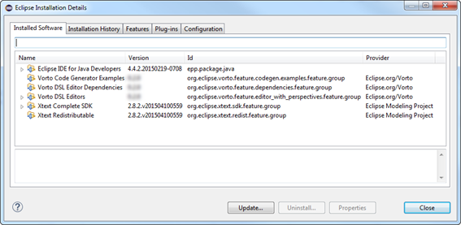  
3. If necessary, click the **Installed Software** tab.
4. Select the Software belonging to the Vorto plug-ins (refer to [Installing the Vorto Plug-ins](#installing-the-vorto-plug-ins)) and click the **Uninstall...** button.  
   The **Uninstall** dialog opens.
5. Click **Finish** to uninstall the Vorto plug-ins.  
   After the uninstallation is complete, the **Software Updates** dialog opens.  
     
6. Click **Yes** to restart your IDE.  
   After the restart, the IDE contains no **Vorto** group anymore (**File > New > Project...**).

-----

# Troubleshooting

This section details the following topics: 

[Installation Issues](#installation-issues)  
[General Issues](#general-issues)

## Installation Issues

This section details the following topics:

[I Get an Error During the Installation That it Cannot Perform the Operation and is Trying for Alternative Solutions](#i-get-an-error-during-the-installation-that-it-cannot-perform-the-operation-and-is-trying-for-alternative-solutions)  
[Should I Upgrade the Xtext Plug-in?](#should-i-upgrade-the-xtext-plug-in)

### I Get an Error During the Installation That it Cannot Perform the Operation and is Trying for Alternative Solutions

You need to uninstall the Vorto plug-ins as well as its dependent Xbase & Xtext plug-ins (refer to [Uninstalling the Vorto Plug-ins](#uninstalling-the-vorto-plug-ins)).

### Should I Upgrade the Xtext Plug-in?

This is not necessary, but even if you update to the latest version of *Xtext*, you should be able to work smoothly, since we assume that every *Xtext* update is backward compatible.

## General Issues

This section details the following topics:

[The Function Block Project Wizard Does Not Appear Under New Projects](#the-function-block-project-wizard-does-not-appear-under-new-projects)  
[When I build a function block, the system throws an out of memory error, or returns with exit code "-1"](#when-i-build-a-function-block-the-system-throws-an-out-of-memory-error-or-returns-with-exit-code-1)

### The Function Block Project Wizard Does Not Appear Under New Projects

Please make sure you are running Eclipse with Java 1.7. To check the Java version your IDE run with, proceed as follows

1. In the main menu click **Help > About Eclipse**.  
   The **About Eclipse** window opens.
2. Click the **Installation Details** button.  
   The **Eclipse Installation Details** window opens.
3. Click the **Configuration tab**.
4. Locate the line beginning with java.runtime.version=1.7.*. Make sure the version start with 1.7. Otherwise you can add the line below to your eclipse.ini file to specify your Java version that should be used to launch the IDE (e.g.):

        openFile
        -vm
        C:\application\Java1.7.51\bin\javaw.exe
        --launcher.appendVmargs

### When I build a function block, the system throws an out of memory error, or returns with exit code "-1"

It is likely the build requires more memory. Build internal uses maven to generate java artifacts and first time it usually need to download a lot of dependencies and require more memory than default setting. Please add below lines to your eclipse.ini file if such error occur.

     -vm  
     \<path\_to\_your\_java\_installation\>/bin/javaw.exe
     -vmargs
     -DMAVEN_OPTS=-Xms256m -XX:MaxPermSize=1024m -Xmx1024m

-----

# Data Type Model DSL Reference

The following code represents the Data Type Model DSL syntax.

	model:entity | enumeration;

	modelReference: 'using' qualifiedName ';' version;

	qualifiedName: id ('.' id)*;
    
    entity:
	   'namespace' qualifiedName
	   'version' version
	   (modelReference)*	
	   'entity' id ('extends' [entity|qualifiedName])? '{'
        	(property)*
       '}'
    ;
    
	enumeration:
	   'namespace' qualifiedName
	   'version' version
	   (modelReference)*	
		'enum' id '{'
        	(enumLiteral)*
		'}'
	;
    
    enumLiteral: id;
    
	property:
	    presence ('multiple')? id 'as' type (description)?
            ('<'constraintType [constraintIntervalType]
            ("," constraintType [constraintIntervalType])*'>')?
	;
	   
	type : primitiveType | entity | enumeration;  
    
	primitiveType : 'string' | 'int' | 'float' | 'boolean' | 'dateTime' |
        'double' | 'long' | 'short' | 'base64Binary' | 'byte' ;
    
	presence : 'mandatory' | 'optional';
    
	constraintType: 'MIN' | 'MAX' | 'STRLEN' | 'REGEX' ;
	 
	constraintIntervalType: int| signedint| float| datetime| string;
    
    id: '^'?('a'..'z'|'A'..'Z'|'_') ('a'..'z'|'A'..'Z'|'_'|'0'..'9')*;
    
    string:  
      '"' ( '\\' ('b'|'t'|'n'|'f'|'r'|'u'|'"'|"'"|'\\') | !('\\'|'"') )* '"' |
      "'" ( '\\' ('b'|'t'|'n'|'f'|'r'|'u'|'"'|"'"|'\\') | !('\\'|"'") )* "'"
    ;
    
    date:  
      ('0'..'9')('0'..'9')('0'..'9')('0'..'9')('-')('0'..'9')('0'..'9')('-')
      ('0'..'9')('0'..'9')  
    ;
    
    time:  
      ('0'..'9')('0'..'9')(':')('0'..'9')('0'..'9')(':')('0'..'9')('0'..'9')
      (timezone)?  
    ;
    
    timezone: 'Z'|(('+'|'-')('0'..'9')('0'..'9')(':')('0'..'9')('0'..'9'))  ;
    
    datetime: date('T')time;
    
    int: ('0'..'9')+;
    
    signedint: '-'INT;
    
    float: int('.'int)?;
    
    version: int('.' int)*('-'id)?;k

<table class="note">
  <tr>
    <td class="notesign"></td>
    <td>To find out more about which language elements are available when writing a data type DSL, have a look at the respective DSL Reference.  
    Use the keyboard shortcut Ctrl + Space to get a list of available DSL elements, that can be applied in the current scope you are in.</td>
  </tr>
</table>

-----

# Function Block Model DSL Reference

This section details the following topics:  

[Function Block DSL Syntax](#function-block-dsl-syntax)  
[Function Block DSL Semantics](#function-block-dsl-semantics)  

## Function Block DSL Syntax

The following code represents the Function Block Model DSL syntax. Function block model use all variables that are defined in Data Type DSL.

	functionblockmodel:
		'namespace' qualifiedName
	    'version' version
	     (modelReference)*	
		'functionblock' id '{'
			functionblock 
		'}'	
	;
	
	functionblock:
	    'displayname' string
	    ('description' string)?
	    'category' category
	    'configuration' '{'
	        (property)*
	    '}'
	    ('status' '{'
	        (property)*
	    '}')?
	    ('fault' '{'
	        (property)*
	    '}')?
	 
	    ('operations' '{'
	        (operation)*
	    '}')?
	 
	    ('events' '{'
	        (event)*
	    '}')?
	 ;
	 
	operation :
		 id '(' (param)?')' ('returns'  returnType)? (string)?
	;
	
	returnType :
		returnObjectType | returnPrimitiveType
	;
	
	returnObjectType :
		 ('multiple')? [datatype::type | qualifiedName]
	;
	
	returnPrimitiveType :
		 ('multiple')? primitiveType
	;
	
	primitiveParam:
		(multiple')? id 'as' primitiveType
	;
	
	refParam:
		('multiple')? id 'as' [datatype::type|qualifiedName]
	;
	
	param:
	    primitiveParam | refParam
	;
	 
	event: 
		 id '{'
			(property)*
		'}'
	;
	
    string:
      '"' ( '\\' ('b'|'t'|'n'|'f'|'r'|'u'|'"'|"'"|'\\') | !('\\'|'"') )* '"' |
      "'" ( '\\' ('b'|'t'|'n'|'f'|'r'|'u'|'"'|"'"|'\\') | !('\\'|"'") )* "'"
    ;
     
	qualifiedName: id ('.' id)*;

    version : int('.' int)*('-'id)?;

    id:
      '^'?('a'..'z'|'A'..'Z'|'_') ('a'..'z'|'A'..'Z'|'_'|'0'..'9')*
    ;

## Function Block DSL Semantics

This section details the following topics: 

[Function Block Model](#function-block-model)  
[Function Block](#function-block)  
[Property](#property)  
[Operation](#operation)  
[Event](#event)  
[Entity](#entity)  
[Enum](#enum)

### Function Block Model

A function block model describes a function block with its properties and behavior. For this it can contain a functionblock element (refer to [Function Block](#function-block)) and no or several entity elements (refer to [Entity](#entity)).

**Syntax**

Refer to functionblockmodel in [Function Block DSL Syntax](#function-block-dsl-syntax).

**Example**

	namespace com.mycompany.fb
	version 1.0.0
    functionblock Lamp {  
      displayname "Lamp"  
      description "A lamp makes the environment bright"  
      category demo  
      configuration{  
        mandatory blinking as boolean "if the lamp is currently blinking or not"  
        mandatory on as boolean "if the lamp is currently switched on"  
        mandatory powerConsumption as int
          "the amount of power the lamp is consuming"  
      }  
      fault{  
      mandatory bulbDefect as boolean
        "true if the light bulb of the lamp is defect"  
      }  
      operations{  
        blink(blinkType as int) "sets the blinking type for the lamp"  
        getPowerConsumption() returns int
          "gets the amount of power being consumed by the lamp"  
        isOn() returns boolean "checks if the lamp is switched on"  
        off() "turns the lamp off"  
        on() "turns the lamp on"  
        stopBlinking() "stops the blinking of the lamp"  
        toggle() "switches the lamp on or off"  
        toggleWithDelay(delayInSeconds as int)
          "switches the lamp on or off with a delay of the specified seconds"  
        }  
      }  

### Function Block

A `functionblock` element describes the properties and behavior of a function block. A `functionblock` element contains

- General metadata parameters (`displayname, description, vendor, category, version`).
- Property elements (`configuration, status, fault`).
- An `operations` element.

**Syntax**

Refer to `FunctionBlock` in [Function Block DSL Syntax](#function-block-dsl-syntax).

**Usage**

The following table describes the parameters and elements of a `functionblock`. Mandatory parameters or elements are marked with `Y` in the column **Mandatory**

<table>
  <tr>
    <th>Parameter/Element</th>
    <th>Mandatory</th>
    <th>Description</th>
    <th>Type</th>
    <th>Examples</th>
  </tr>
  <tr>
    <td border="2">displayname</td>
    <td border="2"></td>
    <td border="2">A descriptive and user friendly name of the function block.</td>
    <td border="2">String enclosed in quotation marks</td>
    <td border="2">displayname "Vending Machine"</td>
  </tr>
  <tr>
    <td>description</td>
    <td></td>
    <td>Extra information about the function block.</td>
    <td>String enclosed in quotation marks</td>
    <td>description "A vending machine withdraws food or drinks"</td>
  </tr>
  <tr>
    <td>category</td>
	<td>Y</td>
    <td>The category should be used to logically group function blocks that semantically belong to the same domain.</td>
    <td>top level category (mandatory) and a sub category (optional), separated by aslash (/)</td>
    <td>IAP/smarthome indego</td>
  </tr>
  <tr>
    <td>configuration</td>
	<td>Y</td>
    <td>Contains one or many configuration properties for the function block.</td>
    <td>complex type containing properties (see grammar for Property)</td>
    <td>... configuration { &nbsp;&nbsp;// properties }</td>
  </tr>
  <tr>
    <td>status</td>
    <td></td>
    <td>Contains one or many status properties for the function block.</td>
    <td>complex type (see grammar for Property)</td>
    <td>... status { &nbsp;&nbsp;// properties }</td>
  </tr>
  <tr>
    <td>fault</td>
    <td></td>
    <td>Contains one or many fault properties for the function block.</td>
    <td>complex type (see grammar for Property)</td>
    <td>... fault { &nbsp;&nbsp;// properties }</td>
  </tr>
  <tr>
    <td>operations</td>
    <td></td>
    <td>Contains one or many operations for the function block.</td>
    <td>complex type (see grammar for Operation)</td>
    <td>... operations { &nbsp;&nbsp;// operations }</td>
  </tr>
  <tr>
    <td>events</td>
    <td></td>
    <td>Contains one or many events for the function block.</td>
    <td>complex type (see grammar for Event)</td>
    <td>... events { &nbsp;&nbsp;// events go here }</td>
  </tr>
</table>

**Example**

    namespace com.mycompany.fb
    version 1.0.0
    functionblock Lamp {  
      displayname "Lamp"
      description "A lamp makes the environment bright"
      category demo
      configuration{
        mandatory blinking as boolean "if the lamp is currently blinking or not"
        mandatory on as boolean "if the lamp is currently switched on"
        mandatory powerConsumption as int
          "the amount of power the lamp is consuming"
      }
        
      fault{
        mandatory bulbDefect as boolean
          "true if the light bulb of the lamp is defect"
      }
      events{
        defect{
          mandatory on as boolean "if on is true"
          mandatory powerConsumption as int "if powerConsumption is 0"
        }
        
      }
      operations{
        blink(blinkType as int) "sets the blinking type for the lamp"
        getPowerConsumption() returns int
          "gets the amount of power being consumed by the lamp"
        isOn() returns boolean "checks if the lamp is switched on"
        off() "turns the lamp off"
        on() "turns the lamp on"
        stopBlinking() "stops the blinking of the lamp"
        toggle() "switches the lamp on or off"
        toggleWithDelay(delayInSeconds as int)
          "switches the lamp on or off with a delay of the specified seconds"
        }
    }

### Property

**Syntax**

Refer to property in [Function Block DSL Syntax](#function-block-dsl-syntax).

**Usage**

The following table describes the property elements. Mandatory property elements are marked with `Y` in the column **Mandatory**

<table>
  <tr>
    <th>Property element</th>
    <th>Mandatory</th>
    <th>Description</th>
    <th>Type</th>
  </tr>
  <tr>
    <td>optional&nbsp;|&nbsp;mandatory</td>
	<td>Y</td>
    <td>Declares if the property is optional or mandatory.</td>
    <td></td>
  </tr>
  <tr>
    <td>multiple</td>
    <td></td>
    <td>Defines if the property can have more than one value.</td>
    <td></td>
  </tr>
  <tr>
    <td>&lt;property_name&gt;</td>
	<td>Y</td>
    <td>A descriptive name of the property.</td>
    <td>String (identifier, without spaces)</td>
  </tr>
  <tr>
    <td>as &lt;type&gt;</td>
	<td>Y</td>
    <td>The data type of the property.</td>
    <td>Supported types: 
	  <ul>
		<li>boolean</li>
		<li>dateTime</li>
		<li>float</li>
		<li>int</li>
		<li>string</li>
		<li>long</li>
		<li>short</li>
		<li>double</li>
		<li>base64Binary</li>
		<li>byte</li>
	  </ul>
    </td>
  </tr>
  <tr>
    <td>&lt;constraints&gt;</td>
    <td></td>
    <td>Key value pair(s) enclosed by &lt;&gt;, following the pattern: &lt;CONSTRAINT_KEYWORD value&gt;</td>
    <td>&lt;STRLEN value>, defining the length of a string 
	    &lt;MIN value&gt;, defining the maximum of a numeric property 
		&lt;MAX value&gt;, defining the minimum of a numeric property 
		&lt;REGEX value&gt;, defining the regular expression pattern of the property 
		&lt;REGEX value&gt;, defining the regular expression pattern of the string property. Value format expected should be of XML schema pattern format, e.g: [A-Z], [0-9], ([a-z][A-Z])+</td>
  </tr>
  <tr>
    <td>&lt;description&gt;</td>
    <td></td>
    <td>Extra information about the property.</td>
    <td>String enclosed in quotation marks</td>
  </tr>
</table>

**Examples**

    optional multiple products as Product
      "the products that are offered by the vending machine"

    optional vendingMachineIdentifier as string <STRLEN 8>
      "the id of the vending machine"

    mandatory positiveNum as int <MIN 0 , MAX 1111>
      "Positive numbers that is within [0 , 1111]"

    mandatory biggerThanInt as long <MAX 999999999999999999>
      "Value for constraint is validated according to the property type,
      in this case, Long instead of Int"

    mandatory deviceName as string <REGEX '[a-zA-Z][a-zA-Z][0-9]'>
      "Only allow 2 uppercase or lowercase characters and 1 digit for
      device name"

### Operation

An operation can be seen as a function the function block can perform. Function block operations support the one-way as well as request-response operation pattern and are composed inside the operations element of a functionblock.

**Syntax**

Refer to operation in [Function Block DSL Syntax](#function-block-dsl-syntax).

**Usage**

The following table shows the operation types.

<table>
  <tr>
    <th>Operation type</th>
    <th>Examples</th>
  </tr>
  <tr>
    <td>One-way without parameter(s)</td>
    <td>resetConfiguration() switchOn()</td>
  </tr>
  <tr>
    <td>One-way with parameter(s)</td>
    <td>setTemperature(temperature as int) setProductConfigurationList(multiple products as Product)</td>
  </tr>
  <tr>
    <td>Request - response without parameter(s)</td>
    <td>getProductIdsList() returns multiple string getProductConfiguration() returns Product</td>
  </tr>
  <tr>
    <td>Request - response with parameter(s)</td>
    <td>withdraw(productId as string, amount as int) returns boolean</td>
  </tr>
</table>

All operations may have a \<description\> at the end of the operations definition.

**Example**

    getProductConfigurationList() returns multiple Product
      "Gets the current configured products from the vending machine"

### Event

An event can be seen as a combination of zero or more properties. The events element of a functionblock can contain 0 or many event elements.

**Syntax**

Refer to event in [Function Block DSL Syntax](#function-block-dsl-syntax).

**Usage**

Refer to *Usage* in [Property](#property).

Example

    ...  
      events {  
        ready {  
          optional since as dateTime  
        }  
      }  
    ...  

### Entity

The entity element defines a new data type that can be referenced by the function block definition. In a function block model 0 or many entity elements can be defined (refer to [Function Block Model](#function-block-model)).

**Syntax**

Refer to entity in [Function Block DSL Syntax](#function-block-dsl-syntax).

**Usage**

<table>
  <tr>
    <th>Entity element</th>
    <th>Mandatory</th>
    <th>Description</th>
    <th>Type</th>
  </tr>
  <tr>
    <td>&lt;entity_name&gt;</td>
    <td>Y</td>
    <td>A descriptive name of the entity.</td>
    <td>String (identifier, without spaces)</td>
  </tr>
  <tr>
    <td>extends &lt;property_name&gt;</td>
    <td></td>
    <td>The entity extends the property &lt;property_name&gt;.</td>
    <td></td>
  </tr>
  <tr>
    <td>&lt;optional&nbsp;|&nbsp;mandatory&gt;</td>
    <td></td>
    <td>Declares if the entity is optional or mandatory.</td>
    <td></td>
  </tr>
  <tr>
    <td>multiple</td>
    <td></td>
    <td>Defines if the entity can have more than one value.</td>
    <td></td>
  </tr>
  <tr>
    <td>&lt;property_name&gt;</td>
    <td>Y</td>
    <td>The name of the property.</td>
    <td>String (identifier, without spaces)</td>
  </tr>
  <tr>
    <td>as &lt;type&gt;</td>
    <td>Y</td>
    <td>The data type of the property.</td>
    <td>Supported types:
	  <ul>
	    <li>boolean</li>
		<li>dateTime</li>
		<li>float</li>
		<li>int</li>
		<li>string</li>
	  </ul>
	</td>
  </tr>
  <tr>
    <td>&lt;description&gt;</td>
    <td></td>
    <td>Extra information about the entity.</td>
    <td>String enclosed in quotation marks</td>
  </tr>
</table>

**Example**

    entity BlinkType {  
      mandatory type as int "0: fast flash, 1: slow flash"  
    }  

### Enum

An Enum is data structure using group literals as values.

**Syntax**

Refer to entity in [Function Block DSL Syntax](#function-block-dsl-syntax).

**Usage**

<table>
  <tr>
    <th>Entity element</th>
    <th>Mandatory</th>
    <th>Description</th>
    <th>Type</th>
  </tr>
  <tr>
    <td>&lt;enum_name&gt;</td>
    <td>Y</td>
    <td>A descriptive name of the enum.</td>
    <td>String (identifier, without spaces)</td>
  </tr>
  <tr>
    <td>{</td>
    <td>Y</td>
    <td>Delimiter of the literal list (comma separated literals).</td>
    <td></td>
  </tr>
  <tr>
    <td>&lt;literal&gt;</td>
    <td>Y</td>
    <td>A descriptive name of an enum value.</td>
    <td>String (identifier, without spaces)</td>
  </tr>
  <tr>
    <td>}</td>
    <td>Y</td>
    <td>The name of the property.</td>
    <td></td>
  </tr>
</table>

**Example**

    // definition of an enum type
    enum Gender{
      Male, Female, NA
    }
     
    // usage as a field
    mandatory sex as Gender

-----

# Information Model DSL Reference

This section details the following topics: 

[Information Model DSL Syntax](#information-model-dsl-syntax)  
[Information Model DSL Semantics](#information-model-dsl-semantics)  

## Information Model DSL Syntax

Information Model DSL import function block model DSL.

InformationModel:

	  'namespace' qualifiedName
	  'version' version
      (modelReference)*
      'infomodel' id '{'
      'displayname' stirng
      ('description' string)?
      'category' category
      'functionblocks' '{'
        (functionblockProperty)*
      '}'
     ;
    
    category:id;

	functionblockProperty: id 'as' [fbs::functionblockModel|qualifiedName]
        (string)?;

    string:
      '"' ( '\\' ('b'|'t'|'n'|'f'|'r'|'u'|'"'|"'"|'\\') | !('\\'|'"') )* '"' |
      "'" ( '\\' ('b'|'t'|'n'|'f'|'r'|'u'|'"'|"'"|'\\') | !('\\'|"'") )* "'"
    ;
     
	qualifiedName: id ('.' id)*;

    version : int('.' int)*('-'id)?;

    id:
      '^'?('a'..'z'|'A'..'Z'|'_') ('a'..'z'|'A'..'Z'|'_'|'0'..'9')*
    ;

## Information Model DSL Semantics

<table>
  <tr>
    <th>Parameter</th>
    <th>Mandatory</th>
    <th>Description</th>
    <th>Example</th>
  </tr>
  <tr>
    <td>Name</td>
    <td>Y</td>
    <td>A descriptive name</td>
    <td>My Lighting Device</td>
  </tr>
  <tr>
    <td>description</td>
    <td>Y</td>
    <td>Short description</td>
    <td>Light Strip</td>
  </tr>
  <tr>
    <td>vendor</td>
    <td>Y</td>
    <td>Vendor Identifier </td>
    <td>www.mycompany.com</td>
  </tr>
  <tr>
    <td>category</td>
    <td>Y</td>
    <td>Device Category</td>
    <td>Light</td>
  </tr>
  <tr>
    <td>version</td>
    <td>Y</td>
    <td>Model Version</td>
    <td>2.0.0</td>
  </tr>
  <tr>
    <td>functionblocks</td>
    <td>N</td>
    <td>Composition of Function blocks</td>
    <td>ColorLight, Switch</td>
  </tr>
</table>

-----

# Information Model Mapping DSL Reference

This section details the following topics: 

[Information Model Mapping DSL Syntax](#information-model-mapping-dsl-syntax)  
[Information Model Mapping DSL Semantics](#information-model-mapping-dsl-semantics)  

## Information Model Mapping DSL Syntax

    'mapping' '{'
		  'model' [infomodel::informationModel|qualifiedName]
	      'target' id
	      (rule)*
    '}'
    ;
    
    rule:
      'from' informationModelElement (',' informationModelElement)*
      'to' targetElement
    ;
    
    informationModelElement:
        [functionblock::functionblockModel|qualifiedName] '.'
        functionBlockElement;
    ;
    
    functionBlockElement:
      (
        operationElement | configurationElement | statusElement |
        faultElement | eventElement
      )
    ;
    
    operationElement:
      'operation.' [functionblock::operation]
    ;
    
    configurationElement:
      'configuration.' [datatype::property]
    ;
    
    statusElement:
      'status.' [datatype::property]
    ;
    
    faultElement:
      'fault.' [datatype::property
    ;
    
    eventElement:
      'event.' [functionblock::event]
    ;
    
    targetElement:
      (StereoType,)*
    ;
    
    stereoType:
      id (with Attribute (',' attribute)*)
    ;
    
	qualifiedName: id ('.' id)*;

    attribute:
      id ':' string
    ;
    
    id:
       '^'?('a'..'z'|'A'..'Z'|'_') ('a'..'z'|'A'..'Z'|'_'|'0'..'9')*
    ;
    
    string  :
      '"' ( '\\' ('b'|'t'|'n'|'f'|'r'|'u'|'"'|"'"|'\\') | !('\\'|'"') )* '"' |
      "'" ( '\\' ('b'|'t'|'n'|'f'|'r'|'u'|'"'|"'"|'\\') | !('\\'|"'") )* "'"
    ;

## Information Model Mapping DSL Semantics

<table>
	<tr>
		<th>Parameter</th>
		<th>Mandatory</th>
		<th>Description</th>
		<th>Example</th>
	</tr>
	<tr>
		<td>model</td>
		<td>Y</td>
		<td>Information Model Name   </td>
		<td>MyLightingDevice</td>
	</tr>
	<tr>
		<td>target</td>
		<td>Y</td>
		<td>Target platform mapping is used for</td>
		<td>smarthome</td>
	</tr>
	<tr>
		<td>from</td>
		<td>Y</td>
		<td>Information model element</td>
		<td>ColorLight.operation.setR</td>
	</tr>
	<tr>
		<td>to</td>
		<td>Y</td>
		<td>Target plaform platform element</td>
		<td>channelType</td>
	</tr>
</table>

<!---
|Parameter|Mandatory|Description|Example|
|:--------|:--------|:----------|:------|
|model|Y|Information Model Name|MyLightingDevice|
|target|Y|Target platform mapping is used for|MyLightingDevice|
|from|Y|Information model element|ColorLight.operation.setR|
|to|Y|Target plaform platform element|channelType|
-->
