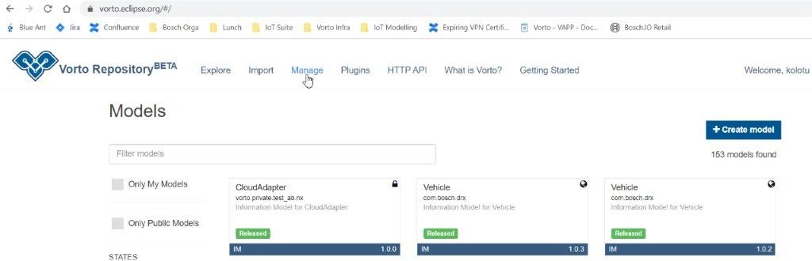
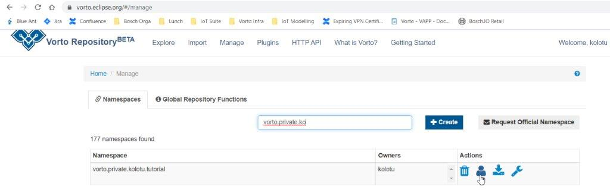
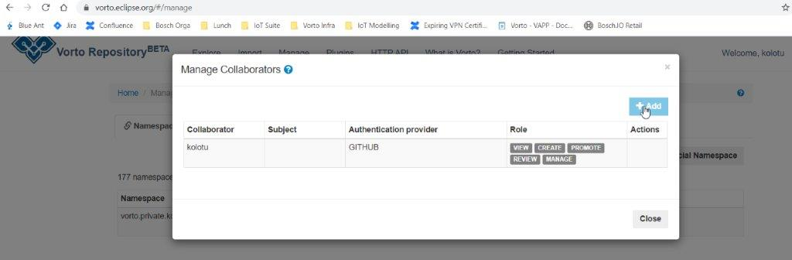
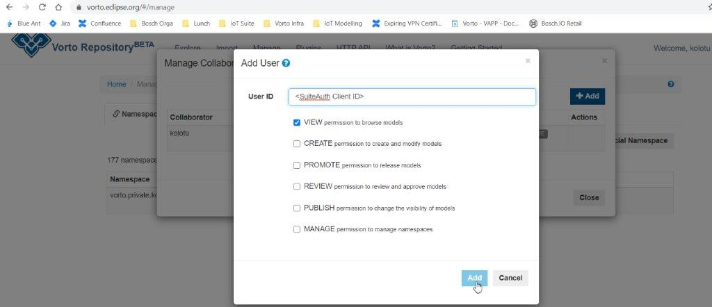
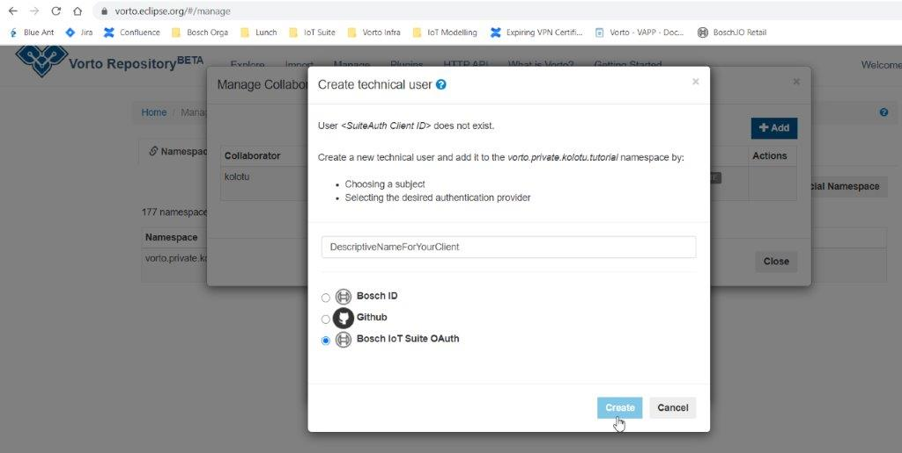

# How to add an OAuth client to a namespace

## Step 1: Navigate to the Manage panel
Click on "Manage" in the top-level menu.

## Step 2: Select your namespace
Search for your namespace and click on the icon for "Manage Collaborators".

## Step 3: Add a new collaborator
In the popup dialog, click on the "Add Collaborator" button.

## Step 4: Enter the client ID
Enter the client ID of your OAuth client as user ID and assign the permissions for the OAuth client. 

## Step 5: Add a descriptive name for the client and select the authentication provider
Finally, add a descriptive name for your OAuth client and select the authentication provider your OAuth client uses. 

