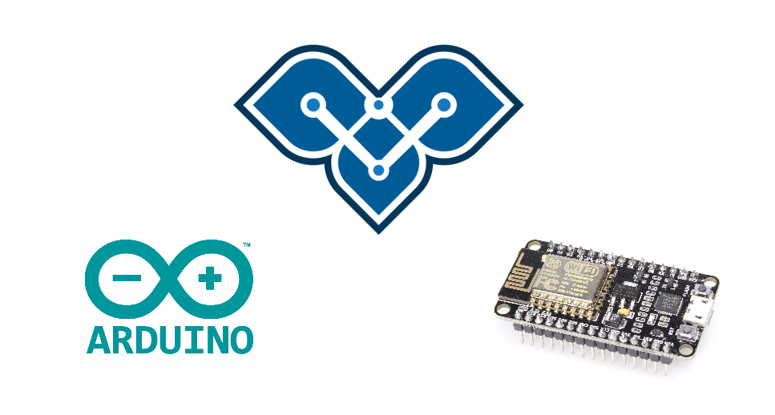
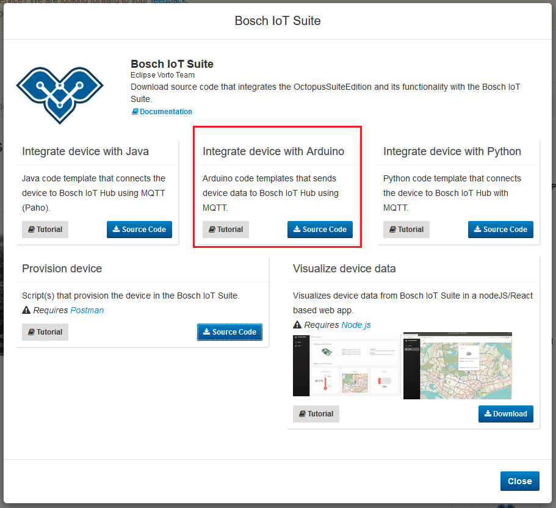

# Integrating an ESP8266 - based Device with the Bosch IoT Suite using Vorto

This tutorial explains how to generate an Arduino sketch for a given Vorto Information Model and send the device data to the Bosch IoT Suite via MQTT.   
Your device should already be created as a thing from an Information Model at this point.   
We will use this [Distance Sensor VIM](https://vorto.eclipse.org/#!/details/org.eclipse.vorto.tutorial:DistanceSensor:1.0.0).



## Prerequisites

* [Arduino IDE](https://www.arduino.cc/en/Main/Software) is installed 

* [Bosch ID User Account](https://accounts.bosch-iot-suite.com)

* Subscription to [Asset Communication for Bosch IoT Suite](https://www.bosch-iot-suite.com/asset-communication/) (Free plan, no credit card required)

* You have created a thing in the Bosch IoT Suite (refer to [Creating a Thing in the Bosch IoT Suite](create_thing.md)).

<br />

## Tools
* ESP8266 Package

* [PubSubClient](https://pubsubclient.knolleary.net/)

<br />

## Steps
1. Setup your development environment (on your development machine).
1. Download the generated integration script
1. Configure the scripts with the information of your created thing
1. Reading the sensor data
1. Start sending data

<br />


## Setup your development environment (on your development machine).

**1.** First you need to install the ESP8266 Board Package. You can conveniently do this by

* Selecting **File -> Preferences -> Additional Board Manager URLs** and adding `http://arduino.esp8266.com/stable/package_esp8266com_index.json`.

* Then selecting **Tools -> Board -> Boards Manager...**, looking for the esp8266 package and installing the latest version.

* Selecting **Tools -> Board**.

**2.** You should now find all the supported ESP8266 boards listed, chose the one you are working with.

**3.** Plug-in the NodeMCU board and check in the Device Manager, whether you have the necessary USB serial driver installed. In case it is missing and Windows Update can't find the driver, get the latest version of the driver from the [NodeMCU github repository](https://github.com/nodemcu/nodemcu-devkit/blob/master/Drivers/).

**4.** Select **Sketch -> Include Library -> Manage Libraries** and look for the `PubSubClient` and install the latest version.

> **Note**: The PubSubClient will get installed in the Arduino/libraries directory, i.e. in `{HOME}/Arduino/libraries`. As you might need to adjust the buffer size for the MQTT payload, it is a good thing to verify the location of the library at this point.

<br />

---
### Important Note for Mac Users!

The ESP3266 Development board's ports will not be recognized by the Arduino IDE	since there are several drivers that are missing on a Mac.

1. Download the drivers through the [SiLabs website](https://www.silabs.com/Support)
2. Install the drivers onto the computer
3. Plug in the ESP3266 through the micro-usb cable to the computer, and the port will appear on the Arduino IDE under    
**Tools -> Ports**.

---

<br />

## Download the generated integration script

**5.** On the Vorto Repository page of your Information Model (we will use this [Distance Sensor](https://vorto.eclipse.org/#!/details/org.eclipse.vorto.tutorial:DistanceSensor:1.0.0)), click on the `Bosch IoT Suite` generator. This will trigger a pop up to appear with the available generators.     


**6.** We want to integrate a device using Arduino. Click the `Source Code` button to download the generated Arduino  project.



**7.** Unzip the downloaded file and open it the [Arduino IDE](https://www.arduino.cc/en/Main/Software).

**8.** In order to guarantee secure transmission of your data, the integration uses SSL. We therefore need a certificate.   
Right click and save the [iothub.crt](https://docs.bosch-iot-hub.com/cert/iothub.crt) file and download it.   
We need to extract the fingerprint of this certificate to paste into our script later. This can be done by using
```bash
openssl x509 -noout -fingerprint -sha1 -inform pem -in iothub.crt
```
This fingerprint has to be added to the `mqttServerFingerprint` in the App file.
```java
#if (USE_SECURE_CONNECTION == 1)
	/* SHA-1 fingerprint of the server certificate of the MQTT broker, UPPERCASE and spacing */
	const char* mqttServerFingerprint = "<XX XX XX XX XX XX XX XX XX XX XX XX XX XX XX XX XX XX XX XX>";
#endif
```

> **Note:** On some systems you need to [install `openssl`](https://www.xolphin.com/support/OpenSSL/OpenSSL_-_Installation_under_Windows) first.

<br />

## Configure the scripts with the information of your created thing

**9.** Once imported, we have to adjust the credentials in order to be able to connect and publish data to the Bosch IoT Suite.
The following sections of the generated file have to be adjusted.

```java
#define tenantId "ADD TENANT ID HERE"

...

/* Device Configuration */
String deviceId = "ADD DEVICE ID HERE";
String authId = "ADD AUTH ID HERE";
const char* device_password = "ADD DEVICE PASSWORD HERE";

/* Payload Configuration*/
String ditto_topic = "ADD DITTO TOPIC HERE, e.g. com.mycompany/4711";

/* WiFi Configuration */
const char* ssid = "<ENTER YOUR WIFI SSID>"; /* SSID (Name) of your Wifi */
const char* password = "<ENTER YOUR WIFI PASSWORD>";
```

**10.** We will use the request response we got upon creating a thing with the postman script. Since it holds exactly the information we need, we can copy and paste the different ids from the response.


<br />

## Reading the sensor data

**11.** After configuring our connection credentials, the last step is to implement the data retrieval from the sensor. The generators create a section in the according class, in our case the DistanceSensorApp.ino file.
By default, random values will be sent for the values the sensor sends.

**12.** We can simply adapt the code in the `loop` function at the end of the script to read the sensors of your device and filling in the corresponding values to the Information Model API.   
The dummy values inside the method calls can be replaced with the read out data from the sensor.

```js
/* SAMPLE CODE */
//Status Properties
infoModel.distance.setsensorValue(dummy_value);
infoModel.distance.setsensorUnits(msg);
infoModel.distance.setminMeasuredValue(dummy_value);
infoModel.distance.setmaxMeasuredValue(dummy_value);
infoModel.distance.setminRangeValue(dummy_value);
infoModel.distance.setmaxRangeValue(dummy_value);
//Configuration Properties
infoModel.distance.setcurrentCalibration(msg);
infoModel.distance.setapplicationType(msg);

publishDistance();
/* END OF SAMPLE CODE */
```

**13.** Make sure to compile the code to verify your code before connecting your ESP8266 to your computer and selecting the virtual COM port to which your device is connected in the Arduino IDE under **Tools -> Port**.

<br />

## Start sending data

**14.** Upload your code to your device by selecting **Sketch -> Upload** and double check it's working properly. 

**15**. We can now verify that there is data incoming by either using
- the [Vorto Dashboard](create_webapp_dashboard.md) that simply displays your data in different UI widgets.
- or the [SwaggerUI](https://apidocs.bosch-iot-suite.com/?urls.primaryName=Bosch%20IoT%20Things%20-%20API%20v2) which doesn't require anything to be installed and allows a quick insight into whether your data is updating.

<details>
    <summary>
        <b>
            Your script is not sending data?
        </b>
    </summary> 
    
You have followed all the steps above but the Hub does not receive any data? Here are a few things you might want to check:

* PubSubClient has an MQTT buffer size of 128 bytes per default.

This means that if the length of your topic and payload plus 5 bytes overhead is longer than those 128 bytes the library will not transmit your data. However there is a solution: you can increase the buffer size by setting the variable `MQTT_MAX_PACKET_SIZE` in `PubSubClient.h` to a larger value, e.g. 256 or 384.

</details>


##### Once you can see your data updating, you have successfully connected your ESP8266 device to the Bosch IoT Suite using the Arduino IDE! 

<br />

## What's next ?
- [Use the Vorto Dashboard](create_webapp_dashboard.md) to visualize the device data in UI widgets.
- [Generate an OpenAPI Spec for your device](create_openapi.md)
- Integrate your device with the Bosch IoT Suite using:
  - [Python](./mqtt-python.md)
  - [Arduino](./connect_esp8266.md)

---

In case you're having difficulties or facing any issues, feel free to [create a new question on StackOverflow](https://stackoverflow.com/questions/ask?tags=eclipse-vorto) and we'll answer it as soon as possible!   
Please make sure to use `eclipse-vorto` as one of the tags. 
