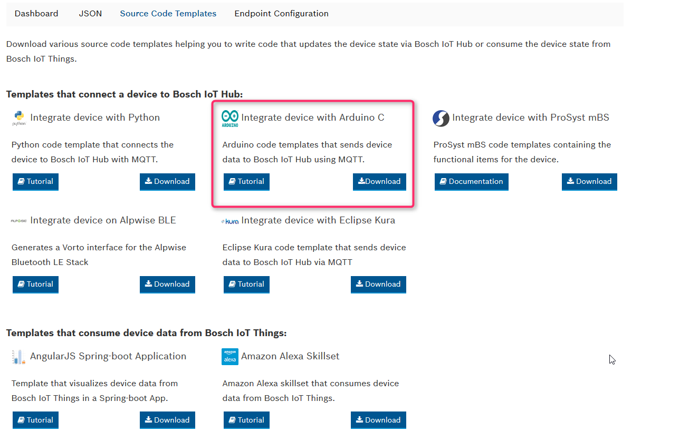
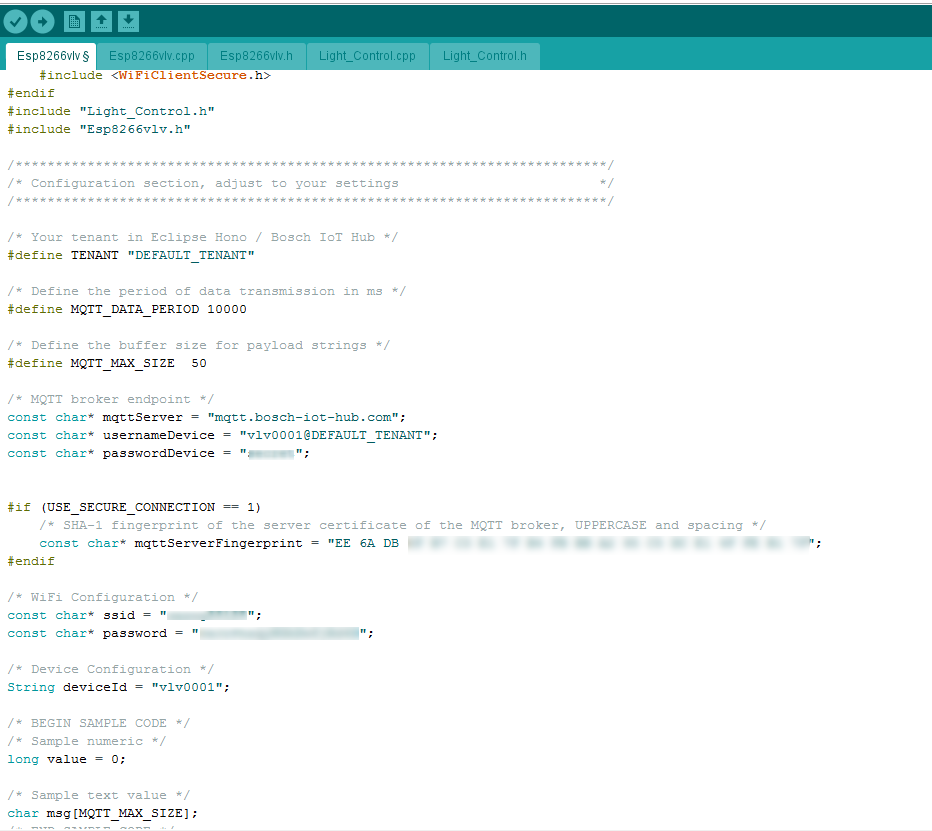

# Integrating an ESP8266 - based Device with the Bosch IoT Suite using Vorto

This tutorial explains how to generate an Arduino sketch for a given Vorto Information Model and send the device data to the Bosch IoT Suite via MQTT.

## Prerequisites

* Bosch ID User Account

* You have booked the Asset Communication package for the Bosch IoT Suite (refer to [https://www.bosch-iot-suite.com/tutorials/getting-started-asset-communication/](https://www.bosch-iot-suite.com/tutorials/getting-started-asset-communication/)).

* You have created a thing in the Bosch IoT Suite (refer to [Creating a Thing in the Bosch IoT Suite](create_thing.md)).

## Tools

* [Arduino IDE](https://www.arduino.cc/en/Main/Software)

 * ESP8266 Package

 * [PubSubClient](https://pubsubclient.knolleary.net/)

* OpenSSL

* Curl

## Proceed as follows

1. Setup your development environment (on your development machine).

	If not already done setup your development environment for the ESP8266. First, you have to install the Arduino IDE, the board-package for the ESP8266 and the PubSubClient.

	- Download and install the [Arduino IDE](https://www.arduino.cc/en/Main/Software).

	- Install the ESP8266 Board Package.

		1. Select **File -> Preferences -> Additional Board Manager URLs** and add `http://arduino.esp8266.com/stable/package_esp8266com_index.json`.

		2. Select **Tools -> Board -> Boards Manager...**, look for the esp8266 package and install the latest version.

		3. Select **Tools -> Board**.

			You should now find all the supported ESP8266 boards listed, chose the one you are working with.

		4. Plug-in the NodeMCU board and check in the Device Manager, whether you have the necessary USB serial driver installed. In case it is missing and Windows Update can't find the driver, get the latest version of the driver from the [NodeMCU github repository](https://github.com/nodemcu/nodemcu-devkit/blob/master/Drivers/).

	- Select **Sketch -> Include Library -> Manage Libraries**, look for the PubSubClient and install the latest version.

		> Note: You can use the search field to search for the PubSubClient.

	The PubSubClient will get installed in the Arduino/libraries directory, i.e. in `{HOME}/Arduino/libraries`. As you might need to adjust the buffer size for the MQTT payload, it is a good thing to verify the location of the library at this point.

2. Generating an arduino sketch using the Arduino Generator (Arduino project).

	- Log in to the [Vorto Console](https://vorto.eclipse.org/console) with your Bosch ID.

	- Navigate to your thing in the Thing Browser and click on it.

	- Click on the **Source Code Templates** tab.

	- At the **Integrate device with Arduino C** template, click **Download**.

		

	- Store the ZIP file and extract the source code.

	- Open the INO file in your Arduino IDE.

3. Adjust the Arduino Project according to your needs.

	The following important changes have to be made:

	* Change the passwordDevice, the password you had entered while creating the thing
	  
	* WLAN configuration.

		* SSID: change the constant ssid to your WiFi's SSID.

		* Password: change the constant password to your WiFi password.

	* In order to verify the server, you need to add a fingerprint of the server certificate to the code. This finger print is an SHA-1 hash of the certificate of the MQTT broker.

		* The certificate of the Bosch IoT Hub can be downloaded from the Web site [http://docs.bosch-iot-hub.com/cert/iothub.crt](http://docs.bosch-iot-hub.com/cert/iothub.crt).

		* For other MQTT brokers you might need to use openssl to extract the server certificate by invoking:

				openssl s_client -showcerts -connect www.example.com:443 </dev/null

			The first certificate, starting with

				-----BEGIN CERTIFICATE-----

			and ending with

				-----END CERTIFICATE-----

			is the part you want to store in a `.crt` file.

		* The fingerprint for the certificate above can be extracted by invoking:

				openssl x509 -noout -fingerprint -sha1 -inform pem -in [certificate-file.crt]

		* Add the fingerprint to the Arduino sketch by setting the constant `mqttServerFingerprint`, replacing the colons with spaces.

			

	* Finally you can adapt the code in the loop function to read the sensors of your device and filling in the corresponding values to the Information Model API.

	* Compile the code to verify everything with your code is ok.

	* Connect your ESP8266 to your computer and select the virtual COM port to which your device is connected in the Arduino IDE under **Tools -> Port**.

	* Upload your code to your device by selecting **Sketch -> Upload**. 

4. Verify incoming sensor data.

	- Log in to the [Vorto Console](https://vorto.eclipse.org/console) with your Bosch ID.

	- Open the thing details

	- Check if the sensor data was sent successfully to the Bosch IoT Suite.

**Congratulations**, you have successfully connected your ESP8266 device to the Bosch IoT Suite.

## What Could Go Wrong

You have followed all the steps above but the Hub does not receive any data? Here are a few things you might want to check:

* PubSubClient has an MQTT buffer size of 128 bytes per default.

	This means that if the length of your topic and payload plus 5 bytes overhead is longer than those 128 bytes the library will not transmit your data. However there is a solution: you can increase the buffer size by setting the variable `MQTT_MAX_PACKET_SIZE` in `PubSubClient.h` to a larger value, e.g. 256 or 384.

## What's next ?

 - [Create an Alexa Skillset](voice_control_alexa.md) that outputs the device data from Bosch IoT Suite via Alexa - based voice service.