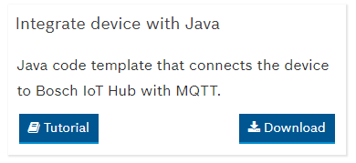
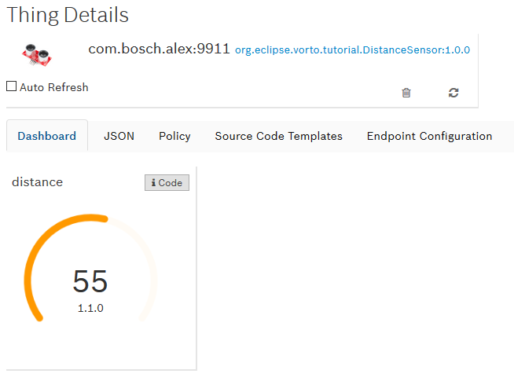

# Integrating a Java - based Device with the Bosch IoT Suite with Vorto

This tutorial explains how Vorto is used to create a simple Java application that sends device telemetry data to the Bosch IoT Suite. 

## Prerequisites

* Bosch ID User Account

* You have booked the Asset Communication package of the Bosch IoT Suite (refer to [https://preview.bosch-iot-suite.com/tutorials/getting-started-asset-communication/](https://preview.bosch-iot-suite.com/tutorials/getting-started-asset-communication/)).

## Tools

* Development IDE, such as Eclipse

* Maven

## Proceed as follows

In this tutorial, we are going to use connect a Distance Sensor to the Bosch IoT Suite. This sensor is already described as a [Vorto Information Model](https://vorto.eclipse.org/#/details/org.eclipse.vorto.tutorial:DistanceSensor:1.0.0).

1. Register a distance sensor thing instance for the Vorto Information Model in the Bosch IoT Suite device registry:

	- Login to the [Vorto Demo Console](https://vorto.eclipse.org/demo).

	- Click **Register a new thing**.
	
	- In the **Vorto Models** table, select a Vorto Model to specify the type of thing you want to register in the Suite.
	
		For the example, select the **DistanceSensor** Vorto Information Model.
	
		> Note: You can use the filter above the Vorto Models table. Just begin to write. The filter is effective immediately.
	
	- Click **Next**.
	
	- Specify the **Namespace**. 
		> The namespace must match with the namespace that you have set in Bosch IoT Things for your solution.
	
	- Leave the default value for **Name**.
	
	- Set the **Technical Device ID** of the thing.

		> This can be a MAC address, a serial number or anything that uniquely identifies the device. For the example, use `47-11-00`.

	- Click **Next**.
	
	- Select the protocol connector you would like to connect the device to the Suite with.
	
		For the example, choose **MQTT**. 
	
	- Click **Next**.
	
	- Specify the **Auth-ID**.
	
	- Specify the value for the **Password**. For the example, use `s3cr3t`
	
	- Click **Next**.

	- Review the changes that are going to be made to the Suite.
	
	- Click **Register**.
	
		The device is registered in the Bosch IoT Suite.

	- In the summary page, click **View thing details** to have a look at the digital twin representation of your device.
		
3. Generate and Download a Java Source Code Template for the device.
	
	- Go back to the [Vorto Demo Console](https://vorto.eclipse.org/demo).

	- Click **Browse my things** to open the Thing Browser.

		> Note: You can also directly open the [Thing Browser](https://vorto.eclipse.org/demo/thingbrowser). If not yet done, you will be asked for logging in.

	- Navigate to your thing and click on it.

	- Click on the **Source Code Templates** tab.

	- At the **Integrate device with Java** template, click **Download**.

		

	- Store the ZIP file and extract the source code.

4. Import the source code bundle as a Maven project into your IDE.

5. Configure the endpoint in the generated source code.

	- Open the class **DistanceSensorApp**.

	- Set the **MQTT Endpoint** to `ssl://mqtt.bosch-iot-hub.com:8883`.

	- Set the **Password**, you have specified during the registration process (refer to above).

	- Click **Save** to save the changes.

	- Download the [Hub Server Certificate](http://docs.bosch-iot-hub.com/cert/iothub.crt) and save the file under `<project>/src/main/resources/certificates/iot-hub.crt`.

6. Run and verify incoming sensor data.

	- Right-Click on the **DistanceSensorApp.java**. Choose **Run As** and select **Java Application**. 
	
	> The running application prints out the logs to the IDE console.

	- Go back to the [Vorto Demo Console](https://vorto.eclipse.org/demo).

	- Click **Browse my things** to open the Thing Browser.

		> Note: You can also directly open the [Thing Browser](https://vorto.eclipse.org/demo/thingbrowser). If not yet done, you will be asked for logging in.

	- Navigate to your thing and click on it.

	- Check if the sensor data was sent successfully to the Bosch IoT Suite.

		

**Great!** You just sent device payload complying to the Bosch IoT Suite using Vorto. Feel free to create another Vorto Information Model for your device.
 