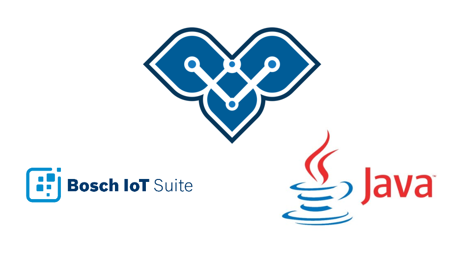
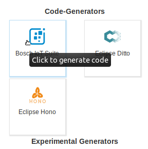
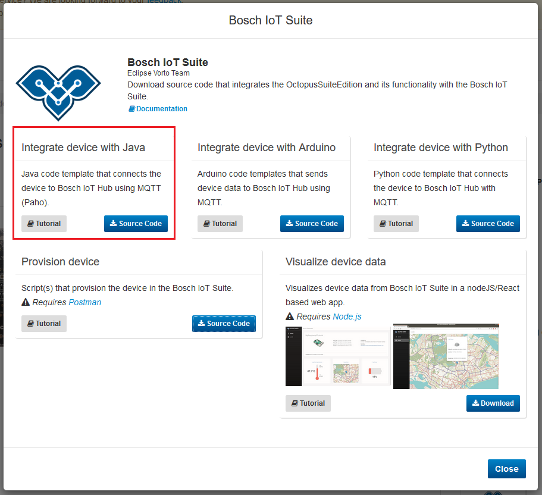
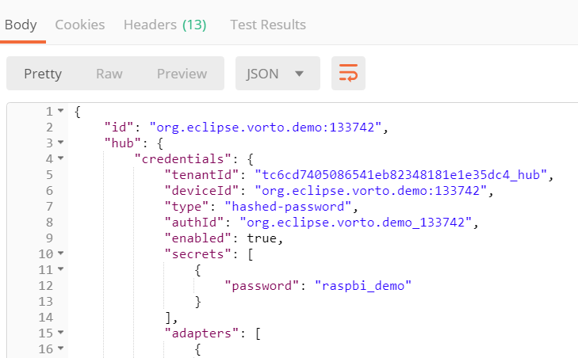

# Integrating a Java - based Device with the Bosch IoT Suite using Vorto

This tutorial explains how to integrate a device with the Bosch IoT Suite using Java and Maven. Your device should already be created as a thing from an Information Model at this point.   
We will use this [Distance Sensor VIM](https://vorto.eclipse.org/#/details/org.eclipse.vorto.tutorial:DistanceSensor:1.0.0).



## Prerequisites

* A [Java Runtime](https://www.java.com/en/download/) and [Maven](https://maven.apache.org/index.html) are installed

* Some code editor is installed (e.g. [Eclipse IDE](https://www.eclipse.org/ide/))

* Created a thing in the Bosch IoT Suite (refer to [Creating a Thing in the Bosch IoT Suite](create_thing.md)).

<br />

## Steps
1. Setup your device
1. Download the generated integration script
1. Configure the scripts with the information of your created thing
1. Reading the sensor data
1. Start sending data

<br />

## Download the generated integration script

**1.** On the Vorto Repository page of your Information Model (we will use this [Distance Sensor](https://vorto.eclipse.org/#/details/org.eclipse.vorto.tutorial:DistanceSensor:1.0.0)), click on the `Bosch IoT Suite` generator. This will trigger a pop up to appear with the available generators.     


**2.** We want to integrate a device using Java. Click the `Source Code` button to download the generated Java project.



**3.** Unzip the downloaded file and import it in your Eclipse IDE as a [Maven project](https://stackoverflow.com/questions/2061094/importing-maven-project-into-eclipse). 

**4.** In order to guarantee secure transmission of your data, the integration uses SSL. We therefore need a certificate.   
Right click and save the [iothub.crt](https://docs.bosch-iot-hub.com/cert/iothub.crt) file and place it at `<project>/src/main/resources/iothub.crt`.	

<br />

## Configure the scripts with the information of your created thing

**5.** To configure the endpoint in the generated source code, modify this section in the `DistanceSensorApp.java` class.
```java
private static final String TENANT_ID = "ADD TENANT ID HERE";

private static final String DEVICE_ID = "ADD DEVICE ID HERE";

private static final String AUTH_ID = "ADD AUTH ID HERE";

private static final String DITTO_TOPIC = "ADD DITTO TOPIC HERE, e.g. com.mycompany/1234";

private static final String DEVICE_PASSWORD = "ADD DEVICE PASSWORD HERE";
```

**6.** We will use the request response we got upon creating a thing with the postman script. Since it holds exactly the information we need, we can copy and paste the different ids from the response.


<br />

## Reading the sensor data

**7.** After configuring our connection credentials, the last step is to implement the data retrieval from the sensor. The generators create a section in the according class, in our case the  `DistanceSensorApp.java` file.   
By default, random values will be sent for the values the sensor sends. 

```java
private static Distance readDistance() {
		Distance distance = new Distance();
		//Status properties
		distance.setSensorValue(Math.round(new java.util.Random().nextFloat()*(float)100));
		distance.setSensorUnits("");
  ...
```

**8.** Use the pre-defined method `private static Distance readDistance()` to implement reading in the data from the Distance sensor.   
You can simply replace the values passed to the `set...` methods with the data read from the sensor.

<br />

## Start sending data

**9.** Run and verify incoming sensor data by right-clicking on the `DistanceSensorApp.java` and choosing **Run As** and select **Java Application**. 

> Note that the running application prints out the logs to the IDE console.

<details>
    <summary>
        <b>
            Your get an error message?
        </b>
    </summary> 

#### `getaddr` - Double check your connection.
If you started the script and you get an `getaddr` error, this means that the address resolution could not take place. This can have several reasons.    
However, it's most likely that you either are not connected to the internet or a **proxy** is blocking the sending of sensor data.

Unfortunately, for now you can't set any proxy. **Please switch to a network without Proxy.**

<br />

#### `Connection to MQTT broker failed: 4` - Double check your configuration 
If you see the sensor a log message with the error value of `4`, this means that the connection was refused due to some bad user name or password. However, this can relate to any of the fields in the configuration tab.

Therefore you have to go in and double check every field of the configuration section for an additional space or some character that does not belong there.

>  Please note that if you have followed the other tutorials, this error is **definitely** due to a fault in entering the credentials correctly.

</details>

**10**. We can now verify that there is data incoming by either using
- the [Vorto Dashboard](create_webapp_dashboard.md) that simply displays your data in different UI widgets.
- or the [SwaggerUI](https://apidocs.bosch-iot-suite.com/?urls.primaryName=Bosch%20IoT%20Things%20-%20API%20v2) which doesn't require anything to be installed and allows a quick insight into whether your data is updating.

##### Once you can see your data updating, you have successfully connected your Distance Sensor to the Bosch IoT Suite using Java!   
 
<br />

## What's next ?

- [Use the Vorto Dashboard](create_webapp_dashboard.md) to visualize the device data in UI widgets.
- [Generate an OpenAPI Spec for your device](create_openapi.md)
- Integrate your device with the Bosch IoT Suite using:
  - [Python](./mqtt-python.md)
  - [Arduino](./connect_esp8266.md)

---

In case you're having difficulties or facing any issues, feel free to [create a new question on StackOverflow](https://stackoverflow.com/questions/ask?tags=eclipse-vorto) and we'll answer it as soon as possible!   
Please make sure to use `eclipse-vorto` as one of the tags. 
