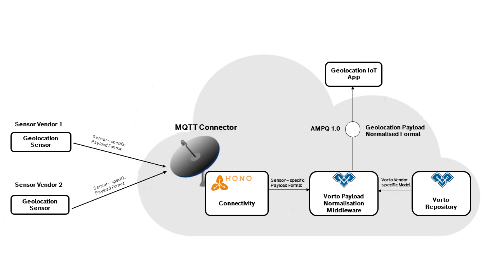
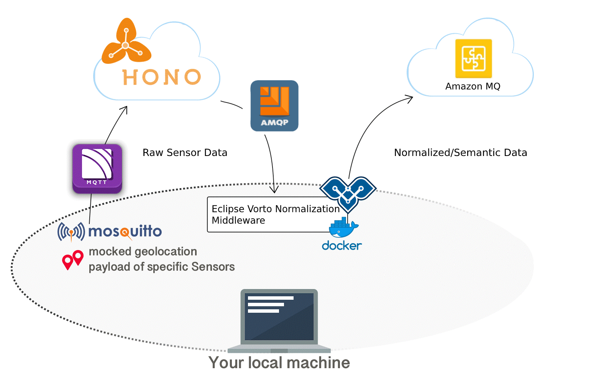
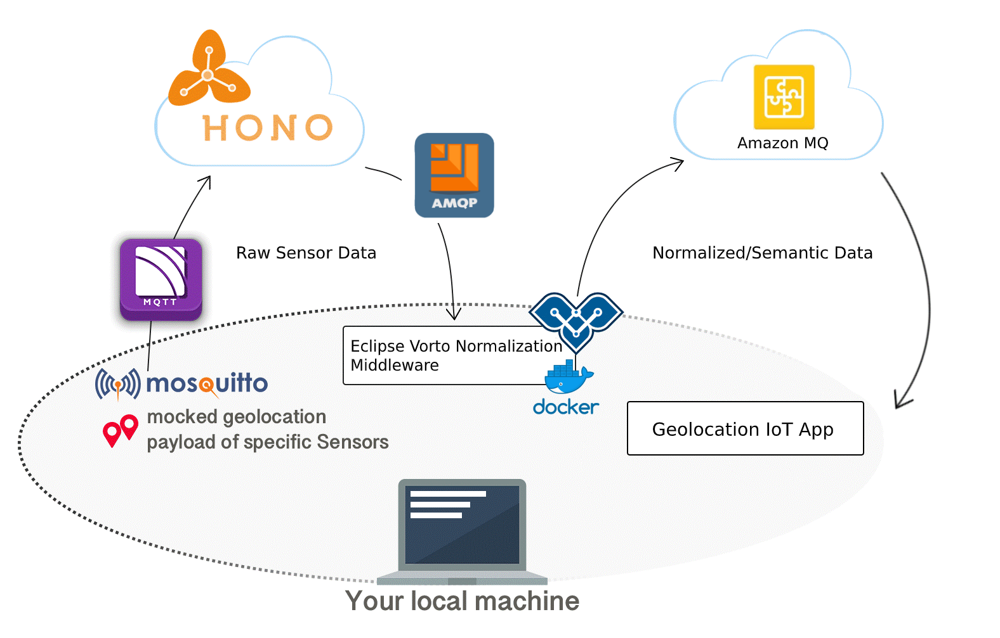

# Decouple IoT solutions from connected device data 

In a technical environment without a global standard, IoT device manufacturers, integrators, and platform providers are facing difficulties keeping up with the massive amounts of different payload formats, APIs, and proprietary protocols. 

The open source project Eclipse Vorto addresses this problem by providing cloud-based editors to abstract vendor-specific device payloads as re-usable Vorto Function Blocks. These are then aggregated to describe a whole device in the form of a Vorto Information Model. Information Models and Function Blocks are written in [vortolang](../vortolang-1.0.md), a simple grammar to define interfaces between a physical device and its digital twin counterpart. IoT solutions communicate with physical devices only via these abstract Function Blocks and their co-related data schema. In this way, IoT solutions become de-coupled from the plethora of different device data formats, APIs, and encodings. But how to convert the device data to these abstract Function Block interfaces? Simple: with so-called Vorto Mapping Specifications, which contain all the necessary instructions in order to harmonize device-specific payloads.

In this tutorial, we are going to work ourselves throught the process of connecting various geolocation sensors to the cloud and consume their data in a simple cloud application. As mentioned earlier, we are going to design an architecture, that makes our application being able to consume data from any geolocation sensor vendor, with the help of Vorto Mapping Specifications.




## Steps to take

1. Create a small IoT application that receives geolocation data and prints it out in the console
2. Test the app by sending data via MQTT in different payload representations
3. Applying Vorto, to normalize the geolocation data. This would reduce the complexity in our app and only deal with a single geolocation representation, regardless of the connected sensors.


## Pre-requisites

The Eclipse IoT stack offers a very nice device connectivity service, called [Eclipse Hono](https://www.eclipse.org/hono), comprising many different protocol adapters. One of them is MQTT, exactly what we need in our solution to connect our sensors. To save us some time of setting up the service on our own, we use a free plan of an cloud operated Eclipse Hono service, provided by Bosch.

Here is a list of things that you need to work through this tutorial:

- Bosch ID Account
- [Subscribe to Bosch IoT Hub](https://accounts.bosch-iot-suite.com/subscriptions/new/service/IoT-Hub/) (Free plan) for MQTT connectivity based on Eclipse Hono
- [Amazon MQ](https://aws.amazon.com/amazon-mq) cloud service for AMQP messaging
- Java 8 or higher
- Maven
- Docker Runtime
- [Mosquitto_pub](http://www.steves-internet-guide.com/mosquitto_pub-sub-clients/) Client tool
- Some IDE (e.g. Eclipse)

## Step 1: Creating a simple IoT application for printing Geolocation data

In this step, we create a tiny IoT solution that receives the sensor data and simply prints the data out to the console. But how do we get the data from Eclipse Hono? It's easy. Hono provides an AMQP endpoint that makes it possible for applications to receive telemetry data. Hono does not make any assumption how the payload looks like and merely forwards the data "as is" to the AMQP endpoint. Our application receives the data and does something useful with it. Well, in this case just prints it out to the console. 

To save us some time at this point, we have already created the application for you. [Download](../samplecode/cloudapp) and then import it into your IDE

Open the ```src/main/resources/application.yml``` and configure the tenantId, username and password. 
> Where to find these values ? Login to [Bosch IoT Suite Portal](https://accounts.bosch-iot-suite.com/subscriptions/) with your Bosch ID and click on `Credentials`.

Run the app with ```mvn spring-boot:run```. You should not see any data coming in just yet. But we can change that quickly by sending some geolocation data to the MQTT endpoint.

## Step 2: Sending geolocation data to Bosch IoT Hub using MQTT protocol

First let's register a device in the device registry under a specific device-id. Only then we can send data for that device-id to the Bosch IoT Hub. 

### Register devices 

We can easily register our sample devices via the [Device Registry Swagger UI](https://apidocs.bosch-iot-suite.com/?urls.primaryName=Bosch%20IoT%20Hub%20-%20Device%20Registry)

In order to use the API, you need to login via username and password. Therefore click on `Authorize`, and use the [Bosch IoT Suite Portal](https://accounts.bosch-iot-suite.com/subscriptions/) again, to find the `username` and `password` values at the bottom of the `Credentials` page. 

1. Register 2 devices `4711` and `4712` using the [Device Registry Swagger UI](https://apidocs.bosch-iot-suite.com/?urls.primaryName=Bosch%20IoT%20Hub%20-%20Device%20Registry#/devices/post_registration__tenant_id_). The following example shows the device registration for device with ID `4711`:


```js
	{
	  "enabled": true,
	  "device-id": "4711"
	}
```	

Repeat the step for the second device.

2. Add device credentials for these 2 devices using the [Credentials Swagger UI](https://apidocs.bosch-iot-suite.com/?urls.primaryName=Bosch%20IoT%20Hub%20-%20Device%20Registry#/credentials/post_credentials__tenant_id_). The following example shows the credentials registration for a device with the ID `4711`:

```js
	{
	  "device-id": "4711",
	  "type": "hashed-password",
	  "auth-id": "4711",
	  "enabled": true,
	  "secrets": [
	    {
	      "password": "secret"
	    }
	  ]
	}
```

Repeat this step for the second device.

### Publish data via MQTT 

1. Download the Hub Server certificate ```curl -o iothub.crt https://docs.bosch-iot-hub.com/cert/iothub.crt```

2. Use the `mosquitto_pub` client to send some geolocation data: 
```bash
mosquitto_pub -h mqtt.bosch-iot-hub.com -p 8883 -u {auth-id}@{tenant-id} -P {password} -t telemetry/{tenant-id}/4711 -m '{"longitude": "103.3223", "latitude": "3.2322"}' --cafile iothub.crt
```
Notice, that the {password} and {auth-id} values are the ones that you set as device credentials previously.

3. Verify the incoming data in our IoT application from step 1. 

You should now see the data being printed out to the console in something like:
```bash
INFO com.acme.solution.AMQPListener - Received AMQP message: {logitude: 103.3223, latitude: 3.2322}
```

4. Send some data for our second device `4712`. This time change the payload message representation to CSV style. Example:

```bash
mosquitto_pub -h mqtt.bosch-iot-hub.com -p 8883 -u {auth-id}@{tenant-id} -P {password} -t telemetry/{tenant-id}/4712 -m '103.3223,3.2322' --cafile iothub.crt
```

You should now also see the data of our second device in the console of our application. 

```bash
INFO com.acme.solution.AMQPListener - Received AMQP message: {103.3223, 3.2322}
```


You can already see from here, that our application would now need to be made aware of handling these two different ways of payload representations. This means writing additional custom code. No worries, let Eclipse Vorto take care of this.

Let us walk you through the process in the next step.

## Step 3: De-coupling application from connected sensors

In this step, we are going to use [Eclipse Vorto](https://www.eclipse.org/vorto) in order to de-couple our application from the connected sensors. This has the following benefits:

- **Reduced** **complexity** **and** therefore **development** **efforts** in our IoT application. Our app can fully focus on processing one single data format, rather than many formats of different devices types.
- It becomes very **easy to extend** our application and support many other different device types providing the same functionality. 

### 1. Specifying the Geolocation interface with Vorto

As in traditional Software Design, we need to first think about the interfaces of the system as well as the data structures that are exchanged between devices and the IoT solution. Vorto provides a web-based tooling, that let's you easily define interfaces, so called Function Blocks. In our case, we are going to create a Geolocation Function Block: 

1. Login to the [Vorto Repository](https://vorto.eclipse.org) with your Bosch ID or Github ID account.
2. In order to start creating models, you need to first [create your own namespace](managing_namespaces.md). Skip this step, if you already own a namespace
3. Click `Explore` in the menu and then click `Create Model` 
4. Choose `Function Blocks` and work yourself through the wizard by giving it the name `Geolocation` and version `1.0.0`. Confirm to create the model. This will take you directly to the newly created Function Block where you can start defining the functionality of the model in the web-based editor:

Add the following status properties for the Geolocation and hit `Save`:


```
vortolang 1.0
namespace vorto.private.aedelmann // namespace can be different in your case
version 1.0.0

functionblock Geolocation {
	status {
		mandatory longitude as float "location longitude coordinate"
		mandatory latitude as float "location latitude coordinate"
		optional altitude as float "location altitude coordinate"
	}
}
```

### 2. Describing device implementing Geolocation interface

In this step, we will create an Information Model that implements the Geolocation Function Block. An Information Model represents a vendor - specific device. 

1. Click `Explore` in the menu and then click `Create Model` 
2. This time choose `Information Model` and work yourself through the wizard by giving it the name `SensorOne` and version `1.0.0`.
3. In the popup Click Next and confirm with `Create`.  This will take you directly to the newly created Information Model

Add the following function block properties and hit `Save`:

```
vortolang 1.0

namespace vorto.private.aedelmann // namespace can be different in your case, depending on your owning namespace
version 1.0.0

using vorto.private.aedelmann.Geolocation;1.0.0
using org.eclipse.vorto.DeviceInformation;1.0.0

infomodel SensorOne {

	functionblocks {
	   deviceInformation as DeviceInformation "gives further meta information about the sensor" 
	   location as Geolocation "gives the position of the sensor"
	}
}
```
**Great!** One sensor is now fully described with Vorto. Go ahead and create a second sensor `SensorTwo` that also implements the same Geolocation function block. This second sensor represents a sensor from a different vendor, which sends data in a different format.

### 3. Mapping device payload to Geolocation interface

Previously, we saw that both sensor types were sending data in different payload representations, JSON as well as CSV. Our solution ordinarily would need to parse these different payloads and somehow identify the semantics behind this payload.

In this step, we are going to map the JSON and CSV to the Geolocation Function Block. Vorto Mappings are a very nice way to do this, and pretty easy to boot. 
Here is how its' done:

1. Click **Explore** and open the details of the SensorOne Information Model
2. Click **Create Mapping** which opens a dialog with some background information about mappings. Confirm with **Create**. This will open the Payload Mapping Editor 
3. You will see two tabs, each for every Function Block property. Select **deviceInformation** tab
4. Our sensor does not really transmit any device information meta data. That's why we hard code these values here. Under **manufacturer** add `"ACME Company"`. Make sure to add quote marks at the beginning and end of the provided manufacterer string.
5. Open **location** mapping tab. Let's map the longitude and latitude to the Function Block. 
6. For **longitude** add `number:toFloat(/longitude)` and for **latitude** add `number:toFloat(/latitude)`
7. Save your changes
8. **Download** the Spec and save it on your local system. You need this spec later in the tutorial.

We can now test the entire mapping by inserting a sample JSON in the input box on the right and hit **Map**:

```js
{
  "longitude" : "103.2",
  "latitude" : "23.2"
}
```

You should be able to see the following mapped output:

```js
{
  "deviceInformation": {
    "status": {
      "manufacturer": "ACME Company"
    }
  },
  "location": {
    "status": {
      "latitude": 23.2,
      "longitude": 103.2
    }
  }
}
```


**Fantastic!** You have just created a mapping for one sensor that sends its payload as JSON. 


Create a mapping spec for your *SensorTwo* Information Model:

This time for **manufacturer**, set the value `"Company XYZ"`
The second sensor sends its geolocation payload as CSV. Therefore, add the following mapping for the **longitude** `number:toFloat(array[1])` and for **latitude** `number:toFloat(array[2])`. 

**Save** and **download** the mapping spec as well.

This completes the Vorto Modelling. In summary, we described two sensor types as Vorto Information Models, implementing the same Geolocation Function Block. We then created payload mappings for each of them, in order to map their specific payload to the same semantic Function Block definition.

In the next step, we are going to see these Vorto models and mappings in action.

### 4. Setting up Eclipse Vorto Payload Normalization Middleware with Vorto AMQP Plugin 



As seen in the picture, we will now setup the Eclipse Vorto Payload Normalization Middleware, which is a micro service written in Java, that consumes data from Eclipse Hono via AMQP and converts the data to semantic data structures, defined as Vorto Function Blocks. For this, the middleware utilizes the Mapping Specification that we created in the previous step. 

Now for the normalized data to be consumed by our IoT application we will send the normalized data from middleware to Amazon MQ and in the next step configure the IoT application to receive data from the new endpoint.

> Create an Amazon MQ Broker using the tutorial from AWS [here](https://docs.aws.amazon.com/amazon-mq/latest/developer-guide/amazon-mq-creating-configuring-broker.html).

Now start the middleware using the [Eclipse Vorto AMQP plugin](https://github.com/eclipse/vorto-examples/tree/master/vorto-middleware/middleware-ext-amqp) and mounting a _mappings_ folder which contains your sensor mapping specifications. We will configure our IoT Solution to subscribe to the new AMQP endpoint in the next step.

```
docker run -it -p 8080:8080 -v c:/absolute_local_dir:/mappings -e mapping_spec_dir=/mappings -e github.client.clientId=your_github_clientid -e github.client.clientSecret=your_github_clientsecret -e hono.tenantId=your_tenantId -e hono.password=your_hono_password -e amqp.url=OpenWire_endpoint -e amqp.topic.vorto=telemetry/vorto -e amqp.username=myusername -e amqp.password=mypassword eclipsevorto/vorto-normalizer:nightly
```

Before we can start sending data via MQTT again, we need to make some changes to the Bosch IoT Hub Device Registry. These changes are required by the Vorto middleware to work properly. 

1. Open the [Device Registry Swagger UI](https://apidocs.bosch-iot-suite.com/?urls.primaryName=Bosch%20IoT%20Hub%20-%20Device%20Registry)
2. Find the **PUT** Command , which updates your existing device ID. Add the following JSON content:

```js
	{
	  "enabled": true,
	  "device-id": "4711",
	  "defaults" : {
	  	"vorto" : "<your_namespace>:SensorOne:1.0.0",
	  	"content-type" : "application/json"
	  }
	}
```	 

This basically overwrites the default configuration for this device ID by specifying the Vorto Information Model (device type) for the registered device as well as in what content-type the device sends its data.  

Repeat this step for the second device ID (4712) , with the following content:

```js
	{
	  "enabled": true,
	  "device-id": "4712",
	  "defaults" : {
	  	"vorto" : "<your_namespace>:SensorTwo:1.0.0",
	  	"content-type" : "text/csv"
	  }
	}
```	 

**Finally!** We are all set to start sending the same data as in **step 2** using `mosquitto_pub`. You should be able to see the normalized payload with the exact same structure for both sensor types in the Vorto Middleware [monitoring logs](http://localhost:8080/#/monitoring). 


### 5. Make IoT application changes



Change the configuration of the Geolocation IoT application, by pointing it to our new [Amazon MQ Broker](https://aws.amazon.com/amazon-mq/) AMQP endpoint, in order to receive the normalized geolocation sensor data.

Please open the `application.yml` and replace the url, topic and credentials as seen below:

```
amqp:
  url: amqps://ENDPOINT_OF_SETUP_AMAZON_MQ_INSTANCE?jms.username=${amqp.username}&jms.password=${amqp.password}&amqp.saslMechanisms=PLAIN&transport.verifyHost=false&transport.trustAll=true
  username: TECHNICAL_USER_AMAZON_MQ_TO_PUBLISH
  password: TECHNICAL_USER_AMAZON_MQ_PASSWORD
  queue: telemetry/vorto
```

When you start the application and send data for the two sensors via MQTT, you will see the normalized geolocation data printed in the console of the application.

## What's next?

- [Integrate with AWS Kinesis for realtime data analytics](./integrate_aws_kinesis.md)
- [Extend the solution with a digital twin service](./extend_mapping_pipeline_with_digital_twin.md)

<br />
---

In case you're having difficulties or facing any issues, feel free to [create a new question on StackOverflow](https://stackoverflow.com/questions/ask?tags=eclipse-vorto) and we'll answer it as soon as possible!   
Please make sure to use `eclipse-vorto` as one of the tags. 
