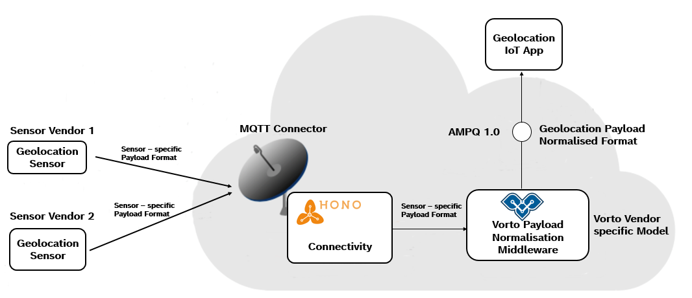

# Decouple IoT solutions from connected device data 

Often times, devices are connected to the cloud using various protocols and sending their data in many different representations. What you want to prevent in your IoT solution is to understand all of these different representations, as it tightly couples your solution with the devices you connect to. What you really want to do is to specify a well - defined interface between the physical and the digital device "world". You might say "Hey, I just use a Digital Twin service to shield me off from all the device connectivity plumbing and wiring". Well, that is just the half truth, because even Digital Twin services do not necessarily abstract device data. So you still might end up in many different ways how things in a Digital Twin service are stored, still coupling your app with the devices connected to the twin service. 
That is exactly where Eclipse Vorto comes in, providing a way to make your things look completely the same, regardless of the actual vendor - specific device. Vorto specifies the interfaces of Digital Twins as so called _Information Models_. You can read more about the Vorto language in the [Vorto 1.0 Specification](../vortolang-1.0.md). 
But that is just one puzzle piece, because in most cases devices do not send their payload in the way, that has been defined in the Information Model. For this use case, Vorto has a very powerful instrument, namely payload mappings. Payload mappings specify how device properties are mapped to Vorto properties. Once defined, they are re-usable whenever the device is connected to an IoT solutions. 

In this tutorial, we are going to work ourselves throught the process of connecting various geolocation sensors to the cloud and consume their data in a tiny cloud application. As mentioned earlier, we are going to design an architecture, that makes our application being able to consume data from any geolocation sensor vendor.




## Steps to take

1. Create an small cloud application that receives geolocation data and prints it out in the console
2. Test the app by sending data via MQTT in different payload representations
3. Applying Vorto, to normalize the geolocation data. This would reduce the complexitity in our app and only deal with a single geolocation representation, regardless of connected sensors.

## Pre-requisites

The Eclipse IoT stack offers a very nice device connectivity service, called [Eclipse Hono](https://www.eclipse.org/hono), comprising many different protocol adapters. One of them is MQTT, exactly what we need in our solution to connect our sensors. To save us some time of setting up the service on our own, we use a free plan of an cloud operated Eclipse Hono service, provided by Bosch.

Here is a list of things that you need to work through this tutorial:

- Bosch ID Account
- [Subscribe to Bosch IoT Hub](https://accounts.bosch-iot-suite.com/subscriptions/new/service/IoT-Hub/) (Free plan) for MQTT connectivity based on Eclipse Hono
- Java 8 or higher
- Maven
- [Mosquitto_pub](http://www.steves-internet-guide.com/mosquitto_pub-sub-clients/) Client tool
- Some IDE (e.g. Eclipse)

## Step 1: Creating Cloud application for Geolocation data

In this step, we create a tiny IoT solution that receives the sensor data and simply prints the data out to the console. But how do we get the data from Eclipse Hono ? It's easy. Hono provides an AMQP endpoint that makes it possible for applications to receive telemetry data. Hono does not make any assumption how the payload looks like and merely forwards the data "as is" to the AMQP endpoint. Our application receives the data and does something useful with it. Well, in this case just prints it out to the console. 

To save us some time at this point, we have already created the application for you. [Download](../samplecode/cloudapp) and import the import it into your IDE

Open the ```src/main/resources/application.yml``` and configure the tenantId, username and password. 
> Where to find these values ? Login to [Bosch IoT Suite Portal](https://www.bosch-iot-suite.com/subscriptions) with your Bosch ID and click on `Credentials`.

Run the app with ```mvn spring-boot:run```. You should not see any data coming in just yet. But we can change that quickly by sending some geolocation data to the MQTT endpoint.

## Step 2: Sending geolocation data to MQTT

First let's register a device in the device registry under a specific device-id. Only then we can send data for that device-id to the Bosch IoT Hub. 

### Register devices 

We can easily register our sample devices via the [Device Registry Swagger UI](https://apidocs.bosch-iot-suite.com/?urls.primaryName=Bosch%20IoT%20Hub%20-%20Device%20Registry)

1. Register 2 devices `4711` and `4712`. The following example show the device registration for device with ID `4711`:


```js
	{
	  "enabled": true,
	  "device-id": "4711"
	}
```	

Repeat the step for the second device.

2. Add device credentials for these 2 devices. The following example show the credentials registration for device with ID `4711`:

```js
	{
	  "device-id": "4711",
	  "type": "hashed-password",
	  "auth-id": "4711",
	  "enabled": true,
	  "secrets": [
	    {
	      "password": "secret"
	    }
	  ]
	}
```

Repeat the step for the second device.

### Publish data via MQTT 

1. Download the Hub Server certificate ```curl -o iothub.crt https://docs.bosch-iot-hub.com/cert/iothub.crt```

2. Use `mosquitto_pub` client to send some geolocation data: 
```bash
mosquitto_pub -h mqtt.bosch-iot-hub.com -p 8883 -u {auth-id}@{tenant-id} -P {password} -t telemetry/{tenant-id}/4711 -m '{"longitude": "103.3223", "latitude": "3.2322"}' --cafile iothub.crt
```

3. Verify the incoming data in our IoT application from step 1. You should see the data being printed out to the console. 

4. Send some data for our second device `4712`. This time change the payload message representation to CSV style. Example:

```bash
mosquitto_pub -h mqtt.bosch-iot-hub.com -p 8883 -u {auth-id}@{tenant-id} -P {password} -t telemetry/{tenant-id}/4712 -m '"103.3223","3.2322"' --cafile iothub.crt
```

You should also see the data of our second device in the console of our application. 

You can already see from here, that our application would now need to be made more intelligent of handling these two different ways of payload representations. Moreover it tightly couples the application to connected sensors and the way how these sensors  

At this point, we introduce device data abstraction which can be easily handled with the Eclipse Vorto project. Let us walk you through the process in the next step.

## Step 3: De-coupling application from connected sensors

In this step, we are going to use [Eclipse Vorto](https://www.eclipse.org/vorto) in order to de-couple our application from the connected sensors. This has the following benefits:

- **Reduced** **complexity** **and** therfore **development** **efforts** in our IoT application. Our app can fully focus on the processing a single data format, rather than many formats of different devices types.
- It becomes very **easy to extend** our application and support many other different device types providing the same functionality. 

### 1. Specifying the Geolocation interface with Vorto

As in traditional Software Design, we need to first think about the interfaces of the system as well as the data structures that are exchanged between devices and the IoT solution. Vorto provides a web-based tooling, that let's you easily define interfaces, so called Function Blocks. In our case, we are going to create a Geolocation Function Block: 

1. Login to the [Vorto Repository](https://vorto.eclipse.org) with your Bosch ID or Github ID account.
2. In order to start creating models, you need to first [create your own namespace](managing_namespaces.md). Skip this step, if you already own a namespace
3. Click `Explore` in the menu and then click `Create Model` 
4. Choose `Function Blocks` and work yourself through the wizard by giving it the name `Geolocation` and version `1.0.0`. Confirm to create the model. This will take you directly to the newly created Function Block where you can start defining the functionality of the model in the web-based editor:

Add the following status properties for the Geolocation and hit `Save`:

```
vortolang 1.0
namespace vorto.private.aedelmann // namespace can be different in your case
version 1.0.0

functionblock Geolocation {
	status {
		mandatory longitude as float "location longitude coordinate"
		mandatory latitude as float "location latitude coordinate"
		optional altitude as float "location altitude coordinate"
	}
}
```

### 2. Describing device implementing Geolocation interface

In this step, we will create an Information Model that implement the Geolocation Function Block. The Information Model represents the vendor - specific sensor. 

1. Click `Explore` in the menu and then click `Create Model` 
2. Choose `Information Model` and work yourself through the wizard by giving it the name `SensorOne` and version `1.0.0`. Click Next and confirm with `Create`.  This will take you directly to the newly created Information Model

Add the following function block properties hit `Save`:

```
vortolang 1.0

namespace vorto.private.aedelmann // namespace can be different in your case, depending on your owning namespace
version 1.0.0

using vorto.private.aedelmann.Geolocation;1.0.0
using org.eclipse.vorto.DeviceInformation;1.0.0

infomodel SensorOne {

	functionblocks {
	   deviceInformation as DeviceInformation "gives further meta information about the sensor" 
		location as Geolocation "gives the position of the sensor"
	}
}
```
**Great!** One sensor is now fully described with Vorto. Go ahead and create a second sensor `SensorTwo` that also implements the same Geolocation function block. This second sensor represents a sensor from a different vendor, sending different data format to our solution later. 

### 3. Mapping device payload to Geolocation interface

Previously, we saw that both sensor types were sending data in different payload representations, JSON as well as CSV. Our solution needed to parse these different payloads and somehow needed to identify the semantics behind this payload. 
In this step, we are going to map the JSON and CSV to the Geolocation Function Block. Vorto Mappings are a very nice way to do this, and pretty easy to boot. 
Here is how its' done:

1. Click **Explore** and open the details of the SensorOne Information Model
2. Click **Create Mapping** which opens a dialog with some background information about mappings. Confirm with **Create**. This will open the Payload Mapping Editor 
3. You will see two tabs, each for every Function Block property. Select **deviceInformation** tab
4. Our sensor does not really transmit any device information meta data. That's why we hard code these values here. Under **manufacturer** add `"ACME Company"`. 
5. Open **location** mapping tab. Let's map the longitude and latitude to the Function Block. 
6. For **longitude** add `number:toFloat(/longitude)` and for **latitude** add `number:toFloat(/latitude)`
7. Save your changes
8. **Download** the Spec and save it on your local system. You need this spec later in the tutorial.

We can now test the entire mapping by inserting a sample JSON in the input box on the right and hit **Map**:

```js
{
  "longitude" : "103.2",
  "latitude" : "23.2"
}
```

You should be able to see the following mapped output:

```js
{
  "deviceInformation": {
    "status": {
      "manufacturer": "ACME Company"
    }
  },
  "location": {
    "status": {
      "latitude": 23.2,
      "longitude": 103.2
    }
  }
}
```


**Fantastic!** You just created a mapping for one sensor that sends its payload as JSON. 


Create a mapping spec for your *SensorTwo* Information Model:

This time for **manufacturer**, set the value `"Company XYZ"`
The second sensor sends its geolocation payload as CSV. Therefore, add the following mapping for the **longitude** `number:toFloat(array[1]` and for **latitude** `number:toFloat(array[2]`. **Save** and **download** the mapping spec as well.

This completes the Vorto Modelling. In summary, we described two sensor types as Vorto Information Models, implementing the same Geolocation Function Block. In the end, we created payload mappings for these sensor types, in order to map their specific payload to the same semantic Function Block definition. 

In the next step, we are going to use these Vorto models and mappings in order to actually convert the sensor payload, which we get from Eclipse Hono via AMQP. 

### 4. Setting up Eclipse Vorto Payload Normalization Middleware

The Eclipse Vorto Payload Normalization Middleware is a micro service, written in Java, that consumes data from Eclipse Hono via AMQP and converts the data to semantic data structures, defined as Vorto Function Blocks. For this, the middleware utilizes the Mapping Specification, that we created in the previous step. 

For more information about the Vorto normalization middleware, please follow this [link](https://github.com/eclipse/vorto-examples/blob/master/vorto-hono-subscriber/Readme.md). 

Here are the steps:

1. Git clone `https://github.com/eclipse/vorto-examples.git`
2. Import the folder `vorto-hono-subscriber` into your IDE as a Maven project
3. Copy the two sensor mapping specs into the folder `src/main/resources/specs` 
4. Open the file `src/main/resources/application.yml` and add the following configurations:

```
hono:
  tenantId: BOSCH_IOT_HUB_TENANTID GOES HERE
  password: BOSCH_IOT_HUB_MESSAGING_PASSWORD GOES HERE

msg:
  queue: telemetry/${hono.tenantId}

session:
  cache:
    size: 1
```

Comment out or remove the other `amqp` configurations for now. We need them only at a later point. 

Run the Spring Boot App with `mvn clean install spring-boot:run`. The console should display no errors, meaning it has successfully connected to the Bosch IoT Hub (Eclipse Hono-based) via AMQP and is now ready to receive any messages from there.

Wait! Before we can start sending data via MQTT again, we need to make some changes to the Bosch IoT Hub Device Registry. These changes are required by the Vorto middleware to work properly. 

1. Again open the [Device Registry Swagger UI](https://apidocs.bosch-iot-suite.com/?urls.primaryName=Bosch%20IoT%20Hub%20-%20Device%20Registry)
2. Find the **PUT** Command , which updates your existing device ID. Add the following JSON content:

```js
	{
	  "enabled": true,
	  "device-id": "4711",
	  "defaults" : {
	  	"vorto" : "vorto.private.aedelmann:SensorOne:1.0.0",
	  	"content-type" : "application/json"
	  }
	}
```	 

This basically overwrites the default configuration for this device ID by specifying the Vorto Information Model (device type) for the registered device as well as in what content-type the device sends its data.  

Repeat this step for the second device ID (4712) , with the following content:

```js
	{
	  "enabled": true,
	  "device-id": "4712",
	  "defaults" : {
	  	"vorto" : "vorto.private.aedelmann:SensorTwo:1.0.0",
	  	"content-type" : "text/csv"
	  }
	}
```	 

F**inally!** We are all set to start sending the same data as in **step 2** using `mosquitto_pub`. When doing so, please observe the logs of the Normalization Middleware Spring Boot application. You should see the normalized payload, with the exact same structure for both sensor types. 

### 5. Setting up AMQP Endpoint for normalized Vorto payload

At this point, we have not yet connected our IoT Geolocation app with the Vorto normalization middleware in order to receive geolocation data. That is exactly what we are going to prepare now. We will set up an AMQP Broker to which the Vorto normalization middleware will publish converted payload data to. The Vorto normalization middleware has built-in support for publishing device messages to a configured AMQP Broker. 
To save us some time, we will create an instance of the [Amazon MQ](https://aws.amazon.com/amazon-mq/) on AWS. In order to do so, please follow these .

1. [Set up and Configure](https://docs.aws.amazon.com/amazon-mq/latest/developer-guide/amazon-mq-creating-configuring-broker.html) an Amazon MQ instance on AWS
2. Create a topic called `telemetry/vorto`
3. Create two technical users. One technical user that is used by the Vorto normalization middleware to publish payload. The other technical user will be used by the Geolocation cloud application to consume the payload. 
4. Stop the running Vorto Normalization middleware, if not already done so. Open the `src/main/resources/application.yml` and make the following changes to your configuration:

```
amqp:
  username: TECHNICAL_USER_AMAZON_MQ_TO_PUBLISH
  password: TECHNICAL_USER_AMAZON_MQ_PASSWORD
  url: ssl://endpoint_of_setup_amazon_mq_instance
  topic:
    native: telemetry/vorto
```

Start the spring boot application again with `mvn spring-boot:run`. 

### 6. Make cloud application changes

In this step, we are going to make a small configuration change to our existing cloud application, which we will make now to point to our new Amazon MQ Broker AMQP endpoint, in order to receive normalized geo location sensor data. 

Please open the `application.yml` and change the url, topic and credentials.

When you start the application and send data for the two sensors via MQTT , you will now see the normalized geo location data in the console of the application.

## What's next?

- [Extend the solution with a digital twin service](https://github.com/eclipse/vorto/blob/development/docs/tutorials/extend_mapping_pipeline_with_digital_twin.md)

<br />
---

In case you're having difficulties or facing any issues, feel free to [create a new question on StackOverflow](https://stackoverflow.com/questions/ask) and we'll answer it as soon as possible!   
Please make sure to use `eclipse-vorto` as one of the tags. 
