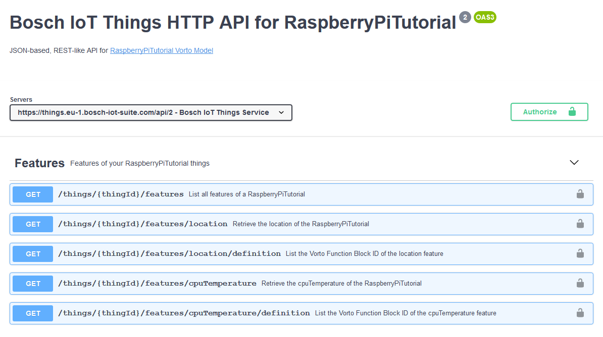

# Generate Digital Twin OpenAPI from an Information Model

This tutorial explains how to generate a fully functional OpenAPI spec from an existing Information Model described in the Vorto Repository.

In this example we'll be using one of the pre-created models. It has a `Geolocation` and `Temperature` Function Block.   
The rendered version of the generated OpenAPI spec for this models looks like this.



<br />

### Prerequisite
* [BoschID](https://accounts.bosch-iot-suite.com/) Account or [GitHub](https://github.com/) 
* You are a collaborator/owner of a namespace
* Subscription to [Asset Communication for Bosch IoT Suite](https://www.bosch-iot-suite.com/asset-communication/) (Free plan, no credit card required)
* Created a Vorto Information Model refer to [Describing a device](./describe_device-in-5min.md))

<br />

## Steps to follow

**1**. [Provision device](./create_thing.md) in Bosch IoT Suite

**2.** Send telemetry data to Bosch IoT Suite using [Java](./connect_javadevice.md), [Python](./mqtt-python.md), or [Arduino](./connect_esp8266.md)

**3.** Create OpenAPI for Bosch IoT Things by choosing the Information Model of your choice and using the OpenAPI generator within the `Official Plugins` section of the details page.


Once you cick the plugin, a pop-up will let you choose which Digital Twin specification the OpenAPI spec should be created for.
> **Note**: Right now, only the Bosch-IoT Things specification is available


**4.** Once downloaded, use the `.yml` file and paste it into the [Swagger Editor](https://editor.swagger.io/).   
You're now all set up with the API documentation..

**5.** We can now use the generators to create clients and even server in different lanugauges.
> **Note**: The downloaded client contains all the features of the SwaggerUI. In our case we therefore need to [authenticate with the Bosch Suite Auth token](https://accounts.bosch-iot-suite.com/oauth2-clients). 


**6.** The generated client can then be used to conveniently get the data and definitions of the used Function Blocks, e.g. the temperature of the RaspberryPi model. 
```python
# Configure OAuth2 access token for authorization: BoschID
configuration = swagger_client.Configuration()
configuration.access_token = 'YOUR_SUITE_AUTH_TOKEN'

# create an instance of the API class
api_instance = swagger_client.FeaturesApi(swagger_client.ApiClient(configuration))
thing_id = 'YOUR_DEVICE_ID'

try:
    # Retrieve the cpuTemperature of the RaspberryPi
    api_response = api_instance.things_thing_id_features_cpu_temperature_get(thing_id)
    pprint(api_response)
except ApiException as e:
    print("Exception when calling FeaturesApi->things_thing_id_features_cpu_temperature_get: %s\n" % e)
```

When executed, this will output the following information.

```bash
$ python clientTest.py
{'definition': ['org.eclipse.vorto:Temperature:1.0.0'],
 'properties': {'status': {'value': {'current_measured': '66.604',
                                     'max_measured': '0',
                                     'min_measured': '0'}}}}
```

<br />

## What's next?
- [Visualize device data](create_webapp_dashboard.md) in a Node.js web application.

---

In case you're having difficulties or facing any issues, feel free to [create a new question on StackOverflow](https://stackoverflow.com/questions/ask?tags=eclipse-vorto) and we'll answer it as soon as possible!   
Please make sure to use `eclipse-vorto` as one of the tags. 
