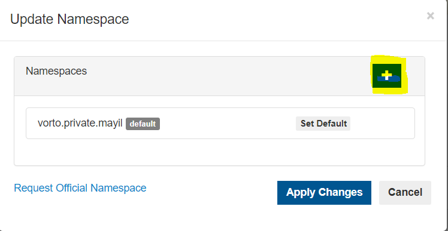

# Managing Repositories  
  
## Creating Repositories  
> **What is a Repository ?**   
A repository as the name implies is a collection of Namespaces. A repository provides a secure workspace for saving models, without interfering with models of other users.  
  
 

An administrator can create his own private repository (restricted to 2 repositories per user) by navigating to the 'Manage Repositories' page, by clicking the 'Manage' tab as shown below:  

  

If the user does not have any repositories, then a link for repository creation will be displayed as shown below:  

  
 
 On clicking the link, the user will get a pop-up which enables repository creation. The Namespace field will be auto-populated with the user ID, if needed it can be edited.  

Users can also click the 'Create Repository' button for creating a repository.  

> **What is a Namespace ?**   
A Namespace is a terminology which is used for grouping similar models. Several models can be grouped under a common namespace.  

 

  

In addition to the namespace, an official namespace can also be requested by clicking the highlighted link below:  

  

On clicking the link the user's default mail client will open up with pre-populated subject and recipients.   

  

 

## Updating Repositories  

The repository can be updated by clicking the icon highlighted below:  

  

On clicking the link, the user will get a pop-up which enables editing and adding more namespaces to the repository, a new namespace can be added by clicking the highlighted button as below:  

  

In addition to the namespace, an official namespace can also be requested by clicking the highlighted link below:  

  

On clicking the link the user's default mail client will open up with pre-populated subject and recipients.   

  

 

## Manage Collaborators  

> **Who is a Collaborator ?**   
A collaborator is a user under whom the repository is created/edited. A Collaborator who has Administrator access can add other collaborators and also assign roles to them.  This way multiple users can collaborate on the same model/namespace pertaining to their respective roles.

 

Collaborators can be managed by clicking the link as highlighted below. This option enables the user to manage his/her roles and also adding/updating additional user roles.  

  

On clicking the link, a pop-up with the default collaborator roles will be displayed as below:  
  
  

The user roles can be edited by clicking the edit icon as below:  

  

 

The roles and their corresponding permission are listed below:  
- **VIEW** permission to browse models
- **CREATE** permission to create and modify models
- **PROMOTE** permission to release models
- **REVIEW** permission to review and approve models
- **ADMINISTRATOR** permission to manage the current repository  

Additional users/collaborators can be added by clicking the 'Create' button'  

  

