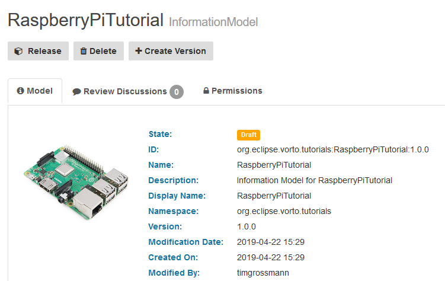
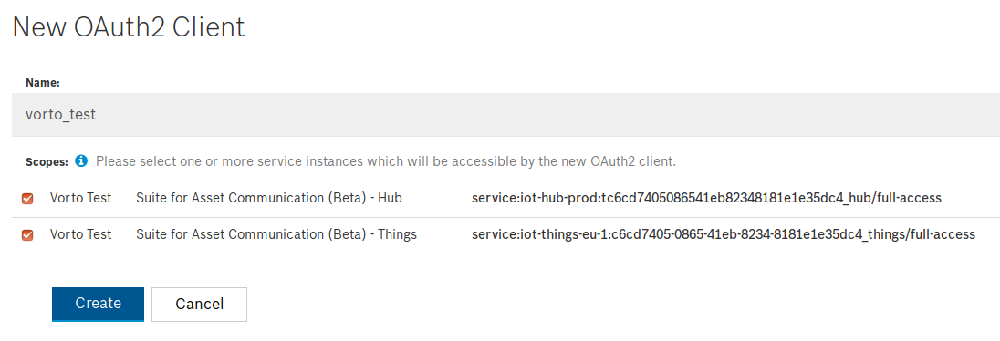
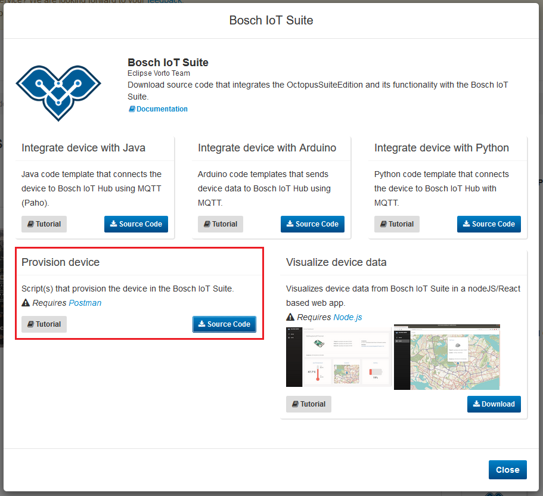
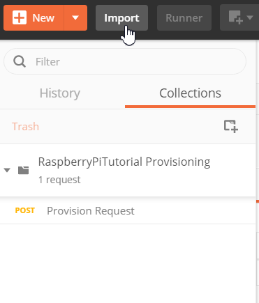
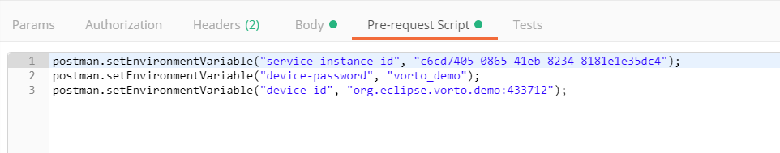
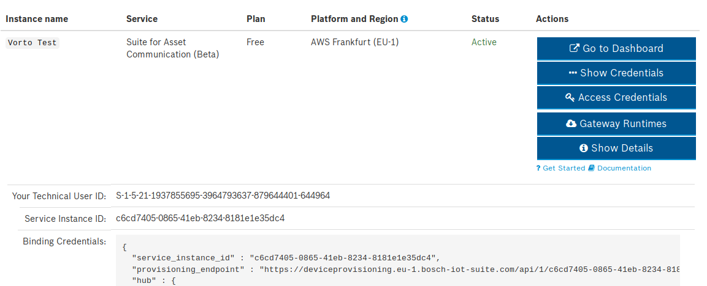
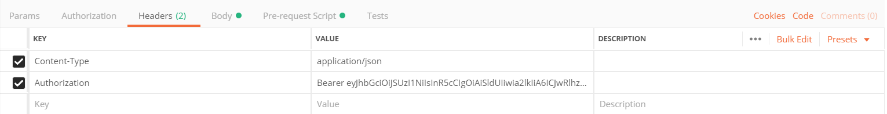

# Creating a thing in the Bosch IoT Suite from a Vorto Information Model

This tutorial explains how to create a thing in the Bosch IoT Suite that was described as a Vorto Information Model.   
As an example, we will use our [RaspberryPi Information Model](https://vorto.eclipse.org/#!/details/org.eclipse.vorto.tutorials:RaspberryPi:1.0.0). 

 

## Prerequisites

* [Postman is installed](https://www.getpostman.com/downloads/)

* Created a Vorto Information Model for the device (refer to [Describing a device](./describe_device-in-5min.md)).

* [Bosch ID User Account](https://accounts.bosch-iot-suite.com)

* Subscription to [Asset Communication for Bosch IoT Suite](https://www.bosch-iot-suite.com/asset-communication/) (Free plan, no credit card required)
> Make sure to have a `namespace` set in the dashboard of Asset communication!

* Created a [Bosch IoT Suite OAuth2 Client](https://accounts.bosch-iot-suite.com/oauth2-clients/)
> Make sure to have both scopes checked on creation! (Hub and Things)

 

## Steps
1. Download the Device provision postman script
2. Configure the request with your custom information
3. Create a new thing

 

## Download the Device provision postman script

**1.** On the Vorto Repository page of your Information Model (we will use the [RaspberryPi Information Model](https://vorto.eclipse.org/#!/details/org.eclipse.vorto.tutorials:RaspberryPi:1.0.0)), click on the `Bosch IoT Suite` generator. This will trigger a pop up to appear with the available generators.     

**2.** We want to provision a device. Click the `Source Code` button to download the generated Postman script.

**3.** Unzip the downloaded file and open Postman   

**4.** Import the file present in the extracted folder into Postman.   

 

## Configure the request with your custom information

**5.** Click on the just imported `Collections` and switch to the `Pre-request Script` tab.

**6.** In here you will see 3 entires. 

- **service-instance-id**: Service Instance ID of your asset communication subscription. (Can be found in the *Show Credentials* on the far bottom)

- **device-id**: Some Unique ID to give the device in the format of `<namespace>:<uniqueId>`. (Namespace has to defined and can be found in the namespace tab of the asset communication subscription).

- **device-password**: Password to be used when creating the integration for the device and sending data to it.

 

**7.** Once you've entered the information into the tab, switch to the `Headers` tab.

**8.** Head over to your Bosch IoT Suite account and open the [OAuth2 Client page](https://accounts.bosch-iot-suite.com/oauth2-clients). Click the `Use` button to get a temporary token (valid for 5min).

**9.** Insert the temporary token into the second row that says `Authorization`. **Don't** remove the `Bearer` keyword.

 

## Create a new thing

**10.** After entering the token, press the blue `Send` button in the upper right corner to create your Thing.

**11.** Once your request was successful, you'll see a long response in the bottom section of Postman and the status `201 Created`. Now your thing has been created and you can start with the integration. 

 

## What's next?

- [Visualize your data with the Vorto Dashboard](./create_webapp_dashboard.md)
- Integrate your device with the Bosch IoT Suite using:
  - [Python](./mqtt-python.md)
  - [Arduino](./connect_esp8266.md)
  - [Java](./connect_javadevice.md)
  
---

In case you're having difficulties or facing any issues, feel free to [create a new question on StackOverflow](https://stackoverflow.com/questions/ask?tags=eclipse-vorto) and we'll answer it as soon as possible!   
Please make sure to use `eclipse-vorto` as one of the tags. 
