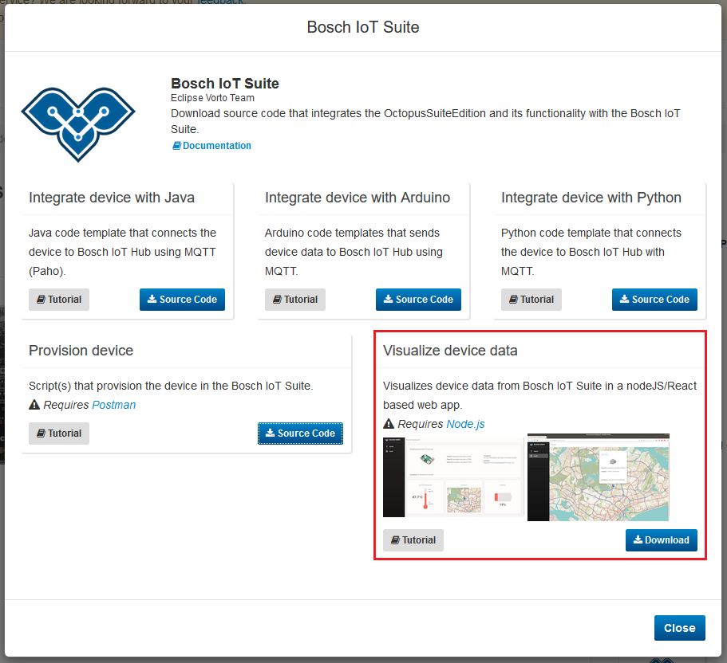
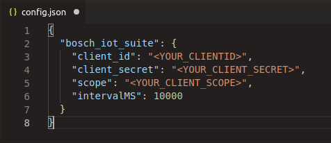

# Using the Vorto Dashboard

This tutorial teaches you how to use the Vorto Dashboard and quickly display the data of the integrated things.
we will use our [RaspberryPiTutorial Information Model](https://vorto.eclipse.org/#/details/org.eclipse.vorto.tutorials:RaspberryPiTutorial:1.0.0) that is already released and available for you to use.
Once set up, the dashboard displays the latest state of your things in a visually appealing manner.


## Prerequisites
- [NodeJS](https://nodejs.org/en/download/) and [NPM](https://www.npmjs.com/get-npm) installed

- Created a [Bosch ID User Account](https://accounts.bosch-iot-suite.com)

- Created a Thing from an Information Model (refer to [Creating a thing](./create_thing.md))

<br />

## Steps
1. Download and install the Vorto Dashboard
1. Copy Client ID, Client secret, scope into the config.json file.
1. [Create more Things](./create_thing.md).

<br />

## Download and install the Vorto Dashboard
**1.** On the Vorto Repository page of your Information Model (we will use the [RaspberryPiTutorial Information Model](https://vorto.eclipse.org/#/details/org.eclipse.vorto.tutorials:RaspberryPiTutorial:1.0.0)), click on the `Bosch IoT Suite` generator. This will trigger a pop up to appear with the available generators.     


**2.** Download the [Vorto Dashboard](https://download.eclipse.org/vorto/downloads/vorto-webui.zip) from the generator in the Vorto Repository.   


**3.** After unzipping the just downloaded file, use your Terminal to install the necessary dependencies using `npm install`. 
> Make sure you `cd` into the right folder first.

<br />

## Copy Client ID, Client secret, and scope into the config.json file.
**4.** While the dependencies are being installed, open the `config.json` file and insert client_id, secret and scope from your [Already created OAuth2 Client](https://accounts.bosch-iot-suite.com/oauth2-clients).   



> **Note:** Make sure to use the **Things** scope in your `config.json` file! 

<br />

## Start the dashboard
**5.** Once all the dependencies are installed and you've entered the credentials into the `config.json` file, do a simple `npm start` within the same directory to start the application.
> You will see a log entry telling you the port the application is running on.    
Default is `localhost:8080`. Open this URL in your browser.

**6.** If everything is running correctly, you will see something like this in your Terminal:
```bash
$ npm start

> vorto_dashboard@0.1.0 start /home/tim/dashboard_test
> node index.js

App running on port 8080
=> Successfully pulled 5 things.
```

**7.** You will now be able to see your things inside of the Vorto Dashboard.
If your device isn't integrated and sending data already, check out these tutorials on how to start sending device data to the cloud.

<br />

## What's next?

- Integrate your device with the Bosch IoT Suite using:
  - [Python](./mqtt-python.md)
  - [Arduino](./connect_esp8266.md)
  - [Java](./connect_javadevice.md)
