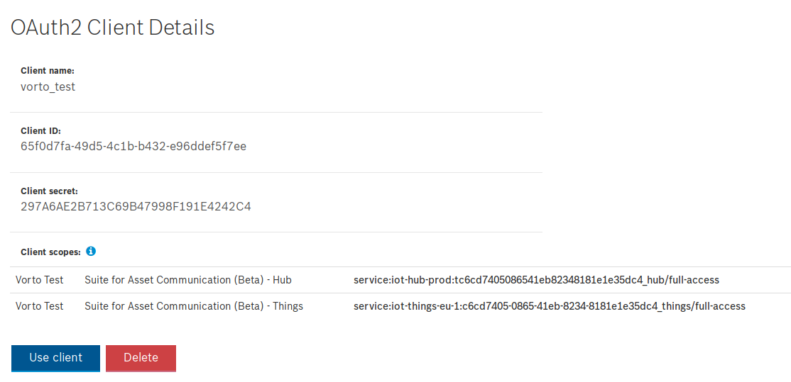

# Generate a Node.js Dashboard that reads device data from Bosch IoT Suite and visualizes it in Vorto UI Widgets.

This tutorial teaches you how to use the Vorto Dashboard and quickly display the data of the integrated things.
we will use our [RaspberryPi Information Model](https://vorto.eclipse.org/#!/details/org.eclipse.vorto.tutorials:RaspberryPi:1.0.0) that is already released and available for you to use.
Once set up, the dashboard displays the latest state of your things in a visually appealing manner.


## Prerequisites
- [NodeJS](https://nodejs.org/en/download/) and [NPM](https://www.npmjs.com/get-npm) installed

- Created a [Bosch ID User Account](https://accounts.bosch-iot-suite.com)

- Created a Thing from an Information Model (refer to [Creating a thing](./create_thing.md))

<br />

## Steps
1. Download and install the Vorto Dashboard
1. Create a `config.json` file with the Client ID, Client secret, scope from your OAuth2 Client
1. [Create more Things](./create_thing.md)

<br />

## Download and install the Vorto Dashboard
**1.** Download and install the Vorto Dashboard by using NPM. In your Terminal type `npm install -g vorto-dashboard`. 
This will install the dashboard as a global dependency which will allow you to call it as `vorto-dashboard` from the Terminal. 

<br />

## Create a `config.json` file with the Client ID, Client secret, scope from your OAuth2 Client
**2.** While the dependencies are being installed, create the `config.json` file and insert client_id, secret and scope from your [Already created OAuth2 Client](https://accounts.bosch-iot-suite.com/oauth2-clients).   
The content of the file has to look like this:

```js
{
  "client_id": "<YOUR_CLIENT_ID>",
  "client_secret": "<YOUR_CLIENT_SECRET",
  "scope": "<YOUR_SCOPE>",
  "intervalMS": 10000
}
```



> **Note:** Make sure to use the **Things** scope in your `config.json` file! 

<br />

## Start the dashboard

**3.** Once the dashboard is installed and you've created the `config.json` file, do a simple `vorto-dashboard <PATH_TO_CONFIG.JSON>` like e.g. `vorto-dashboard ./config.json` if it is in your current directory.

**4.** If everything is running correctly, you will see something like this in your Terminal:
```bash
App running on port 8080
=> Successfully pulled 5 things.
```
Open `localhost:8080` this URL in your browser.


**5.** You will now be able to see your things inside of the Vorto Dashboard.
If your device isn't integrated and sending data already, check out these tutorials on how to start sending device data to the cloud.

<details>
    <summary>
        <b>
            Not displaying any data?
        </b>
    </summary> 

#### Reset the Bridge (Connection of the Asset Communication Package)
Switch back to the tutorial about [integrating a device](./mqtt-python.md) and double check that data is being sent.

If you see the sensor data being sent as shown in the `Publish Payload:...` but you still can't see any changes in the Dashboard or SwaggerUI API when retrieving the current state of the Thing, the connection between Hub and Things might have corrupted at some point.

This is simple to solve. This so called "Bridge" is created by default one subscribing to the Asset Communication.
1. Head over to your [Subscriptions page](https://accounts.bosch-iot-suite.com/subscriptions/) and click on the **Go to Dashboard** button of your Asset Communication Subscription.

2. On the newly opened tab, click on the **Connection** tab that will display all the connections you've set up.
By default there will be a **Telemetry Bosch IoT Hub** connection.

> **Note** that if there is a problem, you will see a triangle with an exclamation mark inside that indicates some failed connection.

3. Click on the connection and hit the **Close connection** button. Wait until the connection is closed.

4. Once the connection was closed, re-open it by clicking the **Open connection** button.

5. After the connection has been re-established, **restart your sensor data sending script** and observe.

</details>

<br />

## What's next?
- Extend the Dashboard by [creating custom UI widgets](https://github.com/eclipse/vorto-examples/blob/master/vorto-dashboard/extending.md)
- [Generate an OpenAPI Spec for your device](create_openapi.md)
- Integrate your device with the Bosch IoT Suite using:
  - [Python](./mqtt-python.md)
  - [Arduino](./connect_esp8266.md)
  - [Java](./connect_javadevice.md)
  
---

In case you're having difficulties or facing any issues, feel free to [create a new question on StackOverflow](https://stackoverflow.com/questions/ask?tags=eclipse-vorto) and we'll answer it as soon as possible!   
Please make sure to use `eclipse-vorto` as one of the tags. 
