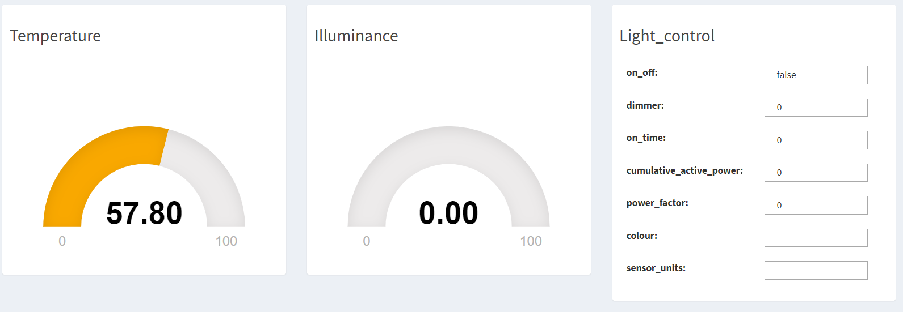

# Creating a Device-specific Web Application

This tutorial explains how to build a small Spring-boot AngularJS Web application that is able to consume device values from the Bosch IoT Suite Cloud Services and display the data in a dashboard. In this example, a web application specific to the XDK functionality is created using the XDK Information Model (refer to [XDK Information Model](https://vorto.eclipse.org/#/details/com.bosch.bcds:XDK:1.0.0)).

## Prerequisites

* [Bosch ID User Account](https://accounts.bosch-iot-suite.com)

* Subscription to [Asset Communication for Bosch IoT Suite](https://www.bosch-iot-suite.com/asset-communication/) (Free plan, no credit card required)

* You have created a XDK thing in the Bosch IoT Suite (refer to [Creating a Thing in the Bosch IoT Suite](create_thing.md)).

## Proceed as follows

1. Generate a Web application.

	- In the [Thing Browser](https://vorto.eclipse.org/console/#/thingbrowser), browse for the registered XDK information model.

	- From the list of generators on the **Source Code Templates** tab, choose **AngularJS Spring-boot Application** and click **Download**.
	
		
	 
		This will generate a ZIP archive containing a maven project of the XDK dashboard spring-boot application.

	- **Unzip** the archive and **Import** the project as a Maven Project into your Eclipse IDE.

2. Configure the application for Bosch IoT Suite.

	- Download [bosch-iot-cloud.jks](bosch-iot-cloud.jks) and store it in a *secure* folder of the project under `/src/main/resources`.

	- From the secure folder, open a command prompt to create a public and private key pair for your solution. Store the CRClient in the *secure* folder as well:
	
			keytool -genkeypair -noprompt -dname "CN=-, OU=-, O=-, L=-, S=-, C=-" -keyalg EC -alias CR -sigalg SHA512withECDSA -validity 365 -keystore CRClient.jks

	- Extract the public key information into a separate file:
	
			keytool -export -keystore CRClient.jks -alias CR -rfc -file CRClient_key.cer

	- Print the public key to the command prompt:
	  
			keytool -printcert -rfc -file CRClient_key.cer

	-  Open the Things Administration Dashboard for your solution and submit your public key by pasting the key from the command prompt (refer to previous step).
	
	- Open the file `src/main/resources/application.yml`.

		- Insert the Bosch IoT Permissions and Bosch IoT Things credentials:
	
				spring:
				  jackson:
				    serialization:
				      write-dates-as-timestamps: false
				bosch:
				  things:
				    alias: CR
				    alias.password: [enter keystore password]
				    endpointUrl: https://things.apps.bosch-iot-cloud.com
				    wsEndpointUrl: wss://events.apps.bosch-iot-cloud.com
				    apiToken: [enter Bosch IoT Things API Token here ]
				    keystoreLocation: /secure/CRClient.jks
				    trustStoreLocation: /secure/bosch-iot-cloud.jks
				    trustStorePassword: jks
				    solutionid: [enter Bosch IoT Things solution ID here ]
				    keystore:
				    password: [enter keystore password]
	
		- If you are behind a proxy, add proxy information:
	  
				  http:
				    proxyUser: [enter proxy user]
				    proxyPassword: [enter proxy password]
				    proxyHost: [enter proxy host]
				    proxyPort: 8080
	
		- Include google OAuth2 client details:

				google:
				  oauth2:
				    client:
				      clientId: [enter google client ID]
				      clientSecret: [enter google client secret]

			Refer to [Guide to create google Client ID for web applications](https://developers.google.com/identity/sign-in/web/devconsole-project).

	- Open the Java class `com.example.iot.xdk.config.LocalConfiguration` and uncomment the proxy authentication configuration.

3. Build and run the application.

	- You can build the application from the command-line using:
	
			$ mvn clean package
	
	- You can easily run the Web application from the command-line using:
	
			$ mvn spring-boot:run

4. Test the application.

	- Open your browser under [http://localhost:8080](http://localhost:8080).

	- Log in with Google:
	
		
	
	- Copy the **Subject** ID from the left menu (highlighted in red).
	
		

5. Update policy of the created thing.

	- In the [Thing Browser](https://vorto.eclipse.org/console/#/thingbrowser) of the Vorto Console, browse for your thing.

	- Select the **Policy** tab and add a new policy, to share the thing with the Google user:

	  - Enter a unique **Label** for your policy.

	  - Choose **Google JWT Token** as subject type.

	  - Paste the **Subject** ID copied from the login screen into the **Subject ID** field:
	
			
	
	- Refresh your Web application [http://localhost:8080](http://localhost:8080) to view the created thing:
	
		
	
	- Click on the device to see the details containing UI widgets for the individual function blocks:

		

6. Update the features of a thing from Things API.

	- Open [Bosch IoT Suite API](https://apidocs.bosch-iot-suite.com).
	  
		- Copy the bosch:things:**apiToken:** value from the file `/src/main/resources/application.yml` and paste it in the **Solution API Token** field.

		- Click **Authorize**.
	  
			
	  
	  - Select **openID** and **Authorize**.
	  
			
	
	- Send some test temperature values to the Bosch IoT Suite, that get displayed in the dashboard.
	
	  - Copy **ThingID** from **Endpoint Configuration** of your thing in the Developer Console and paste it into the **thingId** field.

	  - Enter `temperature` in the **featureId** field.

	  - Copy the raw JSON string (within **temperature{ }**) from the JSON tab or use the updated JSON as given below, and paste it in **featureObject** field and **Try It**.
	    
				{
				  "properties": {
				    "status": {
				      "max_range_value": 100,
				      "min_range_value": -100,
				      "sensor_units": "F",
				      "sensor_value": 57.80,
				      "min_measured_value": 10,
				      "max_measured_value": 90
				    }
				  }
				}
	   
	
	
	
	  
	- Observe the updated temperature widget value in the dashboard of your web application.
	
	
