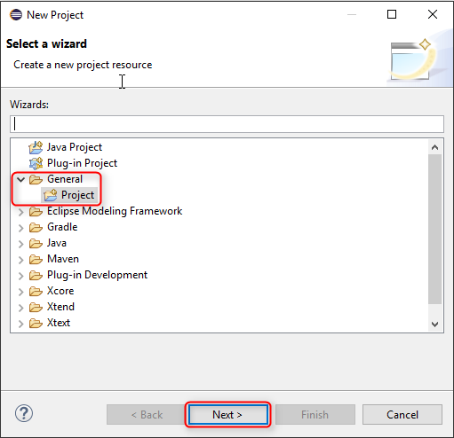
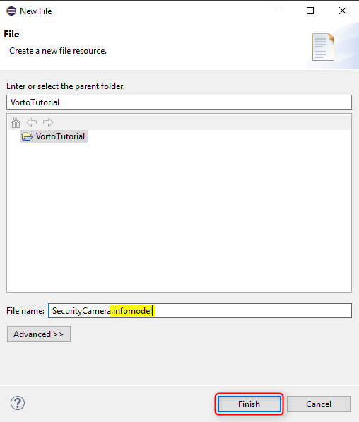
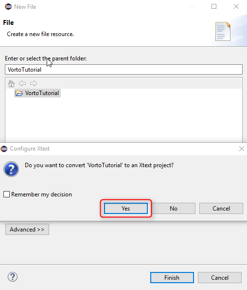
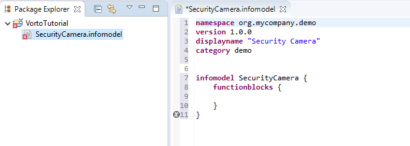
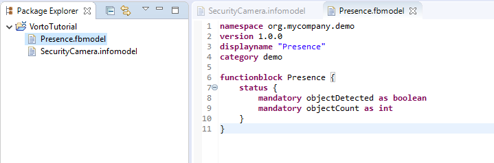
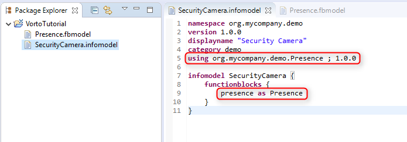
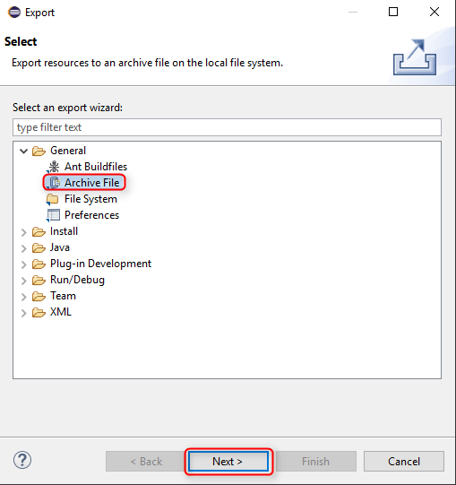
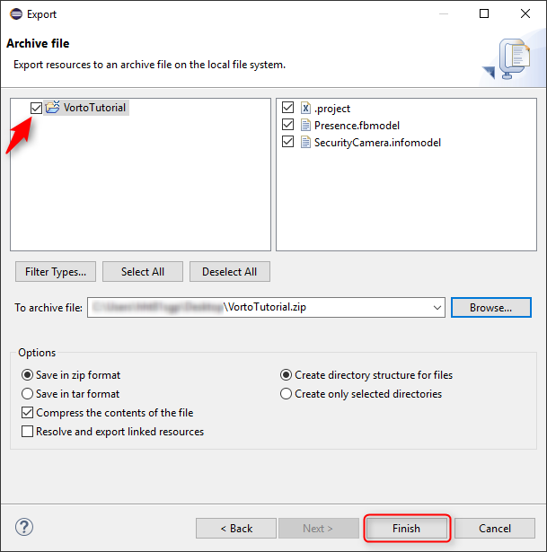

# Describing a device with Vorto using the Eclipse IDE

In this tutorial you are going to learn, how you can use the Eclipse IDE to describe a Vorto Information Model and manage it in the Vorto Repository.

## Prerequisites

* [BoschID](https://accounts.bosch-iot-suite.com/) or [GitHub](https://github.com/) Account 

* Install Eclipse IDE 2018-12 for Java and DSL Developers
	* [Windows](https://www.eclipse.org/downloads/download.php?file=/technology/epp/downloads/release/2018-12/R/eclipse-dsl-2018-12-R-win32-x86_64.zip)
	* [MacOS](https://www.eclipse.org/downloads/download.php?file=/technology/epp/downloads/release/2018-12/R/eclipse-dsl-2018-12-R-macosx-cocoa-x86_64.dmg)
	* [Linux](https://www.eclipse.org/downloads/download.php?file=/technology/epp/downloads/release/2018-12/R/eclipse-dsl-2018-12-R-linux-gtk-x86_64.tar.gz)

## Proceed as follows

### Step 1: Installation of Vorto DSL Eclipse Plugins

1. Open Eclipse IDE

2. Install the Vorto Eclipse Plugins from the zip-file from the [Vorto Eclipse Update Site](https://download.eclipse.org/vorto/downloads/releases/0.10.0/org.eclipse.vorto.update-site-0.10.0.zip)

3. Restart your Eclipse

### Step 2: Create a Simple Eclipse Project
1. Right-click -> **New Project**

    
2. Choose a project name and click **Finish**.

### Step 3: Describe a device
In this tutorial we will use a security camera to illustrate how to describe a device with Vorto using Eclipse.
To keep it simple, we will describe the camera with the indispensable *Informationmodel* and only one *Functionblock*.

**1. Informationmodel**
To create a new *Informationmodel*, right-click on your created project and select **New File**. 
It is important the file name suffix represents the type of file you want to create: `SecurityCamera.infomodel`

After clicking **Finish**, you will be asked if you want to convert your project to an Xtext project. Click **Yes** to enable autocomplete.

With the help of the autocomplete function (`Ctrl-space`) you can now describe the *Informationmodel* of your device.

The next step is to describe the needed functionalities of the camera.

**2. Functionblock**
When creating the new file for the *Functionblock*, make sure that you use the correct suffix: `Presence.fbmodel`

Now we need to reference from the *Informationmodel* to your newly created *Functionblock*.
Go back to your `.infomodel` file and add `using org.mycompany.demo.Presence ; 1.0.0`, using your respective *namespace* and *name*.

Now you need to define an instance of the function within **functionblocks**. The autocomplete function should already suggest your referenced *Functionblock*.

 

### Step 4: Import the Model into the Vorto Repository
You can now import your *Informationmodel* into the [Vorto Repository](https://vorto.eclipseprojects.io) where you can manage your models and release it to the community.
To do that, you need to export your project as a **General Archive File**.

Log into the [Eclipse Vorto Repository](https://vorto.eclipseprojects.io) with your BoschID or GitHub account and [**Import** the zip-file](../../repository/docs/import_model.md).

## What's Next?

- [Connect the device to Bosch IoT Suite](connect_javadevice.md) by a given Vorto Information Model
- [Reference Vorto Models files from your custom DSL](https://github.com/eclipse/vorto-examples/blob/master/vorto-dsl-integration/Readme.md) with [Eclipse Xtext](https://www.eclipse.org/xtext)
- [Other tutorials](../gettingstarted.md)

---

In case you're having difficulties or facing any issues, feel free to [create a new question on StackOverflow](https://stackoverflow.com/questions/ask?tags=eclipse-vorto) and we'll answer it as soon as possible!   
Please make sure to use `eclipse-vorto` as one of the tags. 
