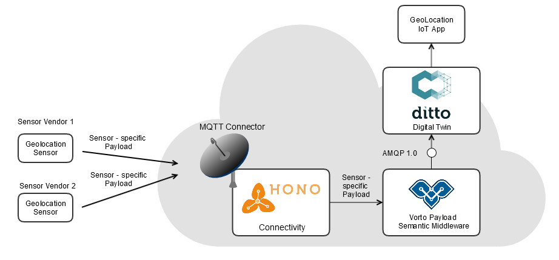
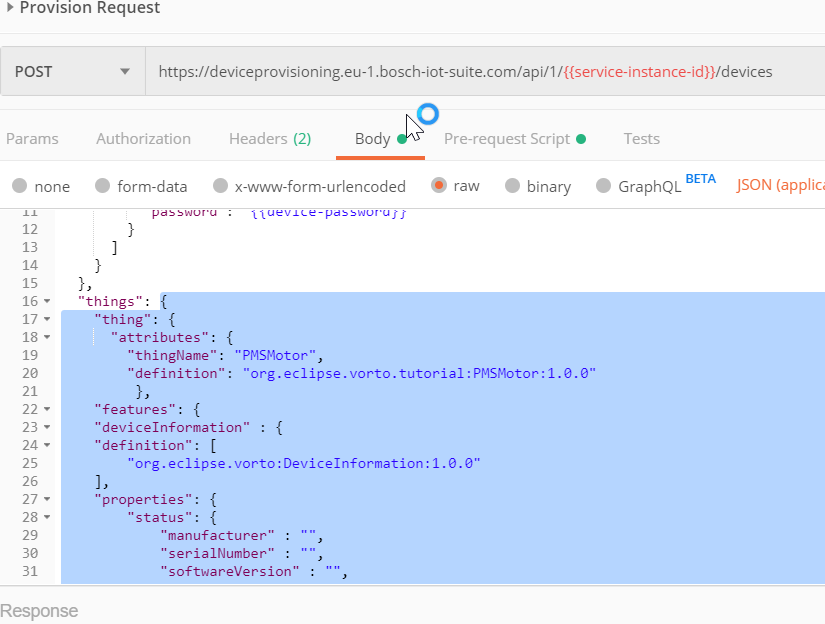
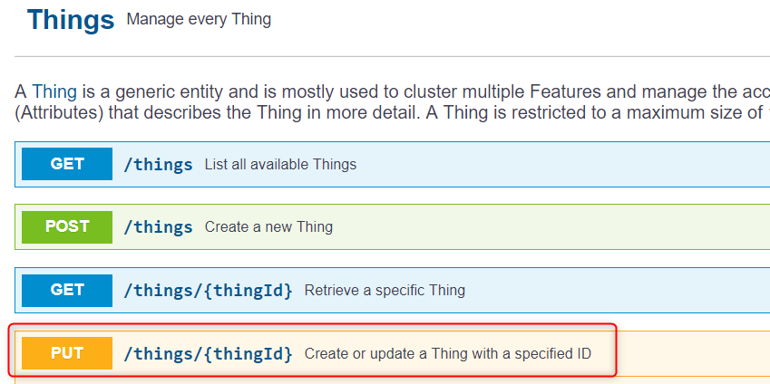
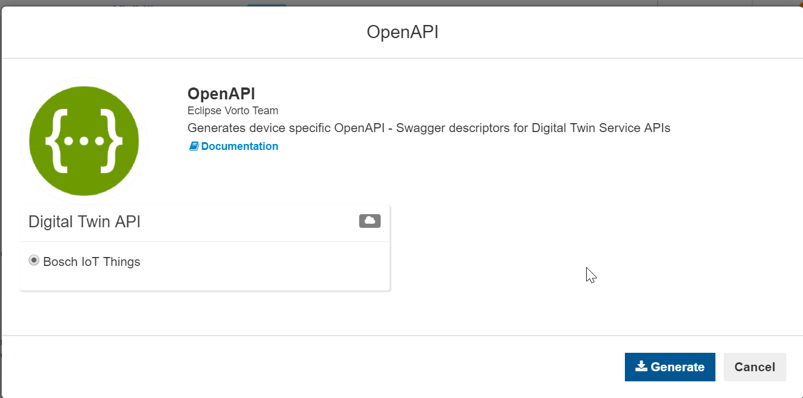

# Extend your pipeline with a Digital Twin Service

So far we have been consuming data directly from Eclipse Vorto Middleware and using it in our GeoLocation App. In the absence of a persistence layer there is no way to know the last active location of the assets. So lets extend our pipeline with a digital twin service.

In simple words digital twin is the virtual representation of a physical asset. All major cloud vendors provide a digital twin service and minimally all of them have a feature of persisting the last known state of the device. We will be using Eclipse Ditto aka Bosch IoT Things as the digital twin service for this tutorial.

The digital twin service will be placed between the Eclipse Vorto Middleware and the IoT Solution. This will allow it to receive the converted device data from Eclipse Vorto Middleware and persist it. Our IoT Solution can then use the Bosch IoT Things REST API to fetch the data.



## Steps to take
1. Subscribe to Bosch IoT Things service
2. Register devices in Bosch IoT Things
3. Configure connection between Bosch IoT Things and Eclipse Vorto Middleware
4. Modify solution to receive data from Bosch IoT Things
5. Test your solution

## Pre-requisites
This tutorial is a follow-up to [Decouple IoT solutions from connected device data](./create_mapping_pipeline.md) hence you must read it first before continuing any further.

- Bosch ID Account
- Subscribe to Bosch IoT Things (Free plan) for digital twin service based on Eclipse Ditto
- Eclipse Vorto Middleware AMQP endpoint for configuring in Bosch IoT Things service

## Step 1: Subscribe to Bosch IoT Things service
In the previous tutorial we subscribed to the Bosch IoT Hub service from [bosch-iot-suite.com](https://www.bosch-iot-suite.com). This time we will subscribe to the free plan of Bosch IoT Things service. Sign-in with your account and subscribe the service.

## Step 2: Register devices in Bosch IoT Things

For Bosch IoT Things to create a digital twin for our devices we need to register our devices. This can be done easily by following three steps:

1. Generate the device provisioning postman scripts using the Bosch IoT Suite generator from [Eclipse Vorto Repository](https://vorto.eclipse.org/).

2. Import the generated file in postman and navigate to the request body. Copy only the *things* part of the body payload.
	
	

3. Open Bosch IoT Things [swagger-ui](https://apidocs.bosch-iot-suite.com/?urls.primaryName=Bosch%20IoT%20Things%20-%20API%20v2#/) and register your device, remember to use the same device-id you used for registering with Bosch IoT Hub.

	

> Repeat the steps for adding more devices.

## Step 3: Configure connection between Bosch IoT Things and Eclipse Vorto Middleware

It's time to configure our Bosch IoT Things instance to listen to incoming data from Eclipse Vorto Middleware. Sign-in to [bosch-iot-suite.com](https://www.bosch-iot-suite.com) and navigate to Things dashboard. Click on the Connections/Integrations tab and add a connection to your Eclipse Vorto Middleware instance.

## Step 4: Modify solution to receive data from Bosch IoT Things

Until now our application was consuming data directly from Eclipse Vorto Middleware, let's change that in order to consume data from Bosch IoT Things HTTP REST endpoints. Refer to [developer documentation](https://things.eu-1.bosch-iot-suite.com/dokuwiki/doku.php?id=dev_guide:http_api:start) from Bosch IoT Things on how to use their api.

You can also choose to use the Eclipse Vorto Open API generator to generate device specific client for Bosch IoT Things saving you a lot of time.



Import the downloaded yml file in [editor.swagger.io](https://editor.swagger.io) and click on generate client for java. This will give you the java code required to invoke the REST endpoints from your application. Refer to the readme file in generated java client to get started with integrating the generated code in your solution.

## Step 5: Test your solution

Use `mosquitto_pub` client to send some geolocation data: 

```bash
mosquitto_pub -h mqtt.bosch-iot-hub.com -p 8883 -u {auth-id}@{tenant-id} -P {password} -t telemetry/{tenant-id}/4711 -m '{"longitude": "103.3223", "latitude": "3.2322"}' --cafile iothub.crt
```

If you see the updates in your application voila you just successfully extended your pipeline to work with a digital twin.

---

<br />

In case you're having difficulties or facing any issues, feel free to [create a new question on StackOverflow](https://stackoverflow.com/questions/ask?tags=eclipse-vorto) and we'll answer it as soon as possible!   
Please make sure to use `bosch-iot-suite` as one of the tags. 
