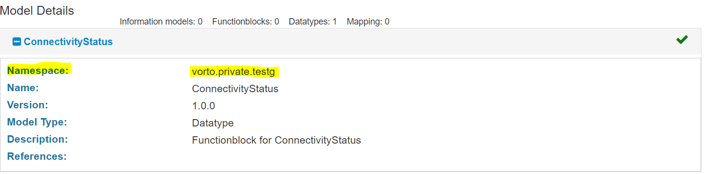
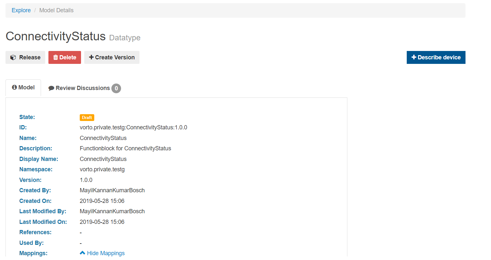

# Importing Models  

Models can be imported by navigating to **'Import'** tab.  
 
Two options are available to import:  
**1.** IPSO imports LwM2M / IPSO descriptions.   
**2.** Vorto imports information models, defined with the Vorto DSL.  

  
 
The **accepted extensions** for uploading models are : 
- .mapping 
- .infomodel 
- .zip 
- .type 
- .fbmodel  

 

## Uploading Vorto Models  

The Vorto option should be selected, followed by Model upload by browsing from the file system. Once the file is selected, 'Upload' button will be enabled.  

  

Once the model has been successfully uploaded, the user will see a similar screen as below:  

  

 

## Prerequisites for importing models  

The following criteria must be met for successful model import and upload:  
- The user must **have 'Model Creator'** permission
- The user must already **have a repository with a namespace** associated with it.
- The **namespace of the model** uploaded **and the namespace** associated with the repository **must match**.  

For example, the namespace of the model uploaded below is 'vorto.eclipse.testg':  

  

The user already has a repository which has a namespace 'testg' associated with it.  

  

If the above prerequisites does not match, below error will be displayed:  

  

 

## Importing Vorto Models  

On successful model upload, the 'Import' button will be enabled:  

  

On clicking the 'Import' button, the model will be imported, it should be noted that the imported models will be in 'Draft' state which can be viewed and modified only by the model importer.  

  

 

## Opening Vorto Models  
On successful model import, the model can be opened by clicking on the 'Open Model' button:  

  

On clicking the 'Open Model', the user will be navigated to the 'Models' page, which displays the models at various states:  

  

The model which is currently in ['Draft' state can either be 'Released'](../../repository/docs/model_states.md) or 'Deleted' or modified further.  

  

On clicking the 'Release' button, the below pop-up will be displayed for confirmation:  

  

Once confirmed, it will trigger an internal review process of the Vorto team, it will be either approved or rejected by a user having 'Model Reviewer' permission.  

  

  

## Creating versions  

New versions of models can be created by clicking on the 'Create Version' button:  

  

Once the new version is created, the version gets updated as below:  

  

