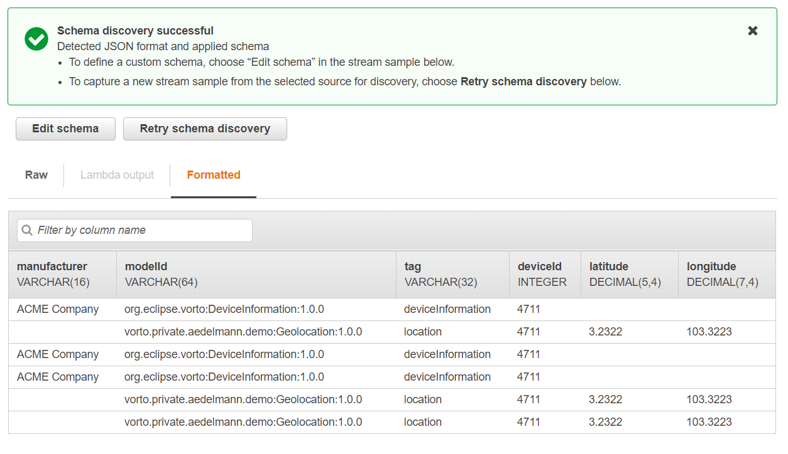
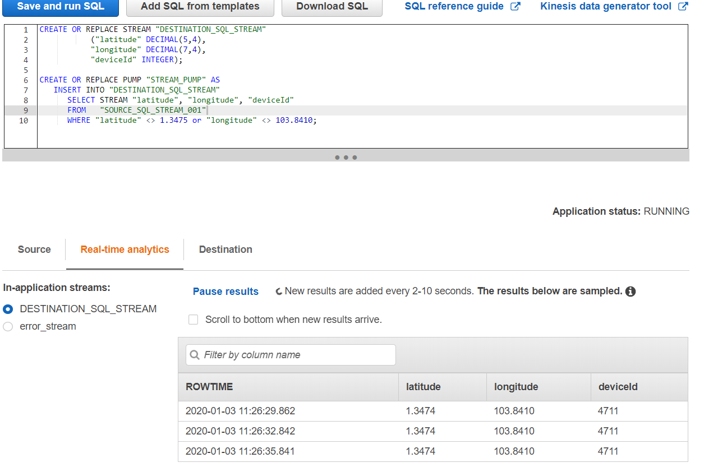

# Integrating AWS Kinesis with Eclipse Vorto for IoT anomaly detection

In this tutorial, you are going to learn, how you can use [Eclipse Vorto](https://www.eclipse.org/vorto) and [AWS Kinesis](https://aws.amazon.com/kinesis/) in order to analyze device data in realtime. 


> **What is AWS Kinesis?** 

> With AWS Kinesis, you can collect and process large amount of data in real time, for example to do anomaly detection or other cool stuff.

We are going to use the GPS sensors, that we had described and connected with Vorto in the [mapping pipeline tutorial](create_mapping_pipeline.md). Make sure you had worked through that tutorial thoroughly before proceeding because it gives you a very good understanding of the essence of the Eclipse Vorto project and prepares everything you need for this tutorial. 
Ready? Great. Let's proceed. 

As shown in the following illustration, we send GPS location data from two different sensors using different data formats via MQTT to Eclipse Hono. The [Eclipse Vorto normalization middleware](https://github.com/eclipse/vorto-examples/blob/master/vorto-middleware/Readme.md) consumes the sensor data and uses the [Vorto AWS Kinesis plugin](https://github.com/eclipse/vorto-examples/blob/master/vorto-middleware/middleware-ext-kinesis/Readme.md), in order to transform the data to a normalized, semantically enriched JSON before forwarding this data to an AWS Kinesis data stream. In Kinesis we will then write a small analytics application, that analyzes the Vorto compliant location data. 
 


## Prerequisites

* Successfully completed the entire [mapping pipeline tutorial](create_mapping_pipeline.md)

<br />

## Steps

Here are the steps, that we are going to take during this tutorial:

1. Setting up Kinesis on AWS
2. Configuring and starting the Vorto middleware with your AWS Kinesis data stream settings
3. Creating an AWS Kinesis analytics application
4. Testing the analytics application by sending device data via MQTT

<br />

## Step 1: Setting up AWS Kinesis

1. Log on to AWS Management Console 
2. Open the AWS Kinesis Dashboard
3. Click **Create Data Stream**
4. Specify a stream name, e.g. *vortoDemo*
5. Specify number of shards. Let's start with **1** for the time being. This number highly depends on the amount of data you are going to process in Kinesis.
6. Confirm with **Create Kinesis Stream** 

## Step 2: Configurating & Starting the Eclipse Vorto Middleware

* Head over to AWS IAM, and create a technical user with AWS Kinesis full access permissions. Keep note of the access key and secret key. 
* Start the Eclipse Vorto Middleware docker with the required [Kinesis environment variables](https://github.com/eclipse/vorto-examples/blob/master/vorto-middleware/middleware-ext-kinesis/Readme.md#configuration) 

```docker run -it -p 8080:8080 -v c:/absolute_local_dir:/mappings -e mapping_spec_dir=/mappings -e github.client.clientId=your_github_clientid -e github.client.clientSecret=your_github_clientsecret -e hono.tenantId=your_tenantId -e hono.password=your_hono_password -e kinesis.streamName=vortoDemo -kinesis.accessKey=mykey -e kinesis.secretKey=mysecret eclipsevorto/vorto-normalizer:nightly```

* Once the service has started successfully, open the local [Eclipse Vorto middleware dashboard](http://localhost:8080/#/plugins). You should see the AWS Kinesis plugin in active mode (green light). 

**Congrats!** Your middleware is all set now to receive IoT device data from Eclipse Hono protocol adapters and forward it to your AWS Kinesis stream.

## Step 3: Creating an AWS Kinesis analytics application

1. Open the Kinesis service dashboard in AWS
2. Click **Create Analytics Application**
3. Specify a name, e.g. *VortoDemoDataAnalytics*
4. Select **SQL** for runtime
5. Confirm with **Create Application**
6. Select **Connect streaming data** and select **Kinesis data stream** as source
7. Choose the data stream, we had created in step 1, e.g. *vortoDemo*
8. Leave the other selections as default.
9. Click **Discover schema**. Make sure you are sending data to the Vorto middleware, so that AWS is able to discover the schema from the data it receives. You should be able to see a table, similar to this:
10. Select **Save and confinue**
11. Choose **Go to SQL Editor** in order to process the incoming device data. Copy the following SQL snippet in the SQL editor: 

```
CREATE OR REPLACE STREAM "DESTINATION_SQL_STREAM"
           ("latitude" DECIMAL(5,4),
            "longitude" DECIMAL(7,4),
            "deviceId" INTEGER);
 
CREATE OR REPLACE PUMP "STREAM_PUMP" AS
   INSERT INTO "DESTINATION_SQL_STREAM"
      SELECT STREAM "latitude", "longitude", "deviceId"
      FROM   "SOURCE_SQL_STREAM_001"
      WHERE "latitude" <> 1.3475 and "longitude" <> 103.8410; 
```

Firstly, we create a new destination stream, which will contain all data that we are interested in for further processing.
In the second statement,  we find all devices and their locations that do not match a specific reference point and insert them into our destination stream.

> This is very basic and simple example. Feel free to modify it to your liking, for a more complex analytics scenerio.  

Finally, make sure, that you **save&run** the SQL. This sets up the realtime analytics application, ready to receive data from our Vorto middleware.

## Step 4: Testing the analytics application

In this step, we are going to test our analytics app by sending some test data via MQTT from both of our gps sensors: 

* Firstly, we send data from the first GPS sensor **not meeting the location reference point condition**. This will be detected by our analytics algorithm and insert the data into our destination kinesis stream. 

	```
	mosquitto_pub -h mqtt.bosch-iot-hub.com -p 8883 -u 4711@tenantID -P secret -t telemetry/tenantID/4711 -m '{"longitude": "103.8410", "latitude": "1.3474"}' --cafile iothub.crt
	```

* Now, let's send some data from the other gps sensor that **meets the reference point condition**:

	```
	mosquitto_pub -h mqtt.bosch-iot-hub.com -p 8883 -u 4712@tenantID -P secret -t telemetry/tenantID/4712 -m '103.8410,1.3475' --cafile iothub.crt
	```


* You can check if the correct location data is pushed into our kinesis destination stream:

	
	
	
* Optionally: For easy debugging, you can observe the [monitoring dashboard](http://localhost:8080/#/monitoring) for any inbound/outbound device messages.


**Way to go!** That's it. You just saw how easy it is to use the Vorto Kinesis plugin with the Eclipse Vorto normalization middleware, in order to push normalized/semantic device data to AWS Kinesis.

## What's next?

* Jump over to the [AWS Kinesis documentation](https://docs.aws.amazon.com/kinesis/index.html) to find out more about how further process your IoT device data.


---

In case you're having difficulties or facing any issues, feel free to [create a new question on StackOverflow](https://stackoverflow.com/questions/ask) and we'll answer it as soon as possible!   
Please make sure to use `eclipse-vorto` as one of the tags. 
