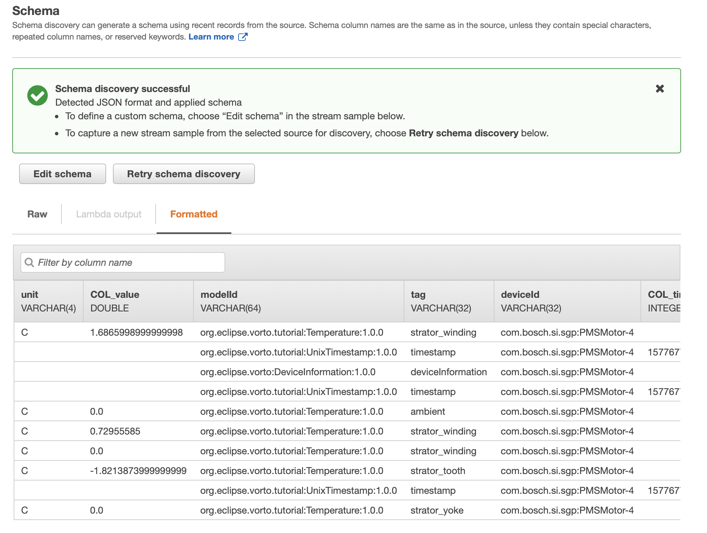

# Integrating AWS Kinesis with Eclipse Vorto for IoT anomaly detection

In this tutorial, you are going to learn, how you can use [Eclipse Vorto](https://www.eclipse.org/vorto) with [AWS Kinesis](https://aws.amazon.com/kinesis/) in order to do realtime device data analytics. 


> **What is AWS Kinesis?** 

> With AWS Kinesis, you can collect and process large amount of data in real time, for example to do anomaly detection or other cool stuff.

We are going to use the GPS sensors, that we had described and connected with Vorto to Eclipse Hono in the [mapping pipeline tutorial](create_mapping_pipeline.md). Makes sure you had worked yourself through that tutorial thoroughly before proceeding because it gives you a very good understanding of the essence of the Eclipse Vorto project and prepares everything you need for this tutorial. 
Done? Great. Let us proceed then. 

As illustrated, we are going to send GPS location data via MQTT to Eclipse Hono and intercept the different payload formats (CSV, JSON) using the [Eclipse Vorto normalization middleware](https://github.com/eclipse/vorto-examples/blob/master/vorto-middleware/Readme.md) and the existing [Vorto AWS Kinesis plugin](https://github.com/eclipse/vorto-examples/blob/master/vorto-middleware/middleware-ext-kinesis/Readme.md), in order to transform the data to a normalized, semantically enriched JSON before forwarding this data to an AWS Kinesis data stream, where we analyze the data.
 


## Prerequisites

* Successfully completed the [mapping pipeline tutorial](create_mapping_pipeline.md)

<br />

## Steps

Here are the steps, that we are going to take during this tutorial:

1. Setting up Kinesis on AWS
2. Configuring and starting the Vorto middleware with your AWS Kinesis data stream settings
3. Sending device data to Eclipse Hono via MQTT and monitor the incoming data in the Eclipse Vorto middleware dashboard
4. Creating an AWS Kinesis analytics application
5. Testing the analytics application

<br />

## Step 1: Setting up AWS Kinesis

1. Log on to AWS Management Console 
2. Open the AWS Kinesis Dashboard
3. Click **Create Data Stream**
4. Specify a stream name, e.g. *vortoDemo*
5. Specify number of shards. Let's start with **1** for the time being. This number highly depends on the amount of data you are going to process in Kinesis.
6. Confirm with **Create Kinesis Stream** 

## Step 2: Configurating & Starting the Eclipse Vorto Middleware

1. Head over to AWS IAM, and create a technical user with AWS Kinesis full access permissions. Keep note of the access key and secret key. 
2. Start the Eclipse Vorto Middleware docker with the required [Kinesis environment variables](https://github.com/eclipse/vorto-examples/blob/master/vorto-middleware/middleware-ext-kinesis/Readme.md#configuration).
3. Once the service has started successfully, open the local [Eclipse Vorto middleware dashboard](http://localhost:8080/#/plugins). You should see the AWS Kinesis plugin in active mode (green light). 

**Congrats!** Your middleware is all set now to receive IoT device data from Eclipse Hono protocol adapters and forward it to your AWS Kinesis stream.

## Step 3: Sending device data

1. As in the [mapping tutorial](create_mapping_pipeline.md), send your device data via MQTT to the Eclipse Hono MQTT adapter
2. Open the [Vorto Middleware Monitoring dashboard](http://localhost:8080/#/monitoring) and observe the logs. You should see something like this: 


> **Not seeing any incoming data logs?**

> 1. Have you started the middleware with the correct Eclipse Hono tenant and AMQP settings?
> 2. Have you successfully registered the device(s) in the Eclipse Hono Device Registry?

> Head over to the [mapping tutorial](create_mapping_pipeline.md) to find out more about the right settings. 

## Step 4: Creating an AWS Kinesis analytics application

1. Open the Kinesis service dashboard in AWS
2. Click **Create Analytics Application**
3. Specify a name, e.g. *VortoDemoDataAnalytics*
4. Select **SQL** for runtime
5. Confirm with **Create Application**
6. Select **Connect streaming data** and select **Kinesis data stream** as source
7. Choose the data stream, we had created in step 1, e.g. *vortoDemo*
8. Leave the other selections as default.
9. Click **Discover schema**. Make sure you are sending data to the Vorto middleware, so that AWS is able to discover the schema from the data it receives. You should be able to see a table, similar to this:
10. Select **Save and confinue**
11. Choose **Go to SQL Editor** in order to process the incoming device data. Copy the following SQL snippet in the SQL editor and **save&run** the SQL: 

```
HERE goes the SQL analytics snippet for the gps analytics 
```

TODO: Explain the SQL snippet.

## Step 5: Testing the analytics application

In this step, we are going to send some test data of our first GPS sensor with location data, not meeting the analytics rule.  

```mosquitto pub sending JSON with location data```

Now, we are sending test data of the second gps sensor in CSV format that meets the geofence condition:

```mosquitto pub sending JSON with location data```

Now you can check the Kinesis analytics application on AWS where the stream now contains the data of our second sensor. 

## What's next?

* Jump over to the [AWS Kinesis documentation](https://docs.aws.amazon.com/kinesis/index.html) to find out more about how further process your IoT device data.


---

In case you're having difficulties or facing any issues, feel free to [create a new question on StackOverflow](https://stackoverflow.com/questions/ask) and we'll answer it as soon as possible!   
Please make sure to use `eclipse-vorto` as one of the tags. 
