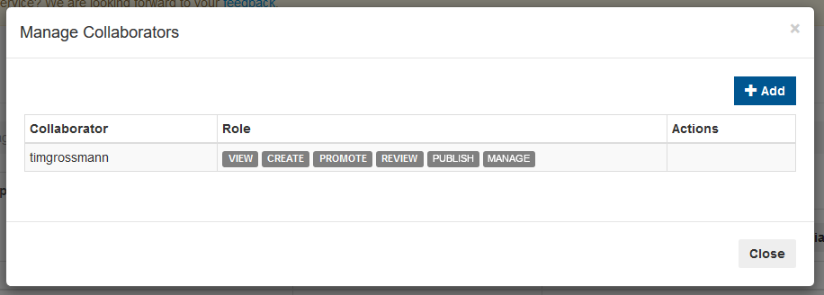
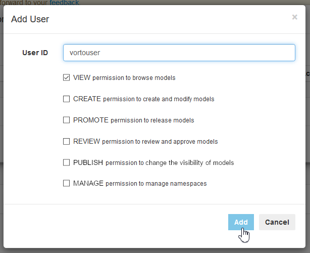

# Managing Collaborators

> **What is a Collaborator** ?    
A Collaborator is a user with access to the namespace. 
A Collaborator who has Administrator access can add other collaborators and also assign roles to them.    
This way multiple users can collaborate on the same model/namespace pertaining to their respective roles.

 

## Editing Collaborators
After [creating a namespace](./managing_namespaces.md), you will see the option to `Manage Collaborators` as one of the actions of your namespace.

 

This action will trigger a dialog box to open in which you can see all the collaborators of the according namespace with their assigned roles.

 

Each Role gives the collaborator permissions for specific actions for the according namespace.   
> **Note**: Please reference the role management matrix below for detailed information about which role gives which permissions.

## Roles
Each Role provides collaborators with specific permissions for the according namespace.

|                           | VIEW | CREATE |  PROMOTE | REVIEW | PUBLISH | MANAGE |
|---------------------------|------|--------|----------|--------|---------|-------|
| View Models               | ✔    | ✔      | ✔        | ✔      | ✔       | ✔     |
| Create Models             | ✘    | ✔      | ✘        | ✘      | ✘       | ✘     |
| Edit Models               | ✘    | ✔      | ✘        | ✘      | ✘       | ✘     |
| Delete Models             | ✘    | ✔      | ✘        | ✘      | ✘       | ✘     |
| Submit Models for Review  | ✘    | ✘      | ✔        | ✘      | ✘       | ✘     |
| Deprecate Models          | ✘    | ✘      | ✔        | ✘      | ✘       | ✘     |
| Initiate Release process  | ✘    | ✘      | ✘        | ✔      | ✘       | ✘     |
| Approve Releases          | ✘    | ✘      | ✘        | ✘      | ✔       | ✘     |
| Add/Remove Namespace      | ✘    | ✘      | ✘        | ✘      | ✘       | ✔     |
| Add Collaborators         | ✘    | ✘      | ✘        | ✘      | ✘       | ✔     |
| Remove Collaborators      | ✘    | ✘      | ✘        | ✘      | ✘       | ✔     |
| Change Collaborator Roles | ✘    | ✘      | ✘        | ✘      | ✘       | ✔     |

---

In case you're having difficulties or facing any issues, feel free to [create a new question on StackOverflow](https://stackoverflow.com/questions/ask?tags=eclipse-vorto) and we'll answer it as soon as possible!   
Please make sure to use `eclipse-vorto` as one of the tags. 
