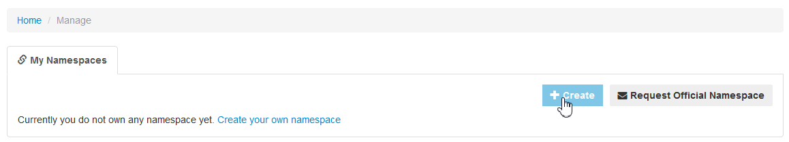
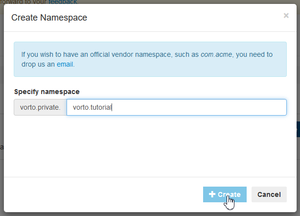
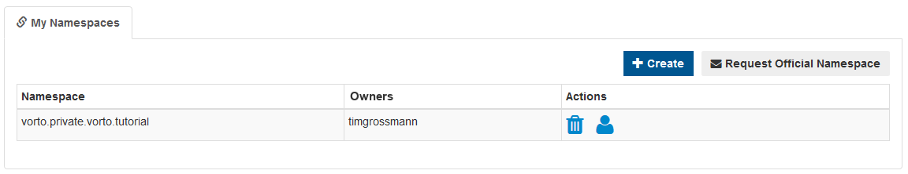

# Managing Namespaces

> **What is a Namespace** ?    
A namespace provides a secure workspace for saving models, without interfering with models of other users.

 

## Creating your Namespace
When you first login with your account, you won't be able to create Vorto Models.   
In order to create them, you need to either own your own namespace or be part of a project in which you've been assigned the role of *Model Creator*.

Creating a new namespace can easily be done by clicking on the `Manage` tab and then `Create`.

 

This will trigger a dialog box which lets you enter the namespace you want to use.   
> **Note**: Each newly created Namespace will use the `vorto.private` prefix. If you want to claim an official namespace like e.g. `org.eclipse.vorto` you need to [reach out to the Vorto Team](mailto:vorto-development@bosch-si.com?Subject=Request%20Vorto%20Repository%20Namespace&body=Dear%20Vorto%20Team%2C%20%0A%0AI%20would%20like%20to%20request%20for%20an%20official%20namespace.%20%0A%0ANamespace%20Owner%20%28user%20ID%29%20%3A%20%0ANamespace%3A%0A%0AThank%20you.%20%0A%0ABest%20regards%2C%20).

 

Once the create button is clicked, your new namespace will be created.   
By default, you as the namespace owner will have all permissions and are able to manage the namespace and it's collaborators. 

 

## Claiming an official Namespace
If you want to make the models you've created publicly available, you need to own the according official namespace.   
In order to claim an official namespace, like e.g. `org.eclipse.vorto`, you need to [reach out to the Vorto Team](mailto:vorto-development@bosch-si.com?Subject=Request%20Vorto%20Repository%20Namespace&body=Dear%20Vorto%20Team%2C%20%0A%0AI%20would%20like%20to%20request%20for%20an%20official%20namespace.%20%0A%0ANamespace%20Owner%20%28user%20ID%29%20%3A%20%0ANamespace%3A%0A%0AThank%20you.%20%0A%0ABest%20regards%2C%20).

When reaching out to the Vorto Dev Team, please make sure to **include the name of the namespace and UserId of its Owner**.

---

In case you're having difficulties or facing any issues, feel free to [create a new question on StackOverflow](https://stackoverflow.com/questions/ask?tags=eclipse-vorto) and we'll answer it as soon as possible!   
Please make sure to use `eclipse-vorto` as one of the tags. 

 

## Sub-namespaces

> **What is a "sub-namespace"?**   
> 
> Namespaces are expressed as dot-separated sequences of characters, reflecting some organizational hierarchy much like package names in most programming languages.
> 
> Sub-namespaces are "virtual" namespaces that allow models to be placed "one or more levels deeper" than their "parent" namespace, purely for aesthetical or organizational purposes.
>
> Access criteria for models are identical between a namespace and any sub-namespace it might feature. 
>
> It is also worth noting that sub-namespaces are the only way to create hierarchical namespaces. 
>
> In other words, if the namespace `com.mycompany` exists, one can only create models in `com.mycompany.examples` via a sub-namespace. 
> However, creating another namespace called `com.mycompany.examples` is not possible.  

## Format, validation and other considerations

The Vorto namespace notation follows a strict set of rules.

- Namespaces are made of character sequences ("segments") separated by dots (".").
- Sequences can include: 
  - All non-accented letters of the Latin alphabet
  - Digits
  - Underscores ("_")
- The first character of a sequence cannot be a digit
- Certain keywords of vortolang cannot be used as namespace fragments. 
  - The keywords that are illegal in namespaces are listed in the `NONREUSABLEKEYORD` parsing rule
  in the Vortolang 1.0 grammar: [Datatype.xtext](https://github.com/eclipse/vorto/blob/master/core-bundles/language/org.eclipse.vorto.editor.datatype/src/org/eclipse/vorto/editor/datatype/Datatype.xtext)
- This format is better summarized by the `NamespaceID` parsing rule of the Vortolang 1.0 grammar:
  
  <pre><code>QualifiedName:
    NamespaceID ('.' NamespaceID)*
    ;</code></pre>
  Source: [Datatype.xtext](https://github.com/eclipse/vorto/blob/master/core-bundles/language/org.eclipse.vorto.editor.datatype/src/org/eclipse/vorto/editor/datatype/Datatype.xtext)
    
  The ID terminal is derived from Xtext's own definition:
  <pre><code>terminal ID: '^'?('a'..'z'|'A'..'Z'|'_') ('a'..'z'|'A'..'Z'|'_'|'0'..'9')*;</code></pre>
  Source: [Terminals.xtext](https://github.com/eclipse/xtext-core/blob/master/org.eclipse.xtext/src/org/eclipse/xtext/common/Terminals.xtext)
    
  
These rules apply to both namespaces and "sub-namespaces".

---

In addition to the format/validation rules, Vorto enforces a few functional restrictions worth noting:

- While upper-case characters in namespace segments are valid, Vorto **lower-cases** all namespaces and sub-namespaces upon creation. 
   
  In other words: 
  - `vorto.private.my_namespace` and `vorto.private.MY_NAMESPACE` are the *same* namespace.
  - When Vorto receives a request to create `vorto.private.MY_NAMESPACE`, it will in fact create `vorto.private.my_namespace`
- Moreover, when a namespace is created, Vorto ensures all hierarchy deriving from that namespace is owned by it.
   
  **For instance**: 
  - User "Jane Doe" creates `vorto.private.janedoe`
  - User "John Smith" wants to contribute to Jane Doe's models by providing tutorials
  - He tries creating `vorto.private.janedoe.tutorials`. 
  - The operation fails, stating the chosen namespace name collides with an existing one
  - The correct operation would be to:
     - Request access to `vorto.private.janedoe`, with the `model_creator` role at least (see [here](https://github.com/eclipse/vorto/blob/development/docs/tutorials/requesting_access_to_a_namespace.md) for instructions)
     - Once granted, create the tutorial models under a **sub-namespace** of  `vorto.private.janedoe`, which can then be called `vorto.private.janedoe.tutorials` 
 
### Examples

Namespace | Valid? | Explanation
----------|--------|------------
`org.eclipse.vorto` | yes | Every segment is a plain-ASCII sequence, dot-separated |
`org.eclipse.vorto.my_contribution` | no | `org.eclipse.vorto` is an existing namespace.   The user should request `model_creator` access to `org.eclipse.vorto` and save their models in a *sub-namespace* instead. | 
`vorto.private.MY_NAMESPACE` | yes | Every segment is a plain-ASCII/underscore sequence, dot-separated.   **Note**: namespaces are automatically lower-cased when saved, so Vorto will save `vorto.private.my_namespace` |
`vorto.private._johndoe1234` | yes | Every segment is a plain-ASCII/digit/underscore sequence, dot-separated |
`org.eclipse.vorto.4ever` | no | One segment starts with a digit |
`vorto.private.mynamespace.` | no | Trailing dot in last segment |
`jp.私.の.名前空間` | no | Characters out of ASCII range |
`vorto.private.my namespace` | no | Segment contains whitespace | 
