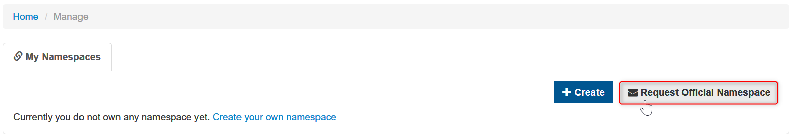

# Migrating your Vorto models to the new Vorto Repository

This guide will walk you through the process of migrating your existing Vorto models from the old repository into the new Vorto repository. Let's get started.

 

## Prerequisites
- [GitHub](https://github.com/login) or [Bosch-Id](https://accounts.bosch-iot-suite.com/)
- Existing Vorto models in the old repository which you would like to migrate

 

## Steps
**1.** Log in to old [Vorto Repository](https://vorto-old.eclipse.org)

**2.** Select the model you would like to migrate(HINT: select the checkbox *Only My Models* to view models created by you)

**3.** Download your model (look for the attribute - Model File)

**4.** Log in to new [Vorto Repository](https://vorto.eclipse.org)

**5.** [Setup your Repository and Namespace](./create_repository.md), by default all new namespaces will be prefixed with *vorto.private*, to request for a custom namespace click on *Request Official Namespace*.

**6.** Click **Browse** and select the zip file you downloaded in Step-3. Optionally select the target namespace from the dropdown (your model will be imported into this namespace).

**7.** Click **Upload** 

**8.** If all goes well you will receive a success message *model is valid and ready for import*

**9.** Click **Import** to finish uploading

 

## What's next?

