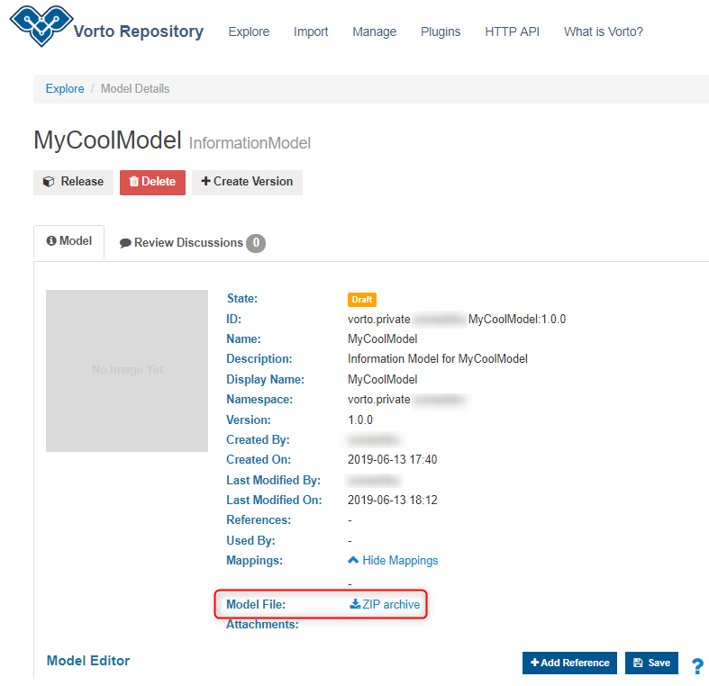

# Migrating your Vorto models to the new Vorto Repository

----------
This guide will walk you through the process of migrating your existing Vorto models into the new Vorto repository. Let's get started.

## Prerequisite
- Login to the new [Vorto Repository](https://vorto.eclipse.org) and [Setup your Repository and Namespace](./create_repository.md)

## Steps
1. Log in to old [Vorto Repository](https://vorto-old.eclipse.org)
2. Select the model you would like to migrate(HINT: select the checkbox *Only My Models* to view models created by you only)
3. Download your model (look for the attribute - Model File)

	

4. Log in to new [Vorto Repository](https://vorto.eclipse.org)
5. Click **Import** and select the zip file you downloaded in Step-3
6. Now select your desired namespace from the dropdown (your model will be imported into this namespace)
7. Click **Upload** 
8. If all goes well you will receive a success message *model is valid and ready for import*
9. Click **Import** to finish uploading

## Explore
The new Vorto repository allows you to have a virtual repository of your own. You can create custom namespaces and organize your models between them. You can also add collaborators and provide them roles to control their access to models. Hope you will enjoy using the new multi-tenancy features.

