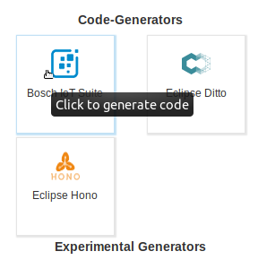
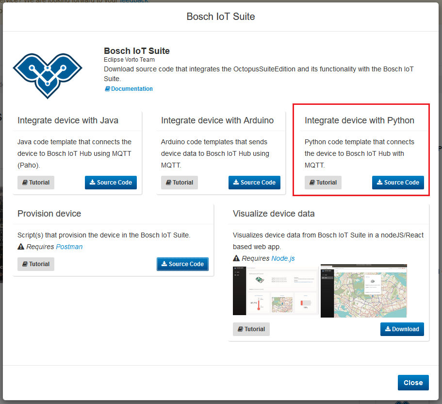

# Integrating a device with Python into the Bosch IoT Hub using Vorto

This tutorial explains how to integrate a device with the Bosch IoT Suite using MQTT. Your device should already be created as a thing from an Information Model at this point.   
We will use our [RaspberryPiTutorial Information Model](https://vorto.eclipse.org/#/details/org.eclipse.vorto.tutorials:RaspberryPiTutorial:1.0.0) again.


## Prerequisites

* [Python](https://www.python.org/downloads/) is installed

* Some code editor is installed (e.g. [VSCode](https://code.visualstudio.com/))

* Created a thing in the Bosch IoT Suite (refer to [Creating a Thing in the Bosch IoT Suite](create_thing.md)).

<br />

## Tools
> **Note**: This tutorial will only show the integration of the in-built temperature sensor of the RaspberryPi. Sending the data to hub, however, is similarilly done for the other sensors.

* [GPS module](https://learn.adafruit.com/adafruit-ultimate-gps-on-the-raspberry-pi?view=all)
* [Pi-Top Battery](https://www.pi-top.com/) ([Reading the battery status](https://github.com/rricharz/pi-top-setup))

<br />

## Steps
1. Setup your device
1. Download the generated integration script
1. Configure the scripts with the information of your created thing
1. Reading the sensor data
1. Start sending data

<br />

## Setup your device.
> **Note**: This tutorial will assume that your RaspberryPi is already running a version of [Raspbian](https://www.raspberrypi.org/learning/software-guide/) and is [connected to the network](https://www.raspberrypi.org/learning/software-guide/wifi/).   
You can either use a display, keyboard, and mouse to directly work on the RaspberryPi or [setup SSH](https://www.raspberrypi.org/documentation/remote-access/ssh/) and later copy your script over to it.

<br />

## Download the generated integration script

**1.** On the Vorto Repository page of your Information Model (we will use the [RaspberryPiTutorial Information Model](https://vorto.eclipse.org/#/details/org.eclipse.vorto.tutorials:RaspberryPiTutorial:1.0.0)), click on the `Bosch IoT Suite` generator. This will trigger a pop up to appear with the available generators.     


**2.** We want to integrate a device using Python. Click the `Source Code` button to download the generated python script.


**3.** Unzip the downloaded file and open it in your code editor. 

**4.** In order to guarantee secure transmission of your data, the integration uses SSL. We therefore need a certificate.   
Right click and save the [iothub.crt](https://docs.bosch-iot-hub.com/cert/iothub.crt) file and place it in the root folder of the just unzipped folder.

<br />

## Configure the scripts with the information of your created thing

**5.** Before we start reading in the sensor data and sending it to Hub, we need to configure our credentials. This will allow the script to send the sensor data to our digital twin.   
The main `.py` file (`RaspberryPiTutorialApp.py` in this case) will contain a section that looks like this:   
```python
# DEVICE CONFIG GOES HERE
tenantId = "ADD TENANT HERE"
device_password = "ADD DEVICE PASSWORD HERE"
hub_adapter_host = "mqtt.bosch-iot-hub.com"
deviceId = "ADD DEVICE ID HERE"
clientId = deviceId
authId = "ADD AUTH ID HERE"
certificatePath = "./iothub.crt"
ditto_topic = "ADD TOPIC HERE, e.g. com.mycompany/4711"
```
> **Note:** Make sure to point the `certificatePath` at your just downloaded `.crt` file.

**6.** We will use the request response we got upon creating a thing with the postman script. Since it holds exactly the information we need, we can copy and paste the different ids from the response.


<br />

## Reading the sensor data	

**7.** After filling in the credentials, we can start integrating our sensors.   
The implementation is done inside of the `periodicAction` function.   
This function is called periodically every `timePeriod` seconds. It is meant to periodically read your sensor's values and transmit them using the thing type as a data model layer and the Paho MQTT Client.

The variable `timePeriod` is set further down in the file. In this example, the variable `timePeriod` is set to 10.
```python
# Period for publishing data to the MQTT broker in seconds
timePeriod = 10
```

**8.** We will only cover the integration of the built-in cpu temperature sensor here.   
The code contains comments which will tell you where to edit code and do your implementation.   
There is no need to edit any other section of the python file.

Code sections which can be customized for your needs are marked with
```python
### BEGIN READING SENSOR DATA
...
### END READING SENSOR DATA
```

In order to read the cpu temperature, we need to add this code block inside the `periodicAction` function between the `BEGIN` and `END` comments.
```python
def get_cpu_temperature():
    with open("/sys/class/thermal/thermal_zone0/temp", "r") as tempFile:
        temp = float(tempFile.read())
        tempC = temp/1000
        return tempC
    
# Read the data and assign it to the functional block properties
infomodel.cpuTemperature.value = {
    "currentMeasured" : get_cpu_temperature()
}
```

> **Note:** In order to implement the sensors in the right way, we have to look at the specifc paths of the attributes.   
<details>
    <summary>
        <b>
            How do I find the specific path?
        </b>
    </summary> 
    

    
The `cpuTemperature` in our [Raspbi IM](https://vorto.eclipse.org/#/details/org.eclipse.vorto.tutorials:RaspberryPiTutorial:1.0.0) is a [Temperature Function Block](http://vorto-dev.eu-central-1.elasticbeanstalk.com/#/details/org.eclipse.vorto:Temperature:1.0.0). 
```js
infomodel RaspberryPiTutorial {
	functionblocks {
		...
		cpuTemperature as Temperature
	}
}
```

This means we have to check the internals of this FB.   
```js
functionblock Temperature {
    status {
      value as SensorValue
    }
}
```
As we can see, it has a `value` which is a [SensorValue Data Type](http://vorto-dev.eu-central-1.elasticbeanstalk.com/#/details/org.eclipse.vorto.types:SensorValue:1.0.0). This DT has one mandatory value, `currentMeasured` and two optional ones.   
Since the nesting ends with this DT, we know that the path to our `currentMeasured` and optional values is:   
```js
cpuTemperature -> value -> currentMeasured, minMeasured, ...
```

Therefore the structure will look like this:
```python
cpuTemperature.value.currentMeasured
cpuTemperature.value.minMeasured
cpuTemperature.value.maxMeasured
```

Which in combination with the parent element is represented like this:
```js
infomodel.cpuTemperature.value = {
    "currentMeasured" : 0.0,
    "minMeasured": 0.0,
    "maxMeasured": 0.0
}
```
</details>

<br />

## Start sending data

**9.** Before we can run the script, we need to install additional dependencies. The bundle contains a file called `requirements.txt`. This file describes the dependencies that still have to be installed in order to run the script.      
Install the dependencies using the `pip install -r requirements.txt` command which looks at the current `requirements.txt` file and installs the dependecies listed there.

**10.** Once the dependencies are installed, we can start the script by simply typing `python RaspberryPiTutorialApp.py`

<details>
    <summary>
        <b>
            Your script is not sending data?
        </b>
    </summary> 
    
If you started the script and you can't see any data being sent your script most likely contains an error in the way the values are assigned to the attributes.

In order to see the error message, you need to add a logger to the script.   
This is easily done by adding the logging module at the top:
```python
import logging
logging.basicConfig(level=logging.DEBUG)
```

And near the end of the file, where the client is created, you have to only paste in those two lines:

```python
# Create the MQTT client
client = mqtt.Client(hono_clientId)
...

logger = logging.getLogger(__name__)
client.enable_logger(logger)
```
</details>

**11**. We can now verify that there is data incoming by either using
- the [Vorto Dashboard](create_webapp_dashboard.md) that simply displays your data in different UI widgets.
- or the [SwaggerUI](https://apidocs.bosch-iot-suite.com/?urls.primaryName=Bosch%20IoT%20Things%20-%20API%20v2) which doesn't require anything to be installed and allows a quick insight into whether your data is updating.

Once you can see your data updating, you have successfully connected your ESP8266 device to the Bosch IoT Suite!   
Now you can go in and connect and integrate the GPS and battery.

<br />

## What's next ?

 - [Use the Vorto Dashboard](create_webapp_dashboard.md) to visualize the device data in UI widgets.
