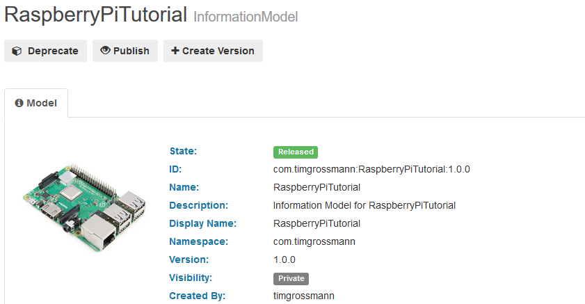
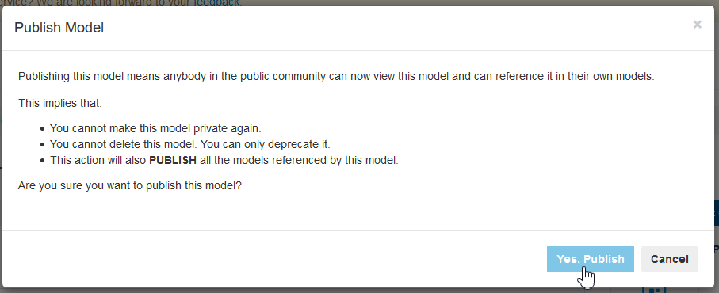
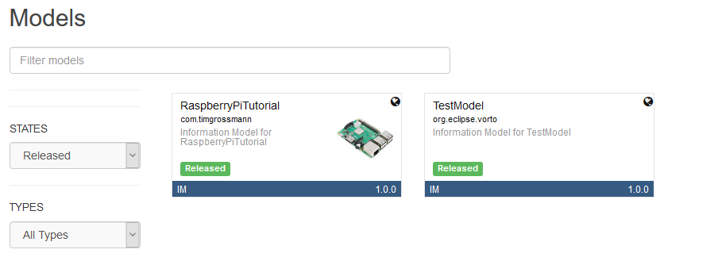

# Publishing Models

> **What does publishing mean** ?    
Publishing a model makes it visible to everybody visiting the Eclipse Vorto Repository. 
Even if they are not logged in and are not collaborating to the namespace.   

> Please note that **published models can only be `deprecated` and not deleted or unpublished**. 

 

## Making your model public
In order to have permission to publish models, you need to fulfill a few requirements.   
You need to
- be an **owner or collaborator** to an [official namespace](#claiming-an-official-namespace).
- have the **role of `Publish`** for the given official namespace. 
- have [`released` the model](../../repository/docs/model_states.md) and all submodels (will be released automatically if not already done)

Only after fulfilling those requirements you will be able to see the `Publish` button for the models of the according namespace.

Please make sure to understand, that **published models can only be `deprecated` and not deleted or unpublished**.

The dialog showing up once clicking the `Publish` button will again explain you the **implications of making a model public**.

After publishing, the `Visibility` of your model will show [**`Public`**](../../repository/docs/model_states.md) and everybody will be able to view and use it.    

 

## Claiming an official Namespace
If you want to make the models you've created publicly available, you need to own the according official namespace.   
In order to claim an official namespace, like e.g. `org.eclipse.vorto`, you need to [reach out to the Vorto Team](mailto:vorto-development@bosch-si.com?Subject=Request%20Vorto%20Repository%20Namespace&body=Dear%20Vorto%20Team%2C%20%0A%0AI%20would%20like%20to%20request%20for%20an%20official%20namespace.%20%0A%0ANamespace%20Owner%20%28user%20ID%29%20%3A%20%0ANamespace%3A%0A%0AThank%20you.%20%0A%0ABest%20regards%2C%20).

When reaching out to the Vorto Dev Team, please make sure to **include the name of the namespace and UserId of its Owner**.

---

In case you're having difficulties or facing any issues, feel free to [create a new question on StackOverflow](https://stackoverflow.com/questions/ask?tags=eclipse-vorto) and we'll answer it as soon as possible!   
Please make sure to use `eclipse-vorto` as one of the tags. 
