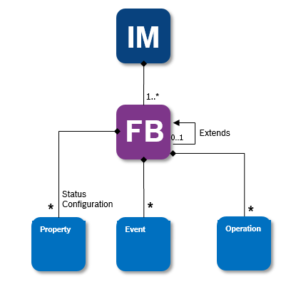

# Digital Twin Vorto Language

**Version 1.0**

## Contents

[Information Model](#information-model)<br>
[Function Block](#function-block)<br>
[Properties](#properties)<br>
[Event](#event)<br>
[Operation](#operation)<br>
[Primitive Schemas](#primitive-schemas)<br>
[Array](#array)<br>
[Enum](#enum)<br>
[Dictionary](#dictionary)<br>
[Entity](#entity)<br>
[Model Property](#model-property)<br>
[Model Reference](#model-reference)<br>


## Introduction

This document specifies the Digital Twin Vorto Language (vortolang 1.0), a language for describing models and interfaces for IoT Digital Twins. Digital twins are models of entities in the physical world such as a (multi) sensor device, smart power plant, and other entities that participate in IoT solutions. Modeling enables IoT solutions and IoT platforms to provision, use, and configure IoT devices and logical entities from multiple sources in a single solution. Using the vortolang and describing the entities's capabilities, IoT platforms and IoT solutions can leverage the semantics of these IoT entities.

## Digital Twin Vorto Language

Digital twins are described using the vortolang, which is domain-specific language (DSL). This DSL underlies a very simple grammar, making it very easy to describe digital twin models. In order to be used in IoT Platforms and solutions, the vortolang can easily be converted into well adopted languages, such as JSON-LD, where there are many libraries available in the Open Source community to process these language files. At definition time, developers can use the vortolang without any knowledge about JSON-LD, and fully focus on describing the device capabilities in a very expressive way.

The vortolang is made up of a set of metamodel classes (described later in more detail) that define the capabilities of digital twins. There are two top-level classes, `Information Model` and `Function Block`, that describe a digital twin and the capabilities of digital twins, respectively. There are three metamodel classes that describe capabilities: `Properties`, `Events`, and `Operations`. 
When writing a digital twin definition, it's necessary to specify the version of the vortolang being used (currently ```1.0```) 

## Information Models and Function Blocks

There are two top-level metamodel classes: `Information Model` and `Function Block`. Information Models describe a complete digital twin, such as a physical device or a space (such as a room). Often, Information Models are associated with a product SKU, such as a "Bosch Dinion IP Starlight 8000MP" security camera, while Function Blocks describe the related capabilities of an digital twin (its status- and configuration properties, events, and operations). Function Blocks can be reused across different Information Models. Information Models are often made up of multiple Function Blocks (interfaces).

<figure class="screenshot">
	
</figure> 

## Information Model

An `Information Model` describes a complete digital twin, such as a physical device or a space (such as a room) and defines the set of interfaces as Function Blocks, implemented by the digital twin.

Because an Information Model definition includes the fully qualified identity of the Function Blocks that it implements (including the full three-part version number), when a Function Block is changed and is assigned a new version number (and therefore a new ID), the Information Model does not automatically implement the changed Function Block (interface). If it is intended that the Information Model implements the changed Function Block, then the Information Model must also be updated.

### Information Model properties

<table>
	<tr>
		<th>Property</th>
		<th>Required</th>
		<th>Data type</th>
		<th>Description</th>
	</tr>
	<tr>
		<td>vortolang</td>
		<td>required</td>
		<td>string</td>
		<td>
			Identifies which vortolang version used to define the Information Model.
			Currently '1.0'
		</td>
	</tr>
	<tr>
		<td>name</td>
		<td>required</td>
		<td>string</td>
		<td>
			The name must match the regular expression:
				<code> ^[A-Z][a-zA-Z0-9]*$ </code>
		</td>
	</tr>
	<tr>
		<td>namespace</td>
		<td>required</td>
		<td>string</td>
		<td>
			The name must match the regular expression:
				<code> name('.' name )* </code>
		</td>
	</tr>
	<tr>
		<td>version</td>
		<td>required</td>
		<td>string</td>
		<td>
			The name must match the regular expression:
				<code> /^\d+\.\d+\.\d+(-\\w+)*$/ </code>
		</td>
	</tr>
	<tr>
		<td>description</td>
		<td>optional</td>
		<td>string</td>
		<td> 
			A description for human display.
		</td>
	</tr>
	<tr>
		<td>category</td>
		<td>optional</td>
		<td>string</td>
		<td> 
			Custom tag to categorize the model. <br>
			The name must match the regular expression:
				<code> name('/' name )* </code>
		</td>
	</tr>
	<tr>
		<td>using</td>
		<td>required</td>
		<td>A set of <code>Model Reference</code>s</td>
		<td>
			Defines the imported models that are referenced by this Information Model under 'functionblocks'
		</td>
	</tr>
	<tr>
		<td>functionblocks</td>
		<td>required</td>
		<td>A set of <code>Model Property</code> of type <code>Function Block</code></td>
		<td> 
			A set of Function Block properties.
		</td>
	</tr>
</table>


### Example:

    vortolang 1.0

	namespace com.mycompany
	version 1.0.0
	description "Information model for FabLab.eu's IoT Octopus"

	using com.ipso.smartobjects.Accelerometer ; 1.1.0
	using com.ipso.smartobjects.Barometer ; 1.1.0

	infomodel IoTOctopus {

		functionblocks {
			mandatory accelerometer as Accelerometer
			mandatory barometer as Barometer
		}
	}

## Function Block

A Function Block describes related capabilities that are implemented by a digital twin. Function Blocks are reusable and can be reused across different Information Models.

### Function Block properties

<table>
	<tr>
		<th>Property</th>
		<th>Required</th>
		<th>Data type</th>
		<th>Description</th>
	</tr>
	<tr>
		<td>vortolang</td>
		<td>required</td>
		<td>string</td>
		<td>
			Identifies which vortolang version used to define the Function Block.
			Currently '1.0'
		</td>
	</tr>
	<tr>
		<td>name</td>
		<td>required</td>
		<td>string</td>
		<td>
			The name must match the regular expression:
				<code> ^[A-Z][a-zA-Z0-9]*$ </code>
		</td>
	</tr>
	<tr>
		<td>namespace</td>
		<td>required</td>
		<td>string</td>
		<td>
			The name must match the regular expression:
				<code> name('.' name )* </code>
		</td>
	</tr>
	<tr>
		<td>version</td>
		<td>required</td>
		<td>string</td>
		<td>
			The name must match the regular expression:
				<code> /^\d+\.\d+\.\d+(-\\w+)*$/ </code>
		</td>
	</tr>
	<tr>
		<td>description</td>
		<td>optional</td>
		<td>string</td>
		<td> 
			A description for human display.
		</td>
	</tr>
	<tr>
		<td>category</td>
		<td>optional</td>
		<td>string</td>
		<td> 
			Custom tag to categorize the model. <br>
			The name must match the regular expression:
				<code> name('/' name )* </code>
		</td>
	</tr>
	<tr>
		<td>using</td>
		<td>optional</td>
		<td>A set of <code>Model Reference</code>s</td>
		<td>
			Defines the imported models that are referenced by the Function Block
		</td>
	</tr>
	<tr>
		<td>extends</td>
		<td>optional</td>
		<td>ID of a <code>Function Block</code></td>
		<td>
			Extends another <code>Function Block</code> by specializing it with extended properties
		</td>
	</tr>
	<tr>
		<td>configuration</td>
		<td>optional</td>
		<td>Configuration <code>Properties</code></td>
		<td> 
			An object describing configuration <code>Properties</code>. Configuration properties are read-writable by default.
		</td>
	</tr>
		<tr>
		<td>status</td>
		<td>optional</td>
		<td>Status <code>Properties</code></td>
		<td> 
			An object describing status <code>Properties</code>. Status properties are read-only by default.
		</td>
	</tr>
	<tr>
		<td>events</td>
		<td>optional</td>
		<td>a set of <code>Event</code>s</td>
		<td> 
			Describes data emitted by a device or other entity
		</td>
	</tr>
	<tr>
		<td>operations</td>
		<td>optional</td>
		<td>a set of <code>Operation</code>s</td>
		<td> 
			Describes functions that can be performed on the device or entity.
		</td>
	</tr>
</table>


### Example:

    vortolang 1.0

	namespace com.mycompany
	version 1.0.0

	functionblock Accelerometer {

		configuration {
			mandatory enable as boolean
		}

		status {
			mandatory xValue as float "The measured value along the X axis."
			optional yValue as float "The measured value along the Y axis."
			optional zValue as float "The measured value along the Z axis."
		}
		
		operations {
			reset() returns boolean
		}
	}

## Properties

Properties describe both read-only and read-write state of a digital twin. Read-only properties are defined as _status_ properties, whereas read-write properties as _configuration_ properties. For example, a device serial number may be a status property and the temperature set point on a thermostat may be a configuration property.

### Status Property Example

	status {
		mandatory serialNumber as string
	}

### Configuration Property Example

	configuration {
		optional temperature as float <MIN 0, MAX 35> "writable temperature with a range constraint"
		mandatory enable as boolean "enables the sensor to start sending data"
	}

## Event

Events define data that is emitted by the device or entity. This kind of data would need to be transmitted to an IoT business solution in a reliable way. 

### Event Example

	events {
		enterFence {
			entryPoint as Location3D		
		}
		leaveFence {
			exitPoint as Location3D
		}
	}

## Operation

An operation represents a function that can be performed on a Digital Twin. Operations may have request params as well as a return type

`breakable? [name]([param name] as [Data Type] <[constraint]*>?) (returns [Data Type])?`

<table>
	<tr>
		<th>Element</th>
		<th>Required</th>
		<th>Description</th>
	</tr>
	<tr>
		<td>breakable</td>
		<td>Optional</td>
		<td>Signals, that it could eventually cause an error when performing the operation on the device</td>
	</tr>
	<tr>
		<td>operation name</td>
		<td>required</td>
		<td>Name of the operation</td>
	</tr>
	<tr>
		<td>request params</td>
		<td>optional</td>
		<td>request params, separated by <code>,</code></td>
	</tr>
	<tr>
		<td>response type</td>
		<td>optional</td>
		<td>Specifies a response of the operation. Response type must comply to <code>Data Type</code></td>
	</tr>
	<tr>
		<td>description</td>
		<td>optional</td>
		<td>A description for human display</td>
	</tr>
</table>

### Example

	op() "A simple operation without request and response types"

	breakable op() "An operation that could cause an error when performed"

	op() returns int "Operation that returns a primitive type"

	op() returns multiple int "Operation that returns an array of a primitive type"

	op(msg as string) "Operation with a single primitive param"

	op(multiple msg as string "msg description") "array param with description"

	op(msg as int <MIN 0, MAX 100>) "Param with constraint"
	

## Data Types

### Primitive Types

A full set of primitive data types are provided and can be specified directly as a type value of a model property.

<table>
	<tr>
		<th>Primitive Schema</th>
		<th>Description</th>
	</tr>
	<tr>
		<td>boolean</td>
		<td>a boolean value</td>
	</tr>
	<tr>
		<td>dateTime</td>
		<td>A date and time in ISO 8601 format</td>
	</tr>
	<tr>
		<td>date (<i>not yet available)</i></td>
		<td>A date in ISO 8601 format</td>
	</tr>
	<tr>
		<td>time (<i>not yet available)</i></td>
		<td>A time in ISO 8601 format</td>
	</tr>
	<tr>
		<td>double</td>
		<td>An IEEE 8-byte floating point number</td>
	</tr>
	<tr>
		<td>float</td>
		<td>An IEEE 4-byte floating point number</td>
	</tr>
	<tr>
		<td>int</td>
		<td>A signed 4-byte integer</td>
	</tr>
	<tr>
		<td>long</td>
		<td>A signed 8-byte integer</td>
	</tr>
	<tr>
		<td>string</td>
		<td>A UTF8 string</td>
	</tr>
	<tr>
		<td>base64Binary</td>
		<td>Represents an arbitrary binary content</td>
	</tr>
	<tr>
		<td>base64Binary</td>
		<td>Represents an arbitrary binary content</td>
	</tr>
	<tr>
		<td>short</td>
		<td>A short 16-bit integer between -32768 and 32767</td>
	</tr>
	<tr>
		<td>byte</td>
		<td>A 8-bit integer between -128 and 127</td>
	</tr>
</table>

### Enum

An `enum` is an enumeration of values of the same type similar to an *enum* in Java.

<table>
	<tr>
		<th>Property</th>
		<th>Required</th>
		<th>Data type</th>
		<th>Description</th>
	</tr>
	<tr>
		<td>vortolang</td>
		<td>required</td>
		<td>string</td>
		<td>
			Identifies which vortolang version used to define the Enum
			Currently '1.0'
		</td>
	</tr>
	<tr>
		<td>name</td>
		<td>required</td>
		<td>string</td>
		<td>
			The name must match the regular expression:
				<code> ^[A-Z][a-zA-Z0-9]*$ </code>
		</td>
	</tr>
	<tr>
		<td>namespace</td>
		<td>required</td>
		<td>string</td>
		<td>
			The name must match the regular expression:
				<code> name('.' name )* </code>
		</td>
	</tr>
	<tr>
		<td>version</td>
		<td>required</td>
		<td>string</td>
		<td>
			The name must match the regular expression:
				<code> /^\d+\.\d+\.\d+(-\\w+)*$/ </code>
		</td>
	</tr>
	<tr>
		<td>description</td>
		<td>optional</td>
		<td>string</td>
		<td> 
			A description for human display.
		</td>
	</tr>
	<tr>
		<td>category</td>
		<td>optional</td>
		<td>string</td>
		<td> 
			Custom tag to categorize the model. <br>
			The name must match the regular expression:
				<code> name('/' name )* </code>
		</td>
	</tr>
	<tr>
		<td>literal</td>
		<td>required</td>
		<td>a set of literal values</td>
		<td> 
			Multiple literal values are separated by <code>,</code>
			It must match the regular expression:
				<code> ('a'..'z'|'A'..'Z'|'_'|'0'..'9')* </code>
		</td>
	</tr>
	<tr>
		<td>literal description</td>
		<td>optional</td>
		<td>string</td>
		<td> 
			A description for human display.
		</td>
	</tr>
</table>

### Example

	vortolang 1.0

	namespace com.mycompany
	version 1.0.0

	enum Unit {
		kg "Kilogram unit" , 
		g "gram unit"
	}	

### Dictionary

A *Dictionary* describes values in a map.

#### Example

 	mandatory lookupTable as dictionary[string, Color] "Lookup table conversion for color"

    mandatory lookupRGBTable as dictionary[Color, RGB] "Lookup table conversion for color from description to RGB"

    mandatory temperatureLabelConversion as dictionary[int, string] "map of temperature to description"

    mandatory simpleMap as dictionary "example of a map with no key and value types"

### Entity

<table>
	<tr>
		<th>Property</th>
		<th>Required</th>
		<th>Data type</th>
		<th>Description</th>
	</tr>
	<tr>
		<td>vortolang</td>
		<td>required</td>
		<td>string</td>
		<td>
			Identifies which vortolang version used to define the entity
			Currently '1.0'
		</td>
	</tr>
	<tr>
		<td>name</td>
		<td>required</td>
		<td>string</td>
		<td>
			The name must match the regular expression:
				<code> ^[A-Z][a-zA-Z0-9]*$ </code>
		</td>
	</tr>
	<tr>
		<td>namespace</td>
		<td>required</td>
		<td>string</td>
		<td>
			The name must match the regular expression:
				<code> name('.' name )* </code>
		</td>
	</tr>
	<tr>
		<td>version</td>
		<td>required</td>
		<td>string</td>
		<td>
			The name must match the regular expression:
				<code> /^\d+\.\d+\.\d+(-\\w+)*$/ </code>
		</td>
	</tr>
	<tr>
		<td>description</td>
		<td>optional</td>
		<td>string</td>
		<td> 
			A description for human display.
		</td>
	</tr>
	<tr>
		<td>category</td>
		<td>optional</td>
		<td>string</td>
		<td> 
			Custom tag to categorize the model. <br>
			The name must match the regular expression:
				<code> name('/' name )* </code>
		</td>
	</tr>
	<tr>
		<td>extends</td>
		<td>optional</td>
		<td>Entity <code>name</code></td>
		<td> 
			Expresses inheritance of entities 
		</td>
	</tr>
	<tr>
		<td>properties</td>
		<td>optional</td>
		<td>A set of <code>Model Property</code> elements</td>
		<td> 
			A set of <code>Model Property</code> elements
		</td>
	</tr>
</table>

#### Example
	vortolang 1.0

	namespace com.mycompany
	version 1.0.0

	entity Color {  
		mandatory red as int <MIN 0, MAX 255> "The red component of a color"  
	    mandatory green as int <MIN 0, MAX 255> "The green component of a color"    
	    mandatory blue as int <MIN 0, MAX 255> "The blue component of a color"  
	}

## Model Property

tbd.

## Model Reference

Model References define using statements (aka. imports) of a particular model. They are specified as a full-qualified model ID triple (namespace, name and version). 

### Example

	using com.acme.3DLocation ; 1.0.0

