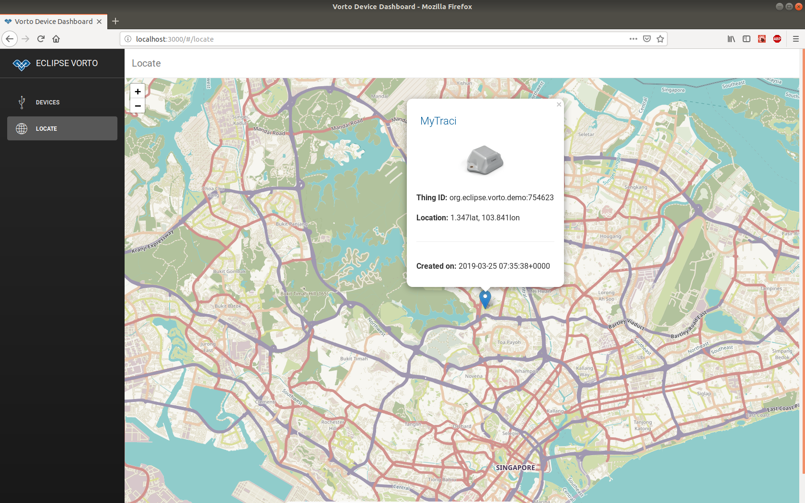

# Bosch IoT Suite Generator Plugin

### Overview

The Bosch IoT Suite Plugin provides a generator that eases the integration of devices with the Bosch IoT Suite.

The following tutorials help you to get started with the Generator:

- [Connect a Java - based device](../../docs/tutorials/connect_javadevice.md)
- [Connect an ESP8266 - based device](../../docs/tutorials/connect_esp8266.md)
- [Connect a RaspberryPi using Python](../../docs/tutorials/mqtt-python.md)

In addition, you download a simple NodeJS/React - based web application, that renders device data from Bosch IoT Suite complying to [org.eclipse.vorto](https://vorto.eclipseprojects.io/#/?s=org.eclipse.vorto) Function Blocks.

## Advanced

### Integration of Code Generator by 3rd Party

The Bosch IoT Suite Code Generators can be easily invoked by 3rd party tools via the Vorto Repository REST API.

Generate for Arduino platform:

	curl -GET https://vorto.eclipseprojects.io/api/v1/generators/boschiotsuite/models/org.eclipse.vorto:Temperature:1.0.0?language=arduino

Generate for Python platform:

	curl -GET https://vorto.eclipseprojects.io/api/v1/generators/boschiotsuite/models/org.eclipse.vorto:Temperature:1.0.0?language=python

Generate for Java platform:

	curl -GET https://vorto.eclipseprojects.io/api/v1/generators/boschiotsuite/models/org.eclipse.vorto:Temperature:1.0.0?language=java

	
