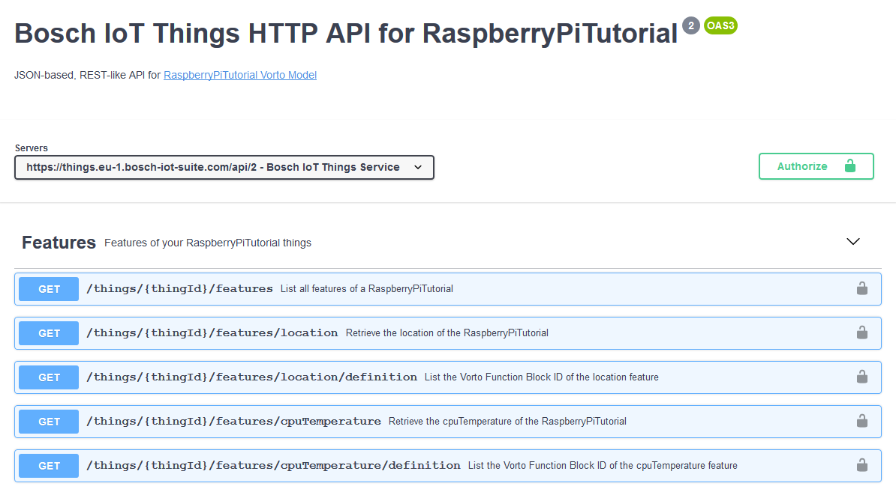

# OpenAPI Generator

Generates an **OpenAPI (a.k.a. Swagger) specification**, that defines a device-specific REST-API for a specific Digital Twin service. All it needs as input is a Vorto Information Model for the device. The generated OpenAPI spec then defines device (type) - specific endpoints for reading telemetry and event data, as well as setting (writable) device configurations and invoking operations on the device.  

The OpenAPI Generator currently supports the following Digital Twin Service:

* Bosch IoT Things (based on Eclipse Ditto)

## Bosch IoT Things (Eclipse Ditto)

Here is an example rendered OpenAPI/Swagger documentation for a [Raspberry Pi Vorto Model]
(https://vorto.eclipseprojects.io/#/details/org.eclipse.vorto.tutorials:RaspberryPi:1.0.0): 



<br />

### Vorto - Ditto Mapping 

| Vorto    |      Eclipse Ditto      |
|----------|:-------------:|
|Function Block Property (of Information Model)| GET endpoint ```/features/{functionBlockPropertyName}``` |
|Function Block status properties| Feature properties JSON ```"status" : {//properties}```|
|Function Block status properties| Feature properties JSON ```"configuration" : {//properties}```|
|Function Block configuration property | PUT endpoint ```/features/{functionblockPropertyName/properties/{configurationPropertyName}```. <br> Payload is the JSON document containing the configuration property value|
|Function Block event| POST endpoint ```{functionBlockPropertyName}/message/outbox/{eventName}```. <br> Payload is a JSON document containing the Vorto event properties|
|Function Block operation name | POST endpoint ```{functionBlockPropertyName}/message/inbox/{operationName}```. <br> Payload is a JSON document, where param name is the JSON key and param value the JSON value|


### Tutorial

* [Create OpenAPI Spec for Raspberry Pi](../../docs/tutorials/create_openapi.md)
