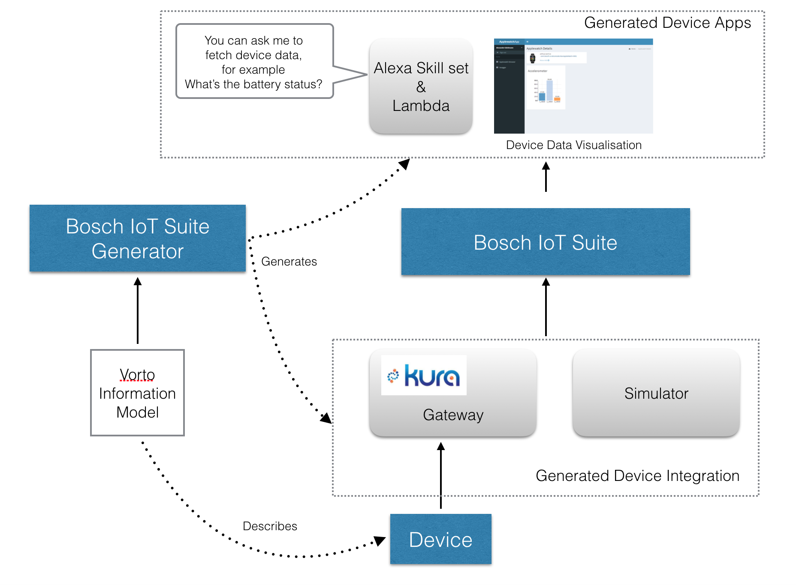

# Bosch IoT Suite Generator

### Overview

This generator features

- JSON Schema files for validating things managed in Bosch IoT Things
- Alexa Skillset that fetches device data from Bosch IoT Suite
- Simulator generating device test data and sends it to Bosch IoT Suite
- Eclipse Kura Gateway OSGI bundle consuming bluetooth data and sends it to Bosch IoT Suite
- Spring Boot Web application that visualizes the device data in UI widgets

----------

List of other available [Code Generators](../Readme.md).