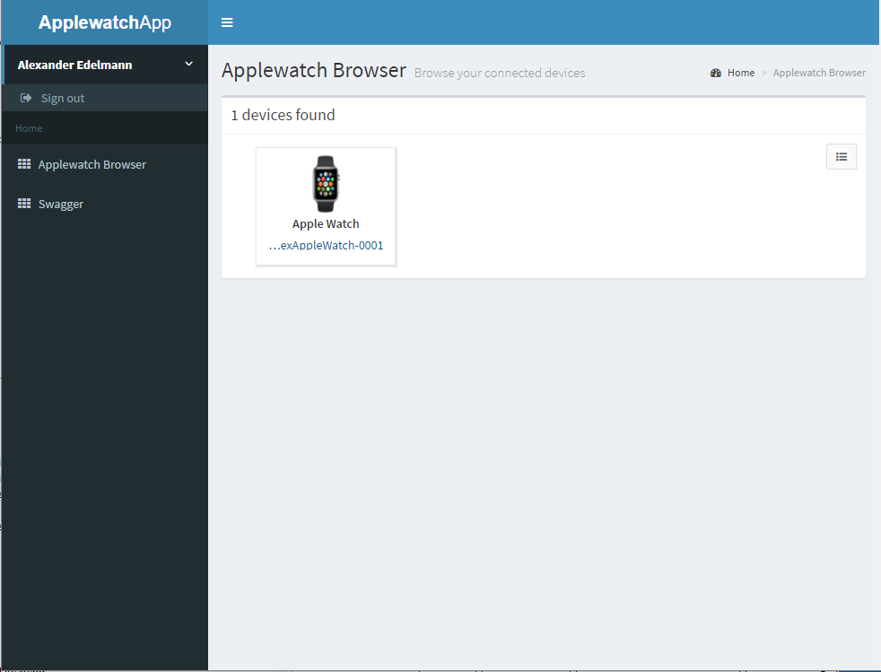
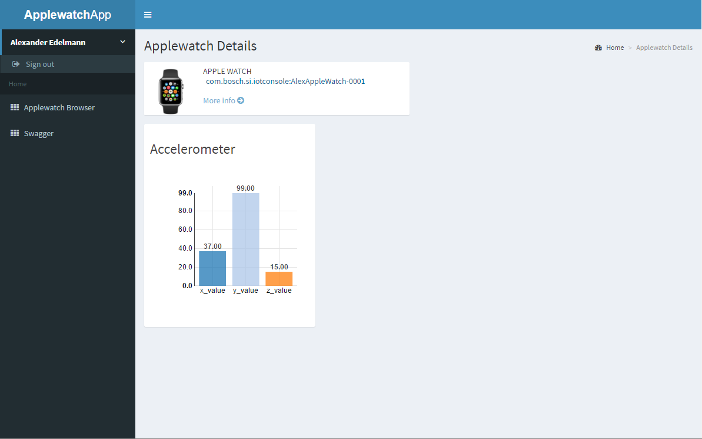

# AngularJS Web UI Generator

The generator creates an AngularJS web application that fetches device data from a IoT Cloud Platform and visualizes its data using various UI widgets. 

The generator produces:

* Device Data UI based on AngularJS
* Device Data Integration with an IoT Cloud Platform backend, supporting
    * Bosch IoT Suite
* Device Data Persistence, including historical data
* Swagger REST API Documentation
* Google OpenID Authentication
 

## Getting Started

1. Extract generated ZIP archive and import it into your Eclipse IDE
2. Go to [Bosch IoT Things Product Website](https://things.apps.bosch-iot-cloud.com). It contains the contact information in order to subscribe to your own Bosch IoT Things instance. The product team will provide you with your credentials
3. Insert these credentials as well as Google ClientID and secret in the application.yml
5. Run the App

In order to create 

----------

List of other available [Code Generators](../Readme.md).