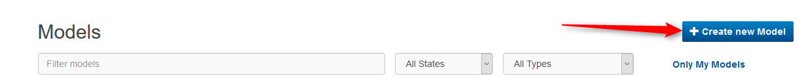
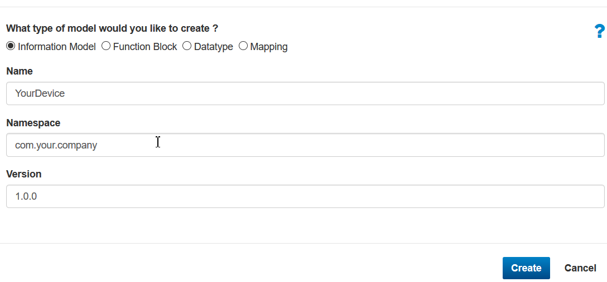
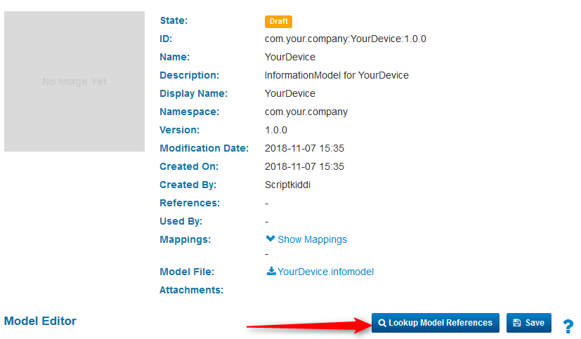
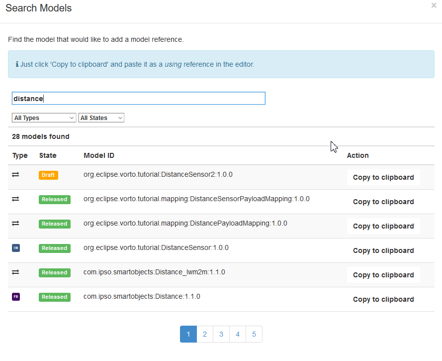
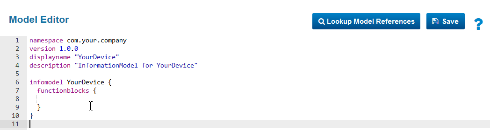
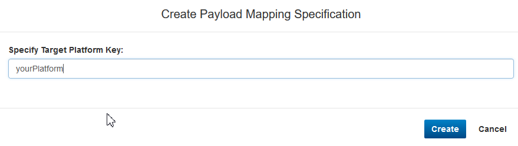
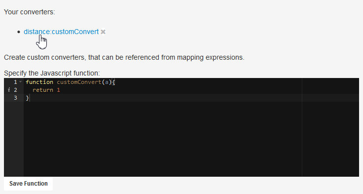

# Vorto Payload Mapping Engine

The Payload Mapping Engine allows to map arbitrary device data to platform - specific data structure complying to Vorto Information Models.  

Getting Started
===
# Create a new Information Model
To use the mapping engine a Vorto model is needed.
The next couple steps will show you on how to create such model.
If you already have one, you can skip this and move on to [Create a mapping](#Create a mapping)

To create a model head over to the [Vorto repository](http://vorto.eclipse.org)
Login using your GitHub account, then you are all set to get going.

First you create a new model by pressing the **Create new model button**



Each model belongs to a namespace which is similar to a Java namespace. So do use a namespace that matches your organization.


An Information Model aggregates multiple Function Blocks that represent the functionality of a device. To add a Function Block to you model go to the **Lookup Model References** Button and search for a Function Block. If you can not find one you also can create a new Function Block. 


To add a Function Block to your model press **Copy to clipboard**
and paste it over to the model editor like shown below.

To use the imported Function Block add the following line to the Function Blocks section
```
distance as Distance
```
Once done you are ready to move on to create a mapping.


# Create a mapping
A mapping adds platform specific information to an Information Model. Since the representation of data can vary from platform to platform.

To create a mapping go to your newly created model and press the **Create Mapping Spec** Button


Now add a Target Platform key for your mapping to signal, which platform this mapping belongs to, like blegatt. Each target platform should offer its own object model which is passed to the mapping engine. This ensures that a mapping is independent of the underlying driver.


Now the web editor opens and allows you to add mapping expression for the Function Blocks you added. You can write XPath 2.0 like notation. Behind the scenes the engine uses [JXPath](https://commons.apache.org/proper/commons-jxpath/) to apply XPath expressions on a java object graph. To add functionality that may not be possible using jxpath, you can also add custom JavaScript or java functions (see the custom functions section).

Once you have written your xpath expressions, press Save.
Now the site will parse your rules and tell you if they are valid expressions. 
Should the expressions be valid you can either test them 


Or download them as json specification, to use them with the mapping engine.


## Custom functions
Custom functions, like one would expect, add the power to write your own converter functions that can be used in an xpath context.
A function always belongs to a namespace.

### Java
To add a custom Java function call on your IDataMapperBuilder
```Java
IDataMapper.newBuilder().registerConverterFunction(IFunction [])
```
An element of such an array could look like
```Java
private static final IFunction FUNC_BASE64 = new ClassFunction("vorto_base64", Base64.class);
```
where **vorto_base64** would be the namespace that’s added and the functions contained in the Base64 Class the added functions.
So this Class would add 
```
vorto_base64:decodeString()
vorto_base64:decodeByteArray()
```
to the xpath workspace.

### Javascript
To add a custom function for JavaScript use the web editor. The function will be register in the namespace of the function block and can be any JavaScript function, but you cannot side load libs. 



