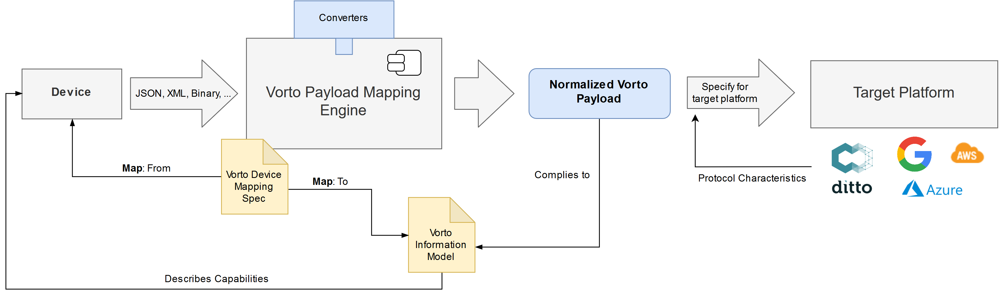
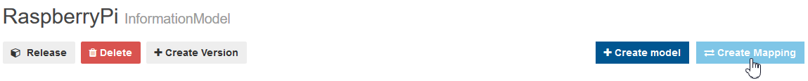
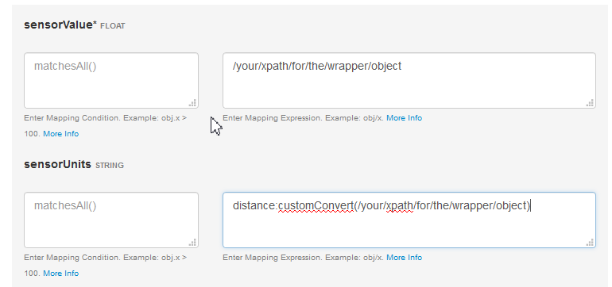
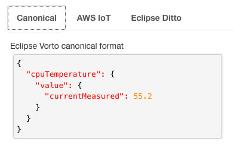
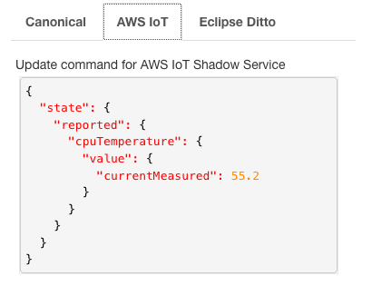
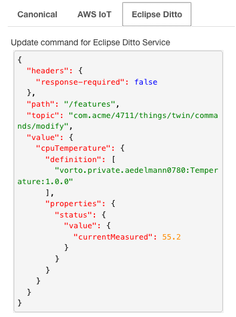

# Getting started with Vorto Mappings

**Vorto abstracts device data** using Function Blocks, thus helping to reduce tight-coupling of devices in IoT solutions.   
But how does Vorto help to map the actual device data to these abstract Function Blocks? 

Payloads sent in different formats from the devices can be piped through the *Vorto Payload Mapping Engine* which will use the [Mapping Specification](docs/mapping_syntax.md) and the [provided Converters](docs/built_in_converters.md).
The advantage of using this approach is that target platforms do not have to care about the different payloads of the devices but only need to handle the normalized Vorto compliant payloads.

This **normalized format** can then be used as a harmonized starting point for more specific, target platform compliant formats.
In addition to that, custom Converters can be easily plugged into the *Payload Mapping Engine* in order to allow for more complex conversion of proprietary payloads.

In this tutorial, we are going to walk you through the process of creating a Vorto mapping specification for an Information Model and execute it with the Vorto Payload Mapping Engine.



<br />

## Prerequisite

To work through this tutorial, you will need:

- [BoschID](https://accounts.bosch-iot-suite.com/) or [GitHub](https://github.com/) account to log in to the Vorto Repository
- You have described a device as a [Vorto Information Model](../docs/tutorials/describe_device-in-5min.md) and it is managed in the Vorto Repository
- You are a collaborator/owner of a namespace

<br />

## Performance
The Vorto mapping-engine has been load-tested regarding performance and speed according to different mapping scenarios. A report and detailed description can be found[here](./docs/LoadTests.md).

## Step 1: Create Mapping Specification

A mapping adds platform specific information to an Information Model. Since the representation of data can vary from platform to platform.

To create a mapping go to your newly created model and press the **`Create Mapping Spec.`** Button



Now the web editor opens and allows you to add mapping expression for the Function Blocks you added. You can write XPath 2.0 like notation. Behind the scenes the engine uses [JXPath](https://commons.apache.org/proper/commons-jxpath/) to apply XPath expressions on a java object graph. To add functionality that may not be possible using jxpath, you can also add custom JavaScript or java functions (see the custom functions section).



Once you have written your xpath expressions, press Save.

## Step 2: Test the Mapping Specification

On the right handside, select "JSON' as content type and paste the device raw data in the JSON editor. Test your mapping rule by clicking **Test Mapping**: 


The test result will give you the mapped data for different IoT platforms. 

The Vorto (canonical) format looks like:




The AWS IoT Shadow update command format looks like:




The Eclipse Ditto update command format looks like:




## Step 3: Download & Execute Mapping Specification

Download and save the Mapping Specification to start integrating it with the engine:


<br />

**1.** Add Maven dependency

```xml
<dependency>
	<groupId>org.eclipse.vorto</groupId>
	<artifactId>mapping-engine-all</artifactId>
	<version>LATEST</version>
</dependency>
```

<br />

**2.** Initialize the mapping engine with the downloaded specification

```Java
MappingEngine engine = MappingEngine.createFromInputStream(FileUtils.openInputStream(new File("src/main/resources/mappingspec.json")));
```

<br />

**3.** Pass the arbitrary device payload to the engine to get it converted to Vorto compliant data

```Java
Object deviceData = ...;
InfomodelValue mappedData = engine.map(deviceData);
```

<br />

**4.** Optionally validate the mapped data to check if it complies to the Vorto model

```Java
ValidationReport validationReport = mappedData.validate();
if (!validationReport.isValid()) {
	// handle invalid data
}
```

<br />

**5.** Convert mapped data to Digital Twin IoT compliant data
 
Convert the normalized Vorto compliant data to a target IoT platform format.

Currently supported target IoT Platform formats

* AWS IoT Shadow Service
* Eclipse Ditto Service

The following example shows how to convert the normalized data to **AWS IoT Shadow Update Command**:

```Java
import com.google.gson.JsonObject;
import org.eclipse.vorto.mapping.targetplatform.awsiot.TwinPayloadFactory;
...

JSONObject updateRequestAWSIoT = TwinPayloadFactory.toShadowUpdateRequest(mappedData);

sendToAWSIoTShadow(updateRequestAWSIoT,"com.acme:4711");
```

<br />

The following example shows how to convert the normalized data to **Eclipse Ditto Update Command**:

```Java
import com.google.gson.JsonObject;
import org.eclipse.vorto.mapping.targetplatform.ditto.TwinPayloadFactory;
...

JSONObject updateRequestDitto = TwinPayloadFactory.toDittoProtocol(mappedData,"com.acme:4711");

sendToEclipseDitto(updateRequestDitto);
```


## Advanced Usage

The Vorto Mapping Engine has extension points in order to plug-in converter functions that can be used as part of your mapping rules.

<br />

### Custom functions

Custom functions adds the power to write your own converter functions that can be used in your mapping rules. Each function belongs to a specific namespace.

You have two options to add custom converter functions:

* As a native Java Function 
* As a Javascript Function 

#### Java Converter Functions

First, create a class containing static converter functions

```Java
public class MyStringConverterFunctions {
	
	public static String concatStrings(String s1, String s2) {
		return s1 + s2;
	}
	...
}
```

Then, register your functions in the mapping engine:

```Java
private static final IFunction FUNC_STRINGS = new ClassFunction("org_mycompany_strings", MyStringConverterFunctions.class);

IDataMapper.newBuilder().registerConverterFunction(FUNC_STRINGS);
```

#### Javascript Converter function

The Vorto Mapping engine uses [Nashorn](http://www.oracle.com/technetwork/articles/java/jf14-nashorn-2126515.html) as a Javascript engine to execute custom JS converter functions. These functions are stored and versioned in the Vorto Repository and are executed by the Mapping Engine. 

#### Security

For security reasons, the following restrictions apply when processing these converters:

* access to Java packages and classes is not possible
* using exit, quit, is not possible
* file access is not possible
* using loops are not allowed
* no JS libraries can be loaded

#### Example

In the following example, a custom (Javascript) converter is defined in a Function Block mapping, that converts a click amount as a **String** to an **Integer** value:

```java
namespace devices.aws.button.mapping
version 1.0.0
displayname "buttonPayloadMapping"
description "Payload Mapping for the button property of the AWS IoT Button"
category payloadmapping

using com.ipso.smartobjects.Push_button;0.0.1

functionblockmapping ButtonPayloadMapping {
	targetplatform aws_ipso

	// Definition of Converter functions which can be used from within the function block mapping
	from Push_button to functions with 
		{convertClickType: "function convertClickType(clickType) { if (clickType === 'SINGLE') return 1; else    if (clickType === 'DOUBLE') return 2; else return -1;}"}

	// Usage of the converter function in the mapping rule expression
	from Push_button.status.digital_input_count to source with {xpath: "button:convertClickType(/clickType)"}
}
```

<br />

### Mapping Conditions

If you want to specify a condition, when mapping rules for a Function Block should be applied, you can do this easily with mapping conditions.

Here is an example of using conditions to map to either temperature or illuminance Function Block based on the device payload header. 

In this example, only the Temperature Function Block will be mapped, if the type field of header matches the 'T' value. 

Function Block Temperature Mapping
```java
...
from Temperature to condition with {value:"header.type == 'T'"}
//mapping rules for Temperature properties
```

Function Block Illuminance Mapping
```java
...
from Illuminance to condition with {value:"header.type == 'I'"}
//mapping rules for Illuminance properties
```

# What's next ?

- [Vorto Mapping Engine in action](https://github.com/eclipse/vorto-examples/tree/master/vorto-middleware/Readme.md). Tutorial that uses Vorto Mappings to convert Geolocation sensor data.
- Understand the [Mapping Specification Syntax](./docs/mapping_syntax.md)


