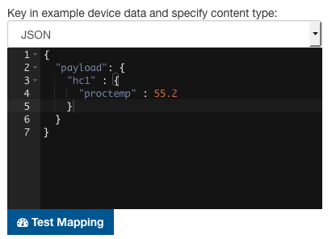

# Getting started with Vorto Mappings

Vorto abstracts device data using Function Blocks, thus helping to reduce tight-coupling of devices in IoT solutions. But how does Vorto help to map the actual device data to these abstract Function Blocks? 

In this tutorial, we are going to walk you through the process of creating a Vorto mapping specification for an Information Model and execute it with the Vorto Payload Mapping Engine.

## Prerequisite

To work through this tutorial, you will need:

- A Github account to log in to the Vorto Repository
- A [Vorto Information Model](https://www.eclipse.org/vorto/tutorials/tisensor/), managed in the Vorto Repository


## Step 1: Create Mapping Specification

A mapping adds platform specific information to an Information Model. Since the representation of data can vary from platform to platform.

To create a mapping go to your newly created model and press the **Create Mapping Spec** Button


Now add a Target Platform key for your mapping to signal, which platform this mapping belongs to, like blegatt. Each target platform should offer its own object model which is passed to the mapping engine. This ensures that a mapping is independent of the underlying driver.


Now the web editor opens and allows you to add mapping expression for the Function Blocks you added. You can write XPath 2.0 like notation. Behind the scenes the engine uses [JXPath](https://commons.apache.org/proper/commons-jxpath/) to apply XPath expressions on a java object graph. To add functionality that may not be possible using jxpath, you can also add custom JavaScript or java functions (see the custom functions section).

Once you have written your xpath expressions, press Save.

## Step 2: Test the Mapping Specification

n the right handside, define the arbitrary device payload (in JSON format) and click **Map**: 




## Step 2: Download & Execute Mapping Specification

Download and save the Mapping Specification to start integrating it with the engine:


### 1. Add Maven dependency:
```
<dependency>
	<groupId>org.eclipse.vorto</groupId>
	<artifactId>mapping-engine-all</artifactId>
	<version>LATEST</version>
</dependency>
```

### 2. Initialize the mapping engine with the downloaded specification:

```Java
MappingEngine engine = MappingEngine.createFromInputStream(FileUtils.openInputStream(new File("src/main/resources/mappingspec.json")));

```

### 3. Pass the arbitrary device payload to the engine to get it converted to Vorto compliant data:

```Java
Object deviceData = ...;
InfomodelValue mappedData = engine.map(deviceData);

```

### 4. Optionally validate the mapped data to check if it complies to the Vorto model:

```Java
ValidationReport validationReport = mappedData.validate();
if (!validationReport.isValid()) {
	// handle invalid data
}

```

### 5. Convert mapped data to Digital Twin IoT compliant data
 
Convert the mapped data to IoT Platform data. The mapping engine provides a useful utility in order to create a JSON object complying to the Eclipse Ditto protocol:

```Java
import com.google.gson.JsonObject;
import org.eclipse.vorto.mapping.engine.twin.TwinPayloadFactory;
...

final String dittoNamespace = "org.mycompany";
final String dittoNamespaceSuffix = "123";
JSONObject dittoPayload = TwinPayloadFactory.toDittoProtocol(mappedData, dittoNamespace, dittoNamespaceSuffix);

sendToDitto(dittoPayload);
```

# Advanced Usage

The Vorto Mapping Engine has extension points in order to plug-in converter functions that can be used as part of your mapping rules.

## Custom functions

Custom functions adds the power to write your own converter functions that can be used in your mapping rules. Each function belongs to a specific namespace.

You have two options to add custom converter functions:

* As a native Java Function 
* As a Javascript Function 

#### Java Converter Functions

First, create a class containing static converter functions

```Java
public class MyStringConverterFunctions {
	
	public static String concatStrings(String s1, String s2) {
		return s1 + s2;
	}
	...
}
```

Then, register your functions in the mapping engine:

```Java
private static final IFunction FUNC_STRINGS = new ClassFunction("org_mycompany_strings", MyStringConverterFunctions.class);

IDataMapper.newBuilder().registerConverterFunction(FUNC_STRINGS);
```

### Javascript Converter function

The Vorto Mapping engine uses [Nashorn](http://www.oracle.com/technetwork/articles/java/jf14-nashorn-2126515.html) as a Javascript engine to execute custom JS converter functions. These functions are stored and versioned in the Vorto Repository and are executed by the Mapping Engine. 

#### Security

For security reasons, the following restrictions apply when processing these converters:

* access to Java packages and classes is not possible
* using exit, quit, is not possible
* file access is not possible
* using loops are not allowed
* no JS libraries can be loaded

#### Example

In the following example, a custom (Javascript) converter is defined in a Function Block mapping, that converts a click amount as a **String** to an **Integer** value:

		namespace devices.aws.button.mapping
		version 1.0.0
		displayname "buttonPayloadMapping"
		description "Payload Mapping for the button property of the AWS IoT Button"
		category payloadmapping
		
		using com.ipso.smartobjects.Push_button;0.0.1
		
		functionblockmapping ButtonPayloadMapping {
			targetplatform aws_ipso

			// Definition of Converter functions which can be used from within the function block mapping
			from Push_button to functions with 
				{convertClickType: "function convertClickType(clickType) { if (clickType === 'SINGLE') return 1; else if (clickType === 'DOUBLE') return 2; else return -1;}"}
			
			// Usage of the converter function in the mapping rule expression
			from Push_button.status.digital_input_count to source with {xpath: "button:convertClickType(/clickType)"}
		}


## Mapping Conditions

If you want to specify a condition, when mapping rules should be applied, you can do this easily with mapping conditions.

Here is an example of using conditions to map to either temperature or illuminance based on the device payload header:

Function Block Temperature Mapping

	...
	from Temperature.status.sensorValue to source with {xpath:"/value", condition:"xpath:eval('/header/type', this) == 'T'"}

Function Block Illuminance Mapping

	...
	from Illuminance.status.sensorValue to source with {xpath:"/value", condition:"xpath:eval('/header/type', this) == 'I'"}


