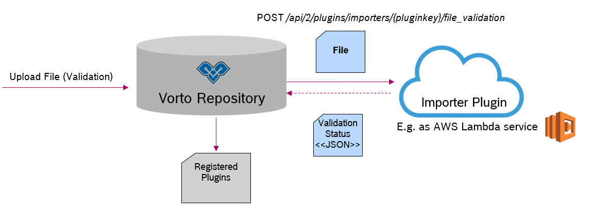
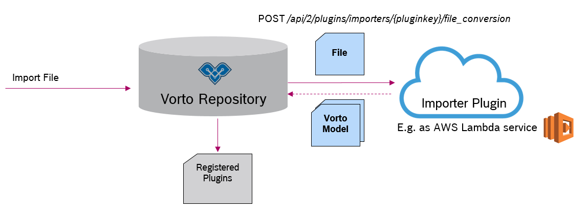

# Importer Plugin SDK

The Vorto Repository manages Vorto Information Models and provides elegant ways to search these models as well as transform these models into runnable source code via Code Generators. 
But how can existing (standardized) device descriptions be integreated into the Vorto eco-system, so that they can benefit from the Repository features? It is just as easy as provide an Importer that manages the validation and conversion into Vorto Information Models. 

## API Version 2 (new)

The version 2 is the new and simpler way of providing importers and plugging them into the Vorto Repository.  

Each Importer must make sure to provide two endpoints, which are called by the Vorto Repository during the entire model import process.

[Download OpenAPI spec](docs/importer-openapi.yml)

### 1. File Validation

The import process begins with a pre-validation check on the file which is to be imported. Here the importer plugin reports back to the repository, if it accepts the file and a file conversion can take place safely.

### 2. File Conversion

Once the file was accepted by the importer plugin, the repository invokes this endpoint, whereby the importer converts the file to Vorto models and returns them as a ZIP archive.

### Example

It is totally up to you, which language you choose to implement an importer, either Java, Go, Node.js etc.

Checkout our [importer example](https://github.com/eclipse/vorto-examples/tree/master/vorto-importers/v2), that is implemented in Node.js and deployed as a AWS Lambda function. 

### Register your Importer

Please send us an email([vorto-dev@eclipse.org](mailto:vorto-dev@eclipse.org)), containing the endpoint and the importer plugin key, and we will get in touch with you.

## API Version 1 (old)

We recommend to use the API Version 2 to implement an importer, as we might no longer support this in future releases!

Here are the steps you need to take for implementing an importer using API Version 1:

### Step 1. Prepare your pom.xml

Add the following dependencies to your importer project:

	<dependency>
		<groupId>org.eclipse.vorto</groupId>
		<artifactId>repository-core</artifactId>
		<version>${vorto.version}</version>
	</dependency>

	<dependency>
		<groupId>org.eclipse.vorto</groupId>
		<artifactId>repository-api</artifactId>
		<version>${vorto.version}</version>
	</dependency>

If you want to use the Xtend Template Language for converting your model to Vorto Model DSL representations, add the following build plugins to your pom.xml:

	<plugin>
		<groupId>org.codehaus.mojo</groupId>
		<artifactId>build-helper-maven-plugin</artifactId>
		<version>1.7</version>
		<executions>
			<execution>
				<id>add-source</id>
				<phase>generate-sources</phase>
				<goals>
					<goal>add-source</goal>
				</goals>
				<configuration>
					<sources>
						<source>${basedir}/src/main/xtend-gen</source>
					</sources>
				</configuration>
			</execution>
		</executions>
	</plugin>
	<plugin>
		<groupId>org.eclipse.xtend</groupId>
		<artifactId>xtend-maven-plugin</artifactId>
		<version>2.9.0</version>
		<executions>
			<execution>
				<goals>
					<goal>compile</goal>
				</goals>
				<configuration>
					<outputDirectory>${basedir}/src/main/xtend-gen</outputDirectory>
				</configuration>
			</execution>
		</executions>
	</plugin>
	<plugin>
		<artifactId>maven-clean-plugin</artifactId>
		<version>2.4.1</version>
		<configuration>
			<filesets>
				<fileset>
					<directory>${basedir}/src/main/xtend-gen</directory>
				</fileset>
			</filesets>
		</configuration>
	</plugin>

### Step 2. Implement the Importer logic

Here is a just a code snippet of the Importer. [Please go here](https://github.com/eclipse/vorto/tree/development/repository/repository-importer/importer-ipso) to look at the full implementation.

	import org.eclipse.vorto.model.ModelId;
	import org.eclipse.vorto.model.ModelType;
	import org.eclipse.vorto.repository.core.FileContent;
	import org.eclipse.vorto.repository.core.IUserContext;
	import org.eclipse.vorto.repository.core.ModelInfo;
	import org.eclipse.vorto.repository.core.ModelResource;
	import org.eclipse.vorto.repository.importer.AbstractModelImporter;
	import org.eclipse.vorto.repository.importer.FileUpload;
	import org.eclipse.vorto.repository.importer.ModelImporterException;
	import org.eclipse.vorto.repository.importer.ValidationReport;

	public class IPSOImporter extends AbstractModelImporter {

		public IPSOImporter() {
			super(".xml"); // Add the possible file extensions of your imported model files.
		}

		@Override
		public String getKey() {
			return "IPSO";
		}

		@Override
		public String getShortDescription() {
			return "Imports LwM2M / IPSO descriptions";
		}

		@Override
		protected List<ValidationReport> validate(FileUpload fileUpload, IUserContext user) {
			/* Validates the uploaded IPSO/LWM2M XMLs e.g. through parsing. An uploaded file can 
			 * potentially create multiple Vorto Models, e.g. Function Blocks and Datatypes. Each of 
			 * these would have its own Validation Report
			 */
		}

		@Override
		protected List<ModelResource> convert(FileUpload fileUpload, IUserContext user) {	
			/* Here you can define what kind of Vorto Model Resources must be created from the   
			 * uploaded file.
			 * It is recommended to use the Xtend Template Language, as it a super convenient way to 
			 * create Vorto DSL files from your specific Object Model. Also, the inherited Super 
			 * Class provides convenient methods to create Model Resource Objects from these DSL 
			 * representations.
			 */
		}
	}

### Step 3. Register the Importer

Create a Pull Request on Github and contribute your Importer to the Vorto Project. 

