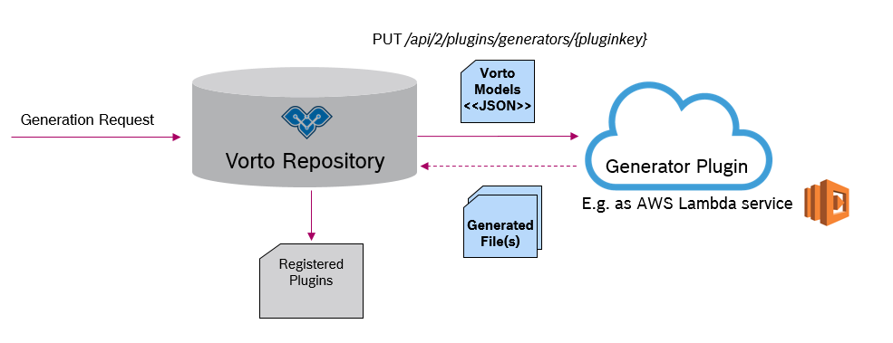

# Plugin Types

The Vorto Plugin SDK currently supports the following plugin types

* Generator Plugin type, to convert Vorto models to platform specific code
* Importer Plugin type, to convert a 3rd party semantic description to Vorto models.

## Generator Plugin Type

Vorto Generator plugins are meant to help you to ease integration of devices into your application. 
Generators are used to generate source code from Vorto Information Models. 
An example of a generator could be generating a piece of device firmware that connects to the AWS cloud and send device data in such a way, that the AWS cloud expects it.

Each Generator must make sure to provide two endpoints, that are called by the Vorto Repository upon code generation:

<table>
	<tr>
		<th>Generator Info</th>
		<td>
			Gives meta information about the generator plugin, such as description, vendor, logos, etc. This meta - information is displayed in the plugins overview of the repository. 
		</td>
	</tr>
	<tr>
		<th>Generator Execution</th>
		<td>
			Performs the actual code generation for a given Vorto model and returns the generated file(s).
		</td
	</tr>
</table>

[Download OpenAPI spec](docs/generator-openapi.yml)

### Example

It is totally up to you, which language you choose to implement a generator, either Java, Go, Node.js etc.

Checkout our [hello world generator](https://github.com/eclipse/vorto-examples/tree/master/vorto-generators/v2/helloworld-example), that is implemented and deployed as a serverless AWS Lambda service.

# Importer Plugin Type

The Vorto Repository manages Vorto Information Models and provides elegant ways to search these models as well as transform these models into runnable source code via Code Generators. 
But how can existing (standardized) device descriptions be integreated into the Vorto eco-system, so that they can benefit from the Repository features? It is just as easy as provide an Importer that manages the validation and conversion into Vorto Information Models. 

[Download OpenAPI spec](docs/importer-openapi.yml)

### 1. File Validation

The import process begins with a pre-validation check on the file which is to be imported. Here the importer plugin reports back to the repository, if it accepts the file and a file conversion can take place safely.

### 2. File Conversion

Once the file was accepted by the importer plugin, the repository invokes this endpoint, whereby the importer converts the file to Vorto models and returns them as a ZIP archive.

### Example

It is totally up to you, which language you choose to implement an importer, either Java, Go, Node.js etc.

Check out our [importer example](https://github.com/eclipse/vorto-examples/tree/master/vorto-importers/lwm2m), that is implemented and deployed as serverless AWS Lambda functions. 

# Register your plugin

Please send us an email([vorto-dev@eclipse.org](mailto:vorto-development@bosch-si.com)), with the details of your plugin and we will get in touch with you.

