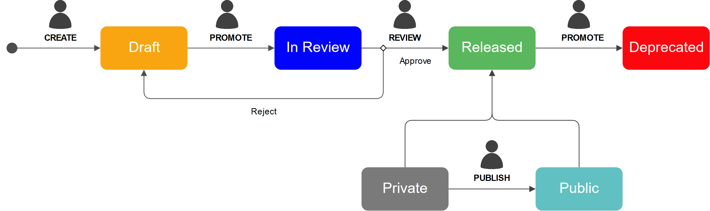

# Vorto Model States

Vorto Models have a lifecycle and undergo various states. This section gives you an overview of these states and the actions that are possible. 

 

## Release States

<figure class="screenshot">
	
</figure> 

The following table gives an overview of what actions are possible for models in a specific state:

### `Draft`
A model in Draft state is a model under construction, here people can try out their ideas and test their behaviour. 

### `Review`
As soon as a developer is happy with the state a model is in, he can request a Review. Then a model supervisor will go through and confirm that all model guidlines are followed. The supervisor can either reject it, or allow it to go on to the Released state.
To request a review all dependent models have to be released.

### `Released`
A released model, is a model one can build upon. The release state ensures there are not changes introduced which could break comability, if there is a requirement for change a new version of the model should be created and the old one deprecated. 

### `Deprecated`
If a model is not up to date anymore and it already has been released, it can be deprecated to mark the broken state. A deprecated model signals to other users that this model should not be used anymore and if possible replaced by a newer version.

 

## Visibility States

### `Private`
By default, every model that is created or imported is `Private`. This means that only collaborators of the according namespace of the model can view it. Private models can have any release state.   
Once `Released`, a model can be made public.

### `Public`
A `Public` model can be viewed by everyone, including non-registered users. In order to change a models visibility state, you need to
- be an **owner or collaborator** to an [official namespace](#claiming-an-official-namespace).
- have the **role of `Publish`** for the given official namespace. 
- have `released` the model and all submodels (will be released automatically if not already done)

You have to also be aware of the fact that, **published models can only be `deprecated` and not deleted or unpublished**.
> Read the [full guide on publishing models](../../docs/tutorials/publishing_models.md)

