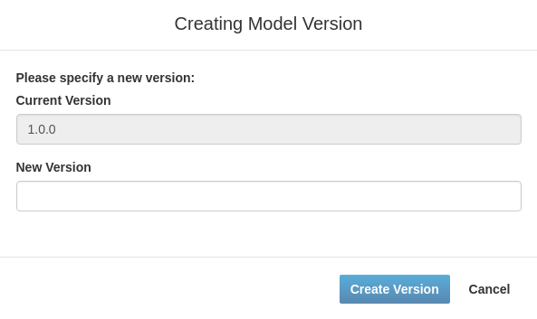

# Create a new Vorto Model Version

This section would lead you through the steps to create a new version of an existing model.

## Prerequisite

* [BoschID](https://accounts.bosch-iot-suite.com/) Account or [GitHub](https://github.com/) 
* You are a collaborator/owner of a namespace
* Existing Vorto Model

## Steps to create a new version of a model

1. Log in to the [Vorto Repository](https://vorto.eclipseprojects.io) using either your BoschID or GitHub Account

2. Search the model for which you want to create a new version

3. Open Model Details

4. Click on the **Create Version** button. This will lead to the **Create Model Version Dialog** dialog box:

<figure class="screenshot">
    
</figure>

5. Fill in the new version number.

6. Confirm with **Create Version** button. This will open the newly created model version details page.
