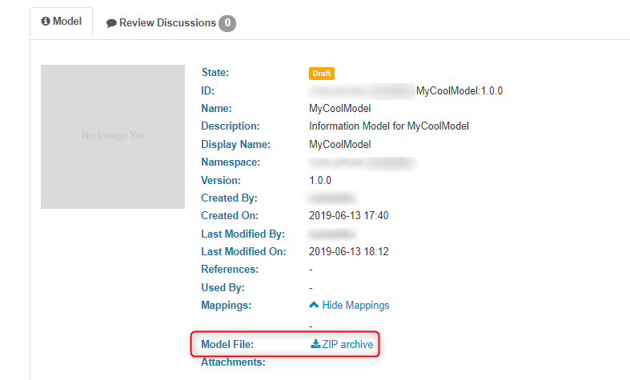
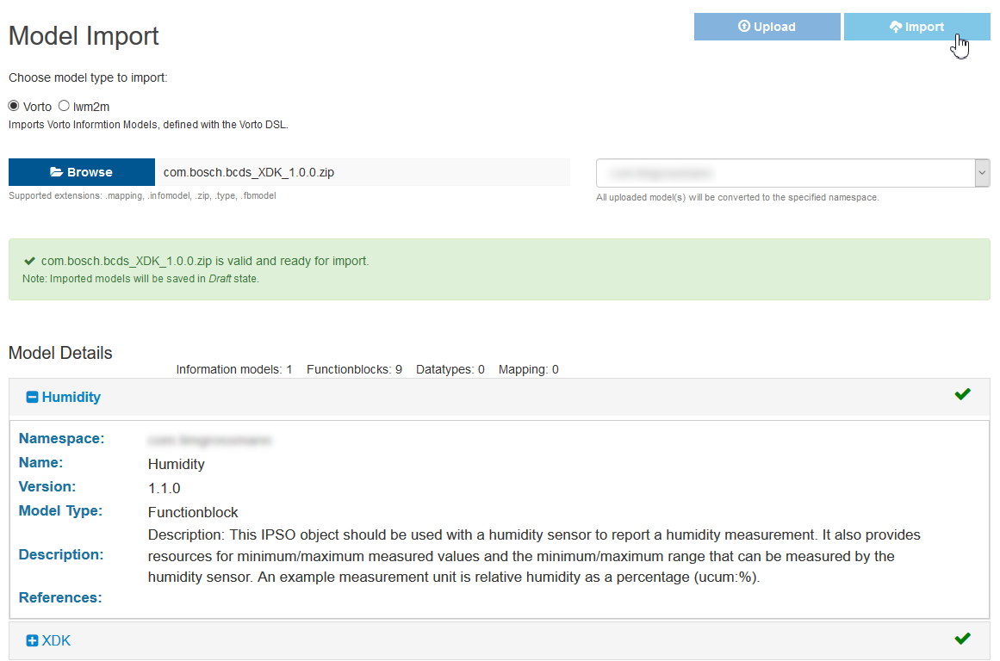
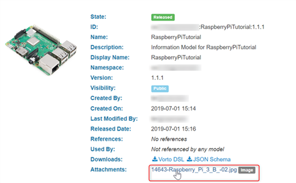
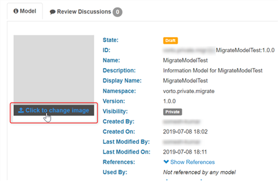

# Migrating from 0.10 to 0.11 Vorto Repository
This guide will walk you through the process of migrating your existing Vorto models from the old repository into the new Vorto repository. Let's get started.

- [Migrate your model](#migrate-your-model)
- [Migrate model image](#migrate-model-image)
- [Migrate your payload mappings](#migrate-your-payload-mappings)

## Important Information
With the new Eclipse Vorto repository, your models are completely private in your own namespace. However you can choose to share your models with other users or make it publicly visible.

All models under `vorto.private.*` cannot be made public, this namespace is meant for sandbox purposes only. You will be restricted to one sandbox namespace only.

Only models under an official namespace can be made public, request for an official namespace by writing to [vorto-development@bosch-si.com](mailto:vorto-development@bosch-si.com?Subject=Request%20Vorto%20Repository%20Namespace&amp;body=Dear%20Vorto%20Team%2C%20%0A%0AI%20would%20like%20to%20request%20for%20an%20official%20namespace.%20%0A%0ANamespace%20Owner%20%28user%20ID%29%20%3A%20%0ANamespace%3A%0A%0AThank%20you.%20%0A%0ABest%20regards%2C%20).

The new repository is hosted in AWS Cloud (region Frankfurt). It helps us to reduce costs at the same time provide you with a much faster repository.

## Prerequisites
- [GitHub](https://github.com/login) or [Bosch-Id](https://accounts.bosch-iot-suite.com/)
- Existing Vorto models in the old repository which you would like to migrate

## Steps

### Migrate your model

1. Log in to old [Vorto Repository](https://vorto-legacy.eclipse.org)

2. Select the model you would like to migrate
	> **Note:** Select the checkbox *Only My Models* to view models created by you

3. Download your *Model File* using the `ZIP archive` link

	

4. Log in to new [Vorto Repository](https://vorto.eclipseprojects.io)

5. [Create and manage Namespace](../../docs/tutorials/managing_namespaces.md), by default all new namespaces will be prefixed with *vorto.private*. To claim for an official namespace, [reach out to the Vorto Team](mailto:vorto-development@bosch-si.com?Subject=Request%20Vorto%20Repository%20Namespace&amp;body=Dear%20Vorto%20Team%2C%20%0A%0AI%20would%20like%20to%20request%20for%20an%20official%20namespace.%20%0A%0ANamespace%20Owner%20%28user%20ID%29%20%3A%20%0ANamespace%3A%0A%0AThank%20you.%20%0A%0ABest%20regards%2C%20).

6. Click **Browse** and select the zip file you downloaded in Step-3.   
Make sure to select the target namespace from the dropdown in which your model should be imported in.

7. Click **Upload** 

8. If all goes well you will receive a success message *model is valid and ready for import*   
In addition to that, you will also see all of the submodels that will be imported and which ones already exist.

	

9. Click **Import** to finish uploading.   

**You're now ready to use the models.**

 

### Migrate model image
If your model has an image which you would like to retain, follow the steps below.

1. Navigate to model information page and you should see the image under attachments, click to download your image

	

2. In the new repository, navigate to your model information page and  hover your mouse over image placeholder, you should see an upload image link. Click to select and upload your image

	

 

### Migrate your payload mappings
Migrating your payload mappings is a matter of copying and pasting.

1. In the new repository, navigate to your Information Model

2. Click Create Mapping

3. Copy over all your mapping expressions from the old repository into the mapping editor

4. Save your changes

## What's next?
- [Add/Manage Collaborators to your namespace](../../docs/tutorials/managing_collaborators.md)
- [Release your models](../docs/model_states.md) (learn more about model states)
- [Publish your models](../../docs/tutorials/publishing_models.md) (make your model public)
