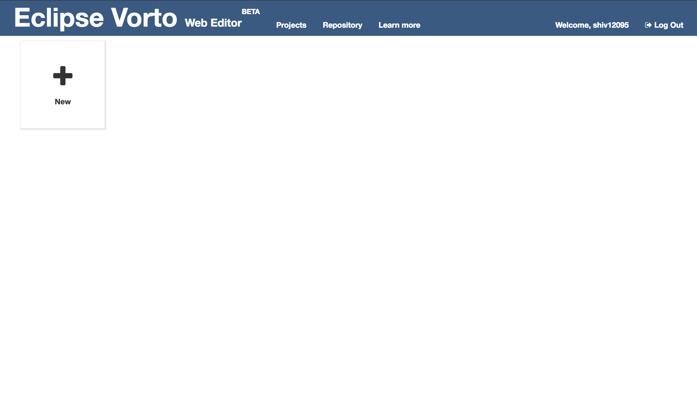
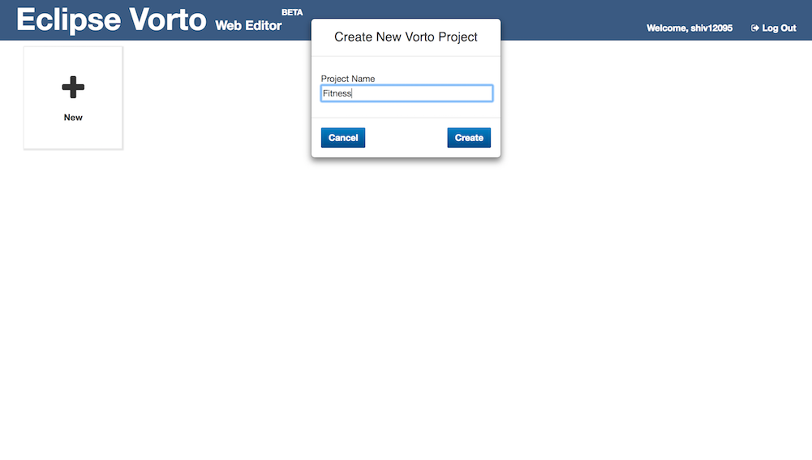
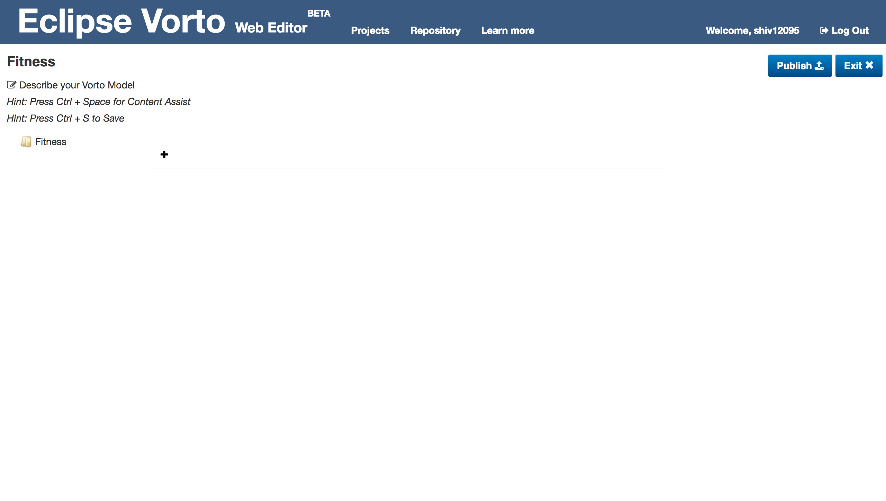
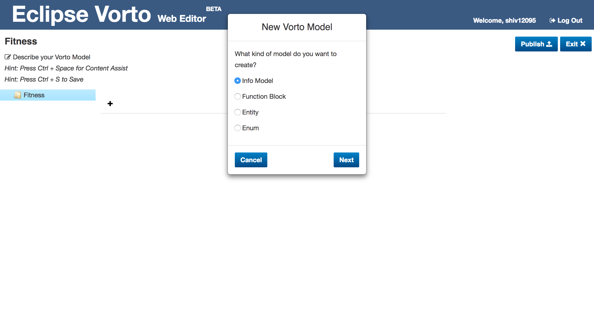
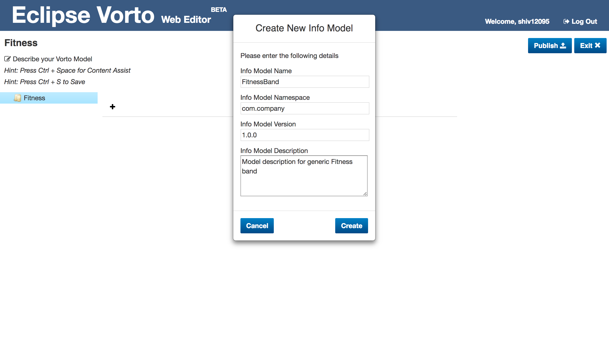
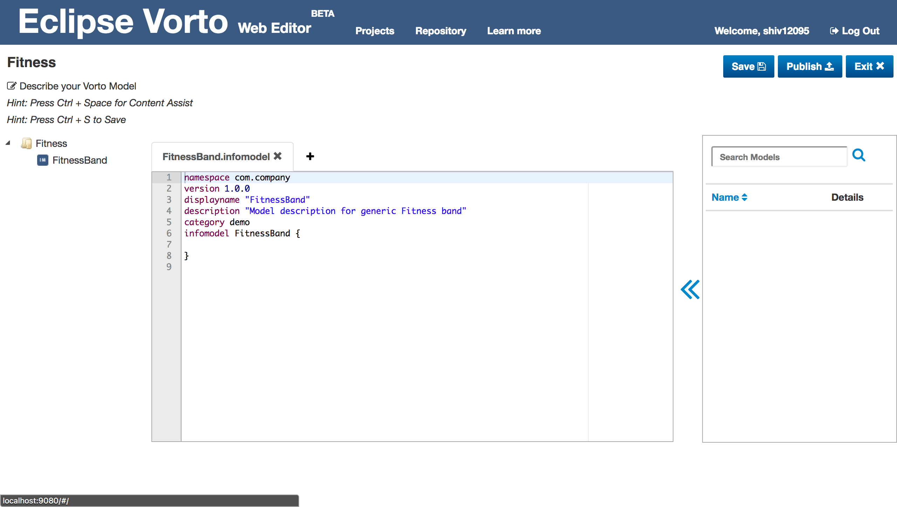
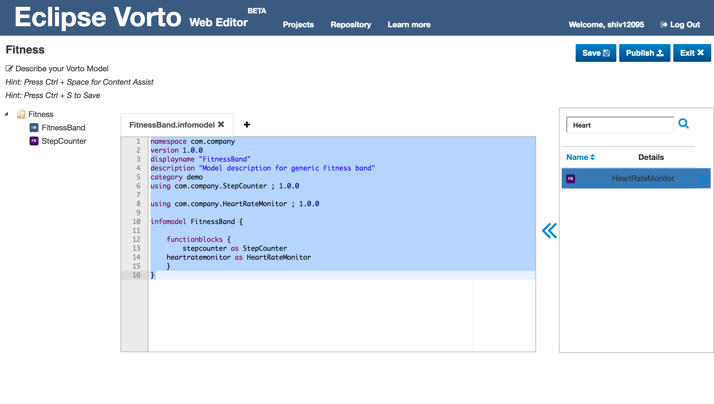
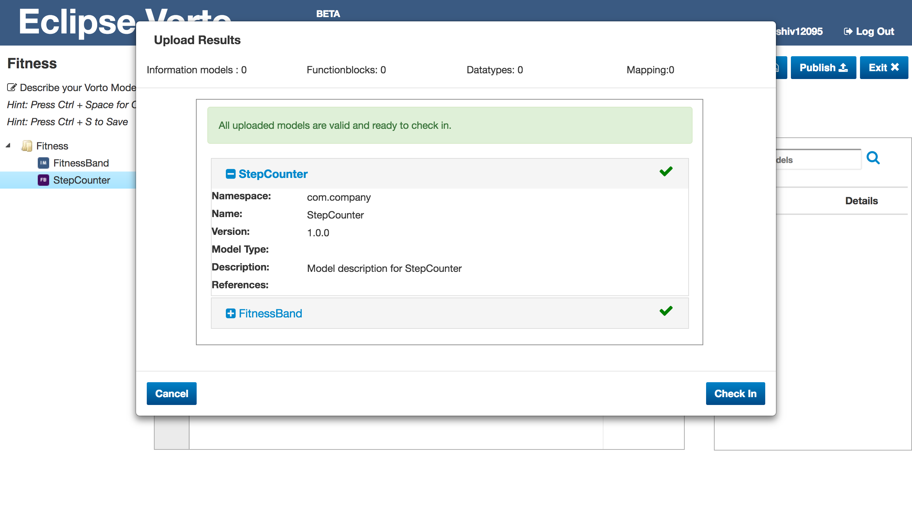
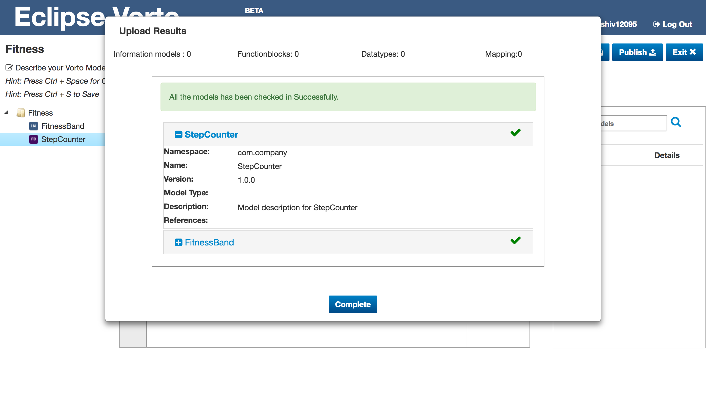

# Create and publish Information Models using Vorto Web Editor

## Prerequisites
1. You must have a Github account to use the Vorto Devtool. If you don't have an account, you can create one [here](https://github.com/join).
2. Sign In to the Vorto Devtool.

## Overview

In this tutorial, we are going to show you how to create an information model and publish it to the Vorto Repository using the devtool. We will be creating the device description for a generic fitness band and in the process touch upon the features of the devtool.

## Tutorial

#### Step 1: Create a new Vorto Project
Click on the **+** icon to create a new project. We will name this project Fitness.

Once you create the project, you will be redirected to the editor page.

#### Step 2: Create a new Information Model file
There are two ways to create a new resource in the project:
1. Click on the **+** icon
2. **Right Click** on the Folder icon and choose **New Resource** in Âthe file viewer present in the left panel.

Select Information model under model type and click on **Next**.

Add the appropriate description and click on **Create** to create the information model.

#### Step 3: Import Function block into the Information model using Drag and Drop

Some of the common functionalities provided by a fitness band include **Step Counter** and **Heart Rate Monitor**. These functionalities can be described using function blocks.

Using the steps mentioned before, you can create a function block to describe a **Step Counter** in the project.

The Web editor provides Drag and Drop functionality to import models. To import the **StepCounter** functionblock in the FitnessBand model, open the **FitnessBand** tab and then Drag and Drop the function block over the information model in the resource tree present in the left panel.

#### Step 4: Import Function block into the Information model from the Vorto Repository

We have already added the **HeartRateMonitor** functionblock to out Vorto Repository. To import this functionblock, first search for it in the search box provided, then select the suitable model and click on the double arrow button to import it.

#### Step 5: Publish the models to the Vorto Repository

Click on the **Publish** button to validate and publish these models on the Vorto Repository

You can check in the files to repository if the files are valid.

These models have now been uploaded to the Vorto Repository

