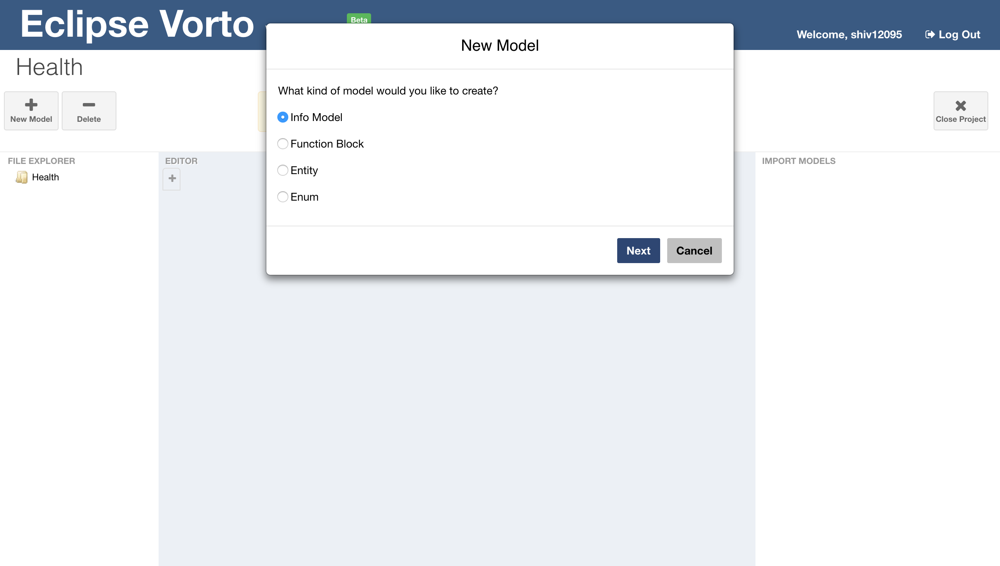
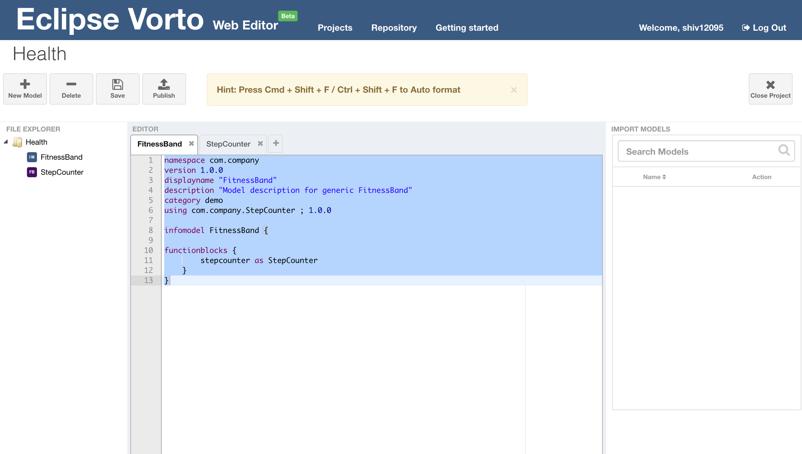
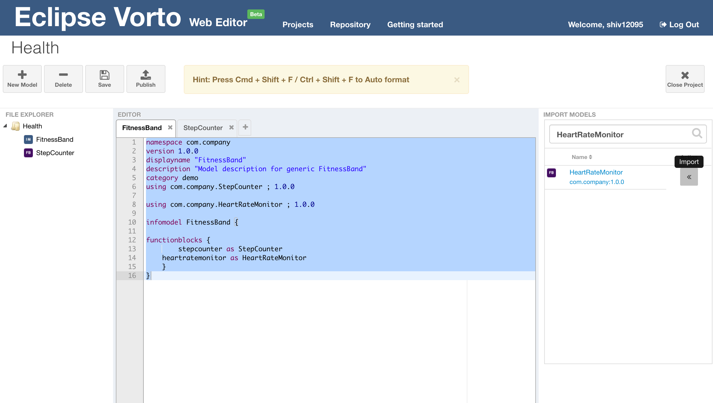
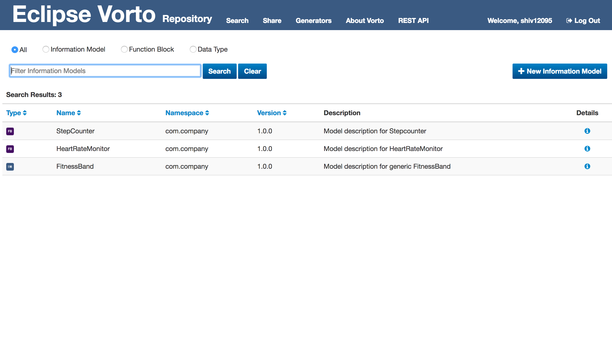

# Create and publish Information Models

In this tutorial, we are going to show you how to create an information model and publish it to the Vorto Repository using the Vorto Web Editor. We are going to describe a fitness band device with a heart rate monitoring- and step counting functionality.

## Prerequisites

Before you begin, make sure, that you have a Github account in order to log on to the Vorto Web Editor. If you don't have an account, you can create one [here](https://github.com/join).


## Steps

### Describing the fitness band device

#### 1. Log on to the [Web Editor](http://vorto.eclipse.org/editor) with your Github Account


#### 2. Create a new Model Project

Click on the **+** icon to create a new project. Let's name the project "Health".


Upon creation, the project view opens where you can add new model resources that describe your device.


#### 3. Create a Fitness Band Information Model

Click on the **+** icon to create a new model and select _Information Model_.



Enter the name for the device "Fitnessband" and a meaningful description. Confirm with **Create**.


This will open the information model in an editor. 


#### 4. Create a Step Counter functionblock

Our fitness band's functionality includes a **Step Counter** and a **Heart Rate Monitor**. These functionalities can be described as function blocks. 

As for the information model, create a new function block model for the step counter by clicking on the **+** icon. This time, make sure to select Function Block as the model type in the creation wizard. 

Open the Step Counter Editor to define the step counter functionality:

```
namespace com.mycompany
version 1.0.0
displayname "StepCounter"
category demo
functionblock StepCounter {

	status {
	   // status properties define the state of the device that
		mandatory dayStepCounter as int "Number of steps covered in 1 day"
		mandatory allTimeStepCount as int "Total number of steps covered"
	}
	
	operations {
	   // operations define functionality that can be invoked on the device
		resetDailyStepCount() "Reset dayStepCount value to 0"
		resetAllTimeStepCount() "Reset allTimeStepCount value to 0"
	}
}

``` 
Your model should look like this:


Now open the Fitnessband Information Model by clicking on the FitnessBand tab and Drag&Drop the Step Counter onto the FitnessBand in the File Explorer. 



#### 5. Import the Heart Rate Monitor Function Block

- Open the FitnessBand Information Model and search for 'HeartRateMonitor' in the _Import Models Browser_.

- Click on the **<<** icon to import the model into the FitnessBand Information Model

	

### Publishing the Information Model to the Vorto Repository

Before users are able to discover your device description and generate code, you must publish the model to the Vorto Repository. 

#### 1. Publish Information model and its referenced models 

Click on the **Publish** button to validate and confirm with _Publish_.


Open the [Vorto Repository](http://vorto.eclipse.org) and search for "FitnessBand". There you can see the Information Model you had just created. 




## What's next?

Now that you have described the device as an Information Model with Vorto, you can use the Vorto Code Generation infrastructure and generate platform-specific source code:

- [Connect the device via bluetooth with Eclipse Kura](tutorial_connect_xdk_ble.md)
- [Create a Spring-Boot web application consuming the device telemetry data](tutorial_create_webapp_dashboard.md)
- [Build an Amazon Alexa Skillset to voice-control the device](tutorial_build_alexaskill.md)